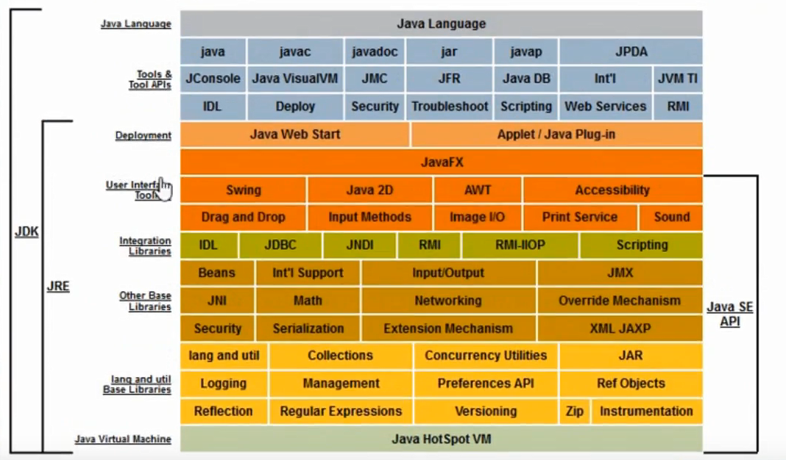
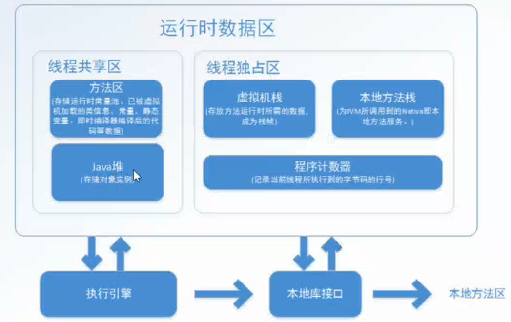

- jdk、jre、jvm

  

  ​

- 内存介绍

  

  - 程序计数器：
    内存空间较小，可以看作当前线程所执行的字节码的行号指示器

- 对象的创建

  

- 对象的结构

- 对象的访问定位

  - 使用句柄

  - 直接指针（栈中的引用类型直接指向堆中的对象实例，HotSpot使用的就是这个）

----

- 垃圾回收

  - 判定对象为垃圾的依据
    - 引用计数法
      在对象中添加一个引用计数器，当有地方引用到这个对象时，引用计数器的值+1，不引用时-1.当引用值为0时，则标记为失效。
    - 可达性分析法
  - 如何回收，何时回收
    - 回收策略
      - 标记-清楚算法
      - 复制算法
      - 标记-整理算法
      - 分代收集算法
    - 垃圾回收器
      - Serial
      - parnew
      - Cms
      - G1
