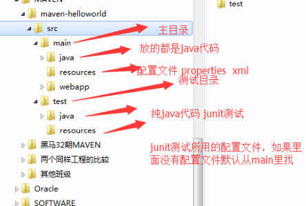
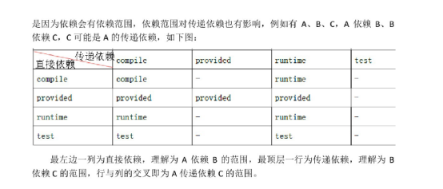
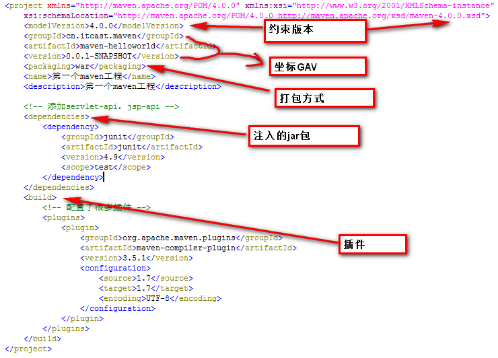

### 简介

1. Apache开源项目；

2. 纯Java开发

### 作用

1. 依赖管理

2. 项目构建
### 仓库分类

- 本地仓库
- 私服
- 中央仓库
### 目录结构



### 生命周期

> Maven的生命周期是对所有的构建过程进行抽象和统一。Maven的生命周期是抽象的，这意味着生命周期本身不做任何实际的工作，生命周期只是定义了一系列的阶段，并确定这些阶段的执行顺序。而在执行这些阶段时，实际的工作还是由插件来完成的。
##### clean生命周期
1）pre-clean 执行一些清理前需要完成的工作。
2）clean 清理上一次构建生成的文件。
3）post-clean 执行一些清理后需要完成的工作。
##### default生命周期
> Maven核心功能之”构建“的所有需要执行的步骤

6) process-resources 处理项目主资源文件。对src/main/resources目录的内容进行变量替换等工作后，复制到项目输出的主classpath目录中。

7） **compile** 编译项目的主源代码

10) process-test-sources 处理项目测试资源文件

13）test-compile 编译项目的测试代码

15) **test** 使用单元测试框架运行测试，测试代码不会被打包或部署

17）**package** 接受编译好的代码，打包成可发布的格式

22) **install** 将包安装到Maven本地仓库，供本地其他Maven项目使用

23）**deploy** 将最终的包复制到远程仓库，供其他开发人员和Maven项目使用

##### site生命周期
> 建立和发布项目站点

### 命令
**命令执行逻辑**：首先会得到该阶段所属生命周期，从该生命周期中的第一个阶段开始按顺序执行，直至该阶段本身。不同声明周期的命令可同时执行。
比如：mvn clean package

### 依赖范围

##### Compile

默认范围

##### Provided
eg: jsp-api.jar   servlet-api.jar（tomcat容器中有这两个jar包，如果打包了这两个到war包中，会和tomcat冲突。
##### Runtime

eg: JDBC驱动包

##### Test

eg: junit

|                  | Compile | Provided | Runtime | Test |
| :--------------: | :-----: | :------: | :-------------: | ------------ |
| **测试**         | **Ｙ**  | **Ｙ**   | **Ｙ**          | **Ｙ**       |
| **编译**         | **Ｙ**  | **Ｙ**   |                 |              |
| **打包** | **Ｙ**  |          | **Ｙ**          |              |

### 依赖传递

引入一个Jar包可能会引入其他Jar，这就是依赖传递。
依赖传递或者导入版本不同的jar包时会出现“**版本冲突**”的问题，解决办法：

- 父工程版本锁定

  版本锁定只是起到指定依赖版本的作用，并不会导入依赖.

```xml
<properties>
　　<spring.version>4.2.4.RELEASE</spring.version>
</properties>
.........
<dependencyManagement>
    <dependencies>
        <dependency>
            <groupId>org.springframework</groupId>
            <artifactId>spring-bean</artifactId>
            <version>${spring.version}</version>
        </dependency>
    </dependencies>
</dependencyManagement>
```

- 依赖的优先原则（次要）

- 排除依赖（不常见，百度即可）

  ​

  ##### 依赖范围对依赖传递造成的影响

  


### pom.xml



// TODO: 待续