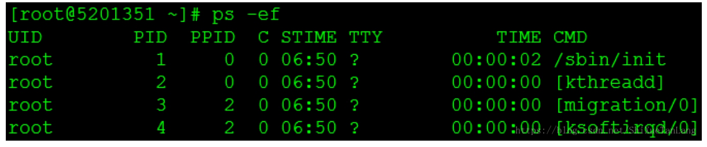
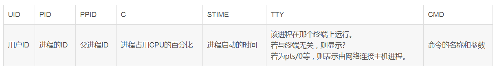
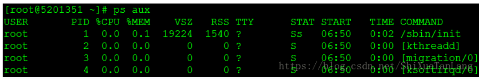
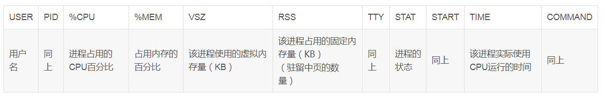
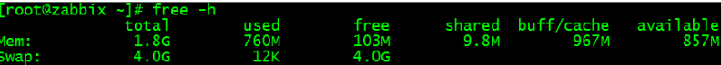

### 一、进程相关指令

#### ==1. ps==

> Process Status

ps -ef 与 ps aux：都能显示全部用户的进程，==只是风格差别==：









#### ==2. top==

[top命令详解](https://www.cnblogs.com/mushang1hao/p/10767062.html)

### 二、网络相关

#### 1. ping

测试TCP/IP (也就是传输层)是否畅通

#### 2. telnet

明文传送报文，安全性不好

#### ==3. netstat==

打印整个系统的网络情况

```sh
## 列举几个常用参数
-a 显示所有
-l 显示有在 Listen (监听) 的服务状态
-n 以网络IP地址代替域名
-p 显示程序名和PID
-t 显示TCP协议的连接情况
-u 显示UDP协议的连接情况

常用组合：netstat -anp
场景：查询zookeeper所用端口：
ps -ef | grep -i zookeeper # 查到zookeeper的PID
netstat -anp | grep PID # 有些内容可能因为权限无法看到，则加上sudo

连接状态(好像和三次握手四次挥手相关？)：
LISTEN　　监听中
SYN-SENT　　在发送连接请求后等待匹配的连接请求
SYN-RECEIVED　　在收到和发送一个连接请求后等待对方对连接请求的确认
ESTABLISHED　　代表一个打开的连接
TIME-WAIT　　等待足够的时间以确保远程TCP接收到连接中断请求的确认
CLOSED　　没有任何连接状态
CLOSED-WAIT　　等待从本地用户发来的连接中断请求
```


### 三、内存相关

#### 1. free



```sh
## 输出简介
			总	已用		剩余		被共享使用的	 buff/cache		可用
Mem 内存
Swap 交换空间

其中：available≈free+buff/cache,也就是如果free的内存不够用了，就会去buff/cache缓存中拿
```


### 四、磁盘空间相关

#### 1. df -ha

#### 2. du -ha