### ==事务==

#### 一、四个问题

- 更新丢失
   非事务控制相关的问题，是锁相关的问题
- 脏读
- 不可重复读
- 幻读
   幻读与不可重复读的区别：不可重复读侧重是对同一条数据的修改导致，幻读是新增/删除数据导致的。锁的范围不一样。

----

#### 二、四种隔离级别

- read umcommitted-读未提交：
  session2 可以读到 session1 未提交的事务(脏读、不可重复读、幻读)；
- read committed- 读已提交:
  session2 不可以读到session1未提交的事务，但可能会因为session1提交后，导致出现读取的数据不一致（不可重复读、幻读）；
- repeatable read-可重复读：
  session2-->start transaction后，与其他事务是隔离状态（幻读）
- Serializable - 串行化

#### 三、问题记录

1.事务自动提交，导致事务不起作用？

查看数据库配置：


可以看到autocommit是ON,
注：多数生产环境都必须配置为ON。
此时可以手动开启事务：

```sql
start transaction ;
```

---


### ==mysqldumpslow==

#### 1. 相关查询：
``` sql
slow_query_log		#慢查询开关
slow_query_log_file #慢查询文件位置
long_query_time 	#单位秒，超过这个时间则记录，且slow_queries+1
slow_launch_time 	#创建线程的阈值,且Slow_launch_threads(慢建立线程数)+1

-- 没有索引的查询是否记录到慢查询日志
show variables like '%log_queries_not_using_indexes%';

-- 查看表索引
SHOW INDEX FROM dpb_froze;
-- 看库的所有索引
SELECT * FROM information_schema.STATISTICS WHERE table_schema='cbs_uat_cug2';
```
---
#### 2. mysql-slow.log文件内容：
``` sql
# Time(发生时间): 2017-06-03T06:48:27.030315Z
# User@Host: root[root] @ localhost（主机信息） []  Id:3
# Query_time（查询时间）: 1.896889  Lock_time（等待锁的时间）: 0.000823 Rows_sent(返回客户端行总数): 100000  Rows_examined(扫描行总数): 200000
SET timestamp=1496472507; 
select * from z_order limit 100000;

注：DML语句也会记录到日志中
```
---

#### 3. 执行  mysqldumpslow mysql-slow.log，查看内容如下：
````sql
Reading mysql slow query log from mysql-slow.log
Count: 2  Time=3.64s (17s)  Lock=0.00s (0s)  Rows=100000.0 (200000), root[root]@localhost
  select * from z_order left join z_league on z_order.league_id = z_league.id limit N

Count: 2  Time=1.05s (200s)  Lock=0.00s (0s)  Rows=55000.0 (110000), root[root]@localhost
  select * from z_order limit N
​```
- Count：出现次数,
- Time：执行最长时间和累计总耗费时间
- Lock：等待锁的时间
- Rows：单次查询返回的平均行数(累计返回的总行数≈count*单次查询返回的平均行数)
````
#### 4.常用的mysqldumpslow参数

```shell
 mysqldumpslow --help  # 查看参数
 
 -s, 是表示按照何种方式排序
    c: 访问计数
 
    l: 锁定时间
 
    r: 返回记录
 
    t: 总查询时间，（即所有这句sql的总和时间，即Time=1.05s (200s)总的200s）
 
    al:平均锁定时间
 
    ar:平均返回记录数
 
    at:平均查询时间
 
-t, 是top n的意思，即为返回前面多少条的数据；
-g, 后边可以写一个正则匹配模式，大小写不敏感的！！！好用
-a ,不将数字抽象成N，字符串抽象成S
-r 反向排序，最大的在最后
--------------------------------
eg:
1.按时间排序，Top 10,包含join。
mysqldumpslow -s t -t 10 -g "join" /database/mysql/mysql06_slow.log

得到返回记录集最多的10个SQL。
mysqldumpslow -s r -t 10 /database/mysql/mysql06_slow.log
 
得到访问次数最多的10个SQL
mysqldumpslow -s c -t 10 /database/mysql/mysql06_slow.log
```

### ==Explain==

**重点**：explain可以模拟服务层中的Query Optimizer来查看==**Mysql执行计划**==，**也即执行阶段，非Query Optimizer分解sql进行优化的阶段！**所以，Explain显示的是执行计划。

##### 总览图

不同版本的Explain差异：

**5.5.x**

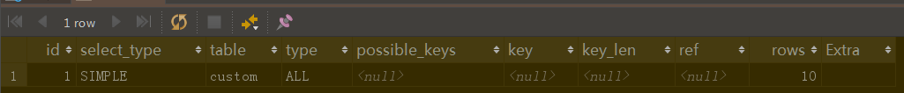

**8.0.x**

==多了partitions/fitered==

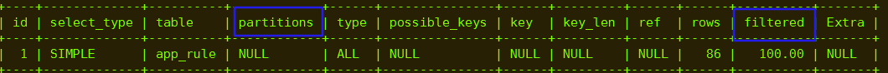

##### 1. id-表的读取顺序

规律：id越大，执行的优先级越高。id相同，则按从上到下的顺序。为null的情况：Union/ Union all结果总是放在一张临时表中，而这张临时表不在sql中体现，所以为null。

经验：往往最里层的子查询id更大，即越优先执行。			

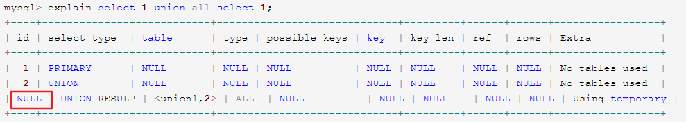

##### 2. select_type-查询类型

​	查询类型主要是针对“子查询”、“union查询”来划分的。

1. ==**simple**==：简单查询，**可以是多表**，但不包含子查询 或 union等

   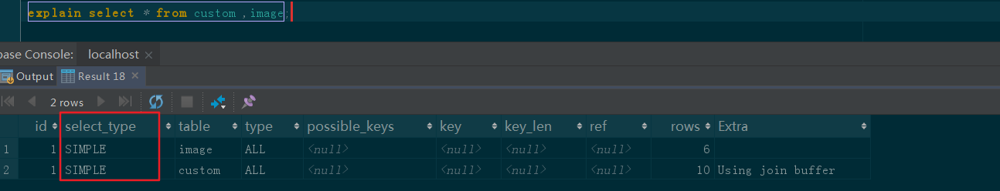

2. ==**primary**==：复杂查询中最外层的 select

     如两表做UNION,则第一个union前的select是primary；
     存在子查询的最外层的表操作为primary。
      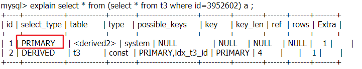

     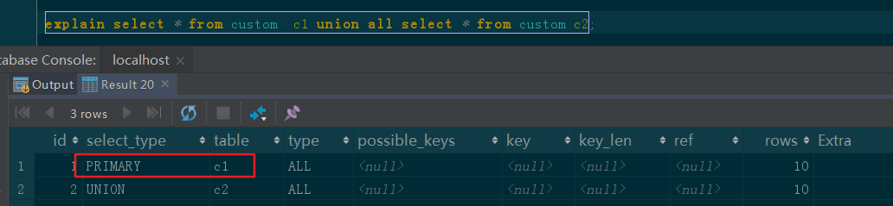

3. ==**subquery**==：包含在 select 中的子查询（**不在 from 子句中**）

4. ==**derived**==：包含在 **from 子句中**的子查询。MySQL会将结果存放在一个临时表中，也称为派生表（derived）

   案例：primary、subquery、derived综合案例：==select **subquery** from **derived**==

   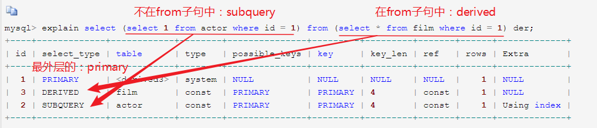

5. ==**union**==：在 union/union all中，除了第一张表的select_type为primary，后面的所有表的都为union

6. ==**union result**==：union/union all之后的结果（备：id值通常为NULL）

   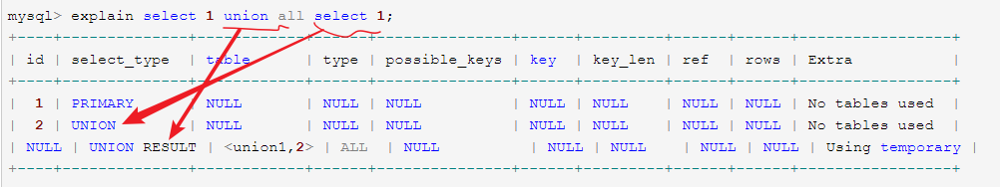

7. **==dependent subquery==**(略)
##### 3. table-表

特殊：当 from 子句中有子查询时，table列是 <derivenN> 格式，表示当前查询**依赖** id=N 的查询，于是先执行 id=N 的查询。当有 union 时，UNION RESULT 的 table 列的值为 <union1,2>，1和2表示参与 union 的 select 行id。

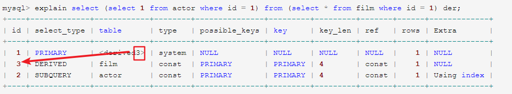

   	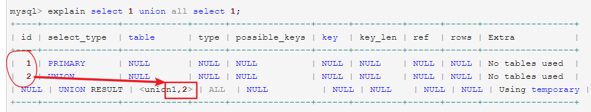

##### 4. type-访问类型

**从好到差**：system > const > eq_ref > ref > fulltext > ref_or_null > index_merge > unique_subquery > index_subquery > range > index > ALL。以及特殊：**null**

1. **==null==**：mysql能够在优化阶段分解查询语句，并查到了想要的结果，在**执行阶段不用再访问表或索引**，所以访问类型为null。
   例如：**在索引列中选取最小值**，可以单独查找索引来完成，不需要在执行时访问表。

   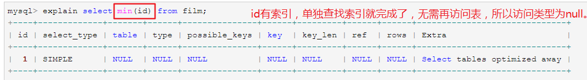

2. ==**const, system**==：mysql能对查询的某部分进行优化并将其转化成一个常量（可以看**==show warnings==** 的结果）。常见场景：**==单表查询==用 primary key 或 unique key 的所有列与常数比较时**，则**只会有一行匹配**，读取1次，速度比较快。

   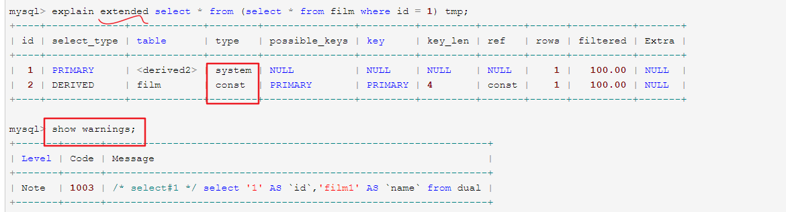

3. **==eq_ref==**：相比const/system,  er_ref就是多表的情况。primary key 或 unique key索引的所有列被使用 ，最多只会返回一条符合条件的记录。简单而言，就是外循环每次到内循环中遍历数据，都只有一条数据匹配。

   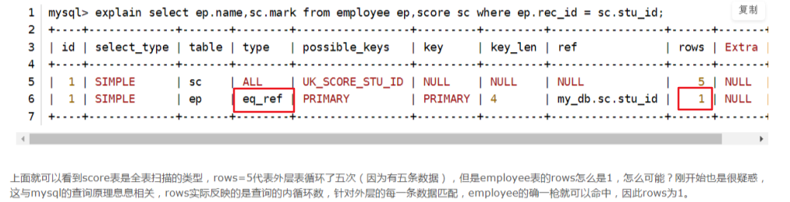

4. **==ref==**：相比 `eq_ref`，ref是**使用普通索引或者唯一性索引的部分前缀**，匹配行可能不唯一

   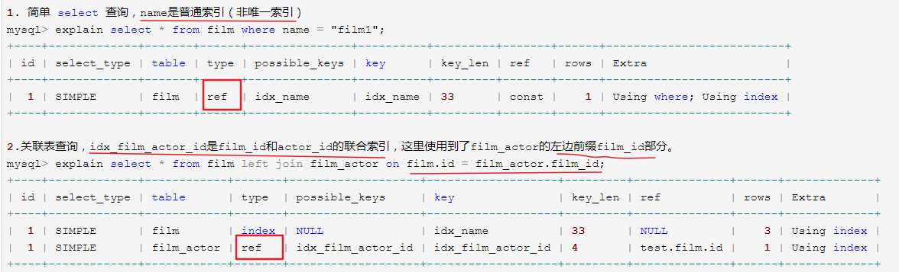

5. ==**ref_or_null**==：相比ref,多了搜索值=null的行

   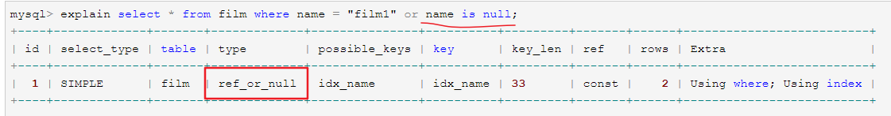

6. ==**index_merge**==：表示使用了索引合并的优化方法。执行计划用到两个索引，mysql进行合并索引。
   例如下表：id是主键，tenant_id是普通索引。or 的时候没有用 primary key，而是使用了 primary key(id) 和 tenant_id 索引。

   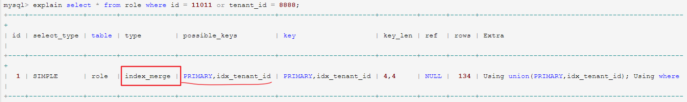

7. ==**range**==：用到了索引，搜索范围。
   常见：in(), between ,> ,<, >= 

8. ==**index**==：用到了索引，只扫描索引树便得到了结果，但没有全表扫描（使用索引文件）

   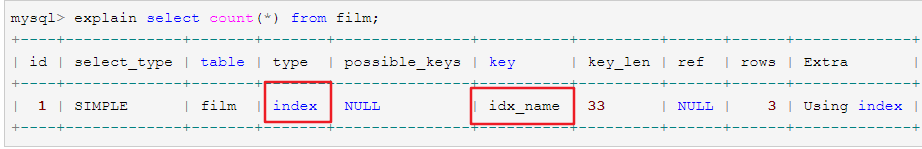

9. ==**ALL**==：全表扫描！！！

##### 5. possible_keys-可能用到的索引

​	**possible_keys 有值，而 key 显示 NULL** 的情况：因为表中数据不多，mysql认为索引对此查询帮助不大，选择了全表查询。

##### 6. key-用到的索引

​	**force index(inx_name)**：可强制使用指定索引
​	**ignore index(inx_name)**：可强制不使用指定索引

##### 7. key_len-索引里使用的字节数

​	作用：通过这个值可以算出具体使用了索引中的哪些列

```mysql
key_len计算规则如下：
    字符串
        char(n)：n字节长度
        varchar(n)：2字节存储字符串长度，如果是utf-8，则长度 3n + 2
    数值类型
        tinyint：1字节
        smallint：2字节
        int：4字节
        bigint：8字节　　
    时间类型　
        date：3字节
        timestamp：4字节
        datetime：8字节
    如果字段允许为 NULL，需要1字节记录是否为 NULL
```

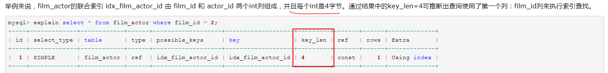

##### 8. ref

这一列显示了在key列记录的索引中，**表查找值所用到的列或常量**，
常见的有：const（常量），func，NULL，字段名（例：film.id）

##### 9. rows

预计扫描多少行

##### 10. extra-额外信息