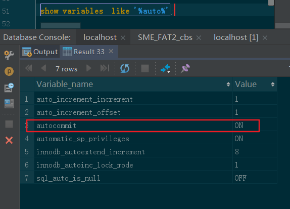

### 事务

#### 一、四个问题

- 更新丢失
   非事务控制相关的问题，是锁相关的问题
- 脏读
- 不可重复读
- 幻读
   幻读与不可重复读的区别：不可重复读侧重是对同一条数据的修改导致，幻读是新增/删除数据导致的。锁的范围不一样。

----

#### 二、四种隔离级别

- read umcommitted-读未提交：
  session2 可以读到 session1 未提交的事务(脏读、不可重复读、幻读)；
- read committed- 读已提交:
  session2 不可以读到session1未提交的事务，但可能会因为session1提交后，导致出现读取的数据不一致（不可重复读、幻读）；
- repeatable read-可重复读：
  session2-->start transaction后，与其他事务是隔离状态（幻读）
- Serializable - 串行化

#### 三、问题记录

1.事务自动提交，导致事务不起作用？

查看数据库配置：



可以看到autocommit是ON,
注：多数生产环境都必须配置为ON。
此时可以手动开启事务：

```sql
start transaction ;
```


### 1.1 六大范式

设计原则： 建议设计的表尽量遵守三大范式。

#### 1NF

要求表的**每个字段必须是不可分割的独立单元**

​							student     :   name              -- 违反第一范式

​										  张小名（原名）|狗娃（现名）					

​							sutdent    ： name    old_name    --符合第一范式

​										张小名    狗娃

#### 2NF

在第一范式的基础上，**要求每张表只表达一个实体的信息**。表的每个字段都和表的主键有依赖关系。

​					

​					employee（员工）: 员工编号  员工姓名 部门名称   订单名称  --违反第二范式

 

​					员工表：员工编号  员工姓名 部门名称   

 

​					订单表：  订单编号  订单名称             -- 符合第二范式

​					      

#### 3NF

在第二范式基础，要求每张表的主键之外的其他字段都只能和主键有直接决定依赖关系。

 

员工表： 员工编号（主键） 员工姓名  部门编号  部门名 --符合第二范式，违反第三范式（数据冗余高）

员工表：员工编号（主键） 员工姓名  部门编号    --符合第三范式（降低数据冗余）

部门表：部门编号  部门名

 

小结：**数据库存储空间  和 数据查询效率**是需要权衡的。遵循了三大范式，但是表就变多了，查询效率肯定会变低，但是节约了存储空间。**并不是遵循了三大范式就是好的**

 


 

