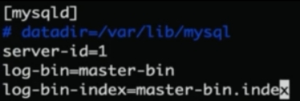
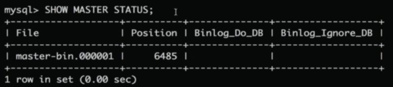
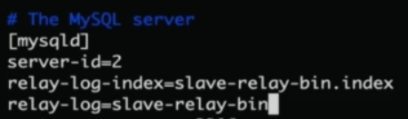

 

# 1 数据库设计

## 1.1 三大范式

设计原则： 建议设计的表尽量遵守三大范式。

### 第一范式

要求表的**每个字段必须是不可分割的独立单元**

​							student     :   name              -- 违反第一范式

​										  张小名（原名）|狗娃（现名）					

​							sutdent    ： name    old_name    --符合第一范式

​										张小名    狗娃

### 第二范式

在第一范式的基础上，**要求每张表只表达一个实体的信息**。表的每个字段都和表的主键有依赖关系。

​					

​					employee（员工）: 员工编号  员工姓名 部门名称   订单名称  --违反第二范式

 

​					员工表：员工编号  员工姓名 部门名称   

 

​					订单表：  订单编号  订单名称             -- 符合第二范式

​					      

### 第三范式

在第二范式基础，要求每张表的主键之外的其他字段都只能和主键有直接决定依赖关系。

 

员工表： 员工编号（主键） 员工姓名  部门编号  部门名 --符合第二范式，违反第三范式（数据冗余高）

员工表：员工编号（主键） 员工姓名  部门编号    --符合第三范式（降低数据冗余）

部门表：部门编号  部门名

 

小结：**数据库存储空间  和 数据查询效率**是需要权衡的。遵循了三大范式，但是表就变多了，查询效率肯定会变低，但是节约了存储空间。**并不是遵循了三大范式就是好的，数据库的设计是非常讲究技巧的。**

 

# 2 存储过程

## 2.1 什么是存储过程

**存储过程， 带有逻辑的sql语句**

## 2.2 存储过程特点

1）执行效率非常快！存储过程是在数据库的服务器端执行的！！！

2）移植性很差！不同数据库的存储过程是不能移植。

 

# 3. 主从库同步

Mysql的配置文件：

Windows：my.ini

Linux:my.cnf

1. 在主数据库上的配置文件中的mysqld下配置三行信息，即打开“master-binlog”：（Binary  Log）

 

Show master status 显示。。。（显示查看某些信息的作用）；

 

 

2. 在从数据库中同样也配置，打开“relay-log”：

 

 

3. 联系主从服务器

主库：

在主服务器上创建一测试用户----repl，

给repl用户赋予**REPLICATION SLAVE**的权限，这句话的意思就是：从数据库（115.28.159.6）可以通过主服数据库中的‘repl’用户来复制主数据库中的数据。

 

从库：

 

 

开启主从跟踪：

查看跟踪状态：（\G表示内容是竖下显示）