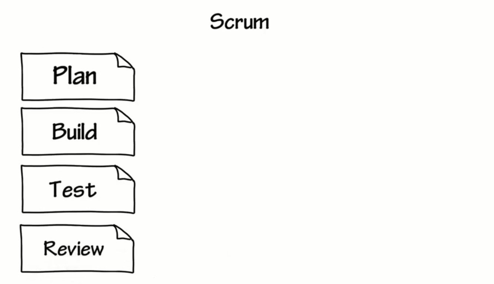

# Scrum

## Scrum	VS	 Waterfall 

### 瀑布式开发

列举几个瀑布式开发可能会出现的问题：

1.产品规划需要在研发之前完成，然后绝大多数项目开发初期，开发者并没有完全理解项目。

2.一旦中间某个环节出现问题，可能就需要回到上一个环节更改。

### 敏捷开发

首先，围绕“**最小可行化产品MVP**”的特性来进行产品规划-测试-评审-发布，这个过程一般在1到3周：

下一次就重复这个过程，得到下一个“**incremental release（增量式发布）**”，也称为“**迭代(Sprint)**”。

每次的“**incremental release（增量式发布）**”，也称为“**迭代(Sprint)**”

---

## 3Roles

> 3个角色

---

**注释**：产品经理、团队负责人、Team(开发、测试、文案等等)

## 3Artifacts

> 3个常用的文档

**注释**：燃尽图，对需要完成的工作的一种可视化表示。理想情况下，该图表是一个向下的曲线，随着剩余工作的完成，“烧尽”至零，意味着这次的Sprint即将完工。

---

## 3Ceremonies

> 3种会议

**Sprint计划会议**：每次Sprint开发初期，三个角色需讨论需求并估算任务量，开发任务安排等等。

**每日例会**：汇报开发进度

**Sprint回顾会议**：每次Sprint临近尾声时，项目的演示、需要改进的地方

---

# 总结：Scrum Work Flow

> Scrum的工作流

- 第1阶段：产品经理制作产品需求列表（Product Backlog）,和团队进行讨论。
- 第2阶段：召开Sprint规划会议，三个角色讨论决定本次Sprint（迭代）需要研发的需求项。
- 第3阶段：根据本次Sprint的需求项，制定Sprint需求列表，此会议后，整个研发团队要对每一个“用户故事（需求）”有深刻的理解。

- 第4阶段：研发阶段，周期为1到3周，每天需汇报任务进度，以及遇到的问题。最后可以得到一个**可交付的产品**（potentially shippable product）

- 第5阶段：Sprint Review

