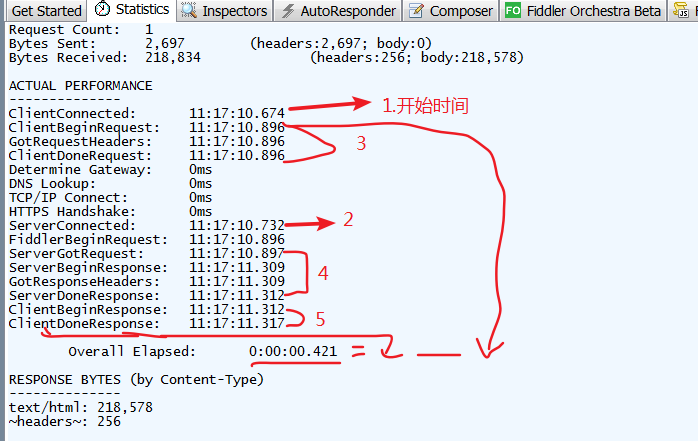

Fiddler使用不难，注重实战，应多了解其使用场景：

1. 重发攻击
2. 添加IP列
4. autoresponder：

   - 重定向资源,重定向js、css、html等资源；
- Edit Response直接编辑响应信息，达到==调试、伪造、无接口测试==的作用；
  有些场景修改响应信息时，要求字节数不变！比如SME_DIT2
4. 断点：
   - 请求前断点、响应后断点（都是在服务器的角度），但好像做不到js方法级别的debug
   - 模拟网络中断，一直不让断点通过
6. bpu 局部断点
6. 各种插件安装：willow

7. Statistic界面：查看各过程时间：

https://blog.csdn.net/qq_33250158/article/details/99640810

其中：dns lookup：域名解析

