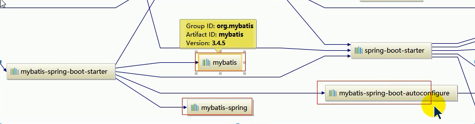

# 六、数据访问

## 1、连接数据库

1、application.yml指明数据库四要素

```yaml
spring:
  datasource:
    username: root
    password: root
    url: jdbc:mysql://localhost:3306/crm
    driver-class-name: com.mysql.jdbc.Driver

注：mysql已经不需要自己手动导入驱动依赖，oracle需要自己手动导入驱动的依赖：
<dependency>
    <groupId>com.oracle</groupId>
    <artifactId>ojdbc6</artifactId>
    <version>11.2.0.3</version>
</dependency>
```


2、编写测试类测试

```java
@RunWith(SpringRunner.class)
@SpringBootTest
public class SpringBoot06DataJdbcApplicationTests {

    @Autowired
    DataSource dataSource;

    @Test
    public void contextLoads() throws SQLException {
        System.out.println(dataSource.getClass());
        System.out.println(dataSource.getConnection());
    }
}
```

3、测试结果

```properties
#Springboot1.x默认的数据库连接池--tomcat
class org.apache.tomcat.jdbc.pool.DataSource
ProxyConnection[PooledConnection[com.mysql.jdbc.JDBC4Connection@c35af2a]]
#Springboot2.x默认的数据库连接池--HikariCP
class com.zaxxer.hikari.HikariDataSource
HikariProxyConnection@715534618 wrapping com.mysql.cj.jdbc.ConnectionImpl@61f39bb
```

数据源相关配置都在DataSourceProperties属性里

自动配置原理org.springframework.boot.autoconfigure.jdbc：

### 1、DataSourceConfiguration

参考DataSourceConfiguration,**根据配置创建数据源**。

### 2、默认支持的数据源

```
Tomcat数据源
HikariDataSource
dbcp.BasicDataSource
dbcp2.BasicDataSource
```

### 3、自定义数据源

**spring.datasource.type**指定自定义的数据源

```yml
spring:
	datasource:
		type: com.alibaba.druid.pool.DruidDataSource
		
# com.alibaba.druid.pool.DruidDataSource
# com.mysql.cj.jdbc.ConnectionImpl
```

**源码：**

```java
@ConditionalOnMissingBean(DataSource.class)
@ConditionalOnProperty(name = "spring.datasource.type")
static class Generic {
   @Bean
   public DataSource dataSource(DataSourceProperties properties) {
       //使用builder创建数据源，利用反射创建相应的type数据源，并绑定数据源
      return properties.initializeDataSourceBuilder().build();
   }
}
```

### 4、DataSourceInitializer

作用：

1）、postConstruct -》runSchemaScript 运行**建表sql**文件

2）、runDataScript运行**插入数据**的sql语句；

默认只需要将文件命名为：

```sql
建表：schema-*.sql 
插数据：data-*.sql

或者：
不更改sql文件的名称，指明sql文件的位置：
spring:
	datasource:
		schema:
			- classpath:department.sql
```

**注：一般不会在springboot中运行sql文件**

### 5、操作JdbcTemplate

SpringBoot提供的原生JDBC模版用于操作数据库。

## 2、自定义数据源

#### 1、导入数据源依赖

```xml
<dependency>
    <groupId>com.alibaba</groupId>
    <artifactId>druid</artifactId>
    <version>1.1.9</version>
</dependency>
```

#### 2、添加datasource.type

```yaml
spring.datasource.type指定自定义的数据源
```

**！！！到此数据源已经更换为自定义的**

#### 3、配置数据源配置(以Druid为例)

```yaml
spring:
  datasource:
    username: root
    password: Welcome_1
    url: jdbc:mysql://192.168.179.131:3306/jdbc
    driver-class-name: com.mysql.jdbc.Driver
    type: com.alibaba.druid.pool.DruidDataSource
	# 初始化大小，最小，最大  
    initialSize: 5
    minIdle: 5
    maxActive: 20
    # 配置获取连接等待超时的时间  
    maxWait: 60000
    # 配置间隔多久才进行一次检测，检测需要关闭的空闲连接，单位是毫秒 
    timeBetweenEvictionRunsMillis: 60000
    # 配置一个连接在池中最小生存的时间，单位是毫秒 
    minEvictableIdleTimeMillis: 300000
    validationQuery: SELECT 1 FROM DUAL
    testWhileIdle: true
    testOnBorrow: false
    testOnReturn: false
    poolPreparedStatements: true
    # 配置监控统计拦截的filters,去掉监控界面sql无法统计，‘wall’用于防火墙
    filters: stat,wall,log4j
    maxPoolPreparedStatementPerConnectionSize: 20
    userGlobalDataSourceStat: true
    # 通过connectProperties属性来打开mergeSql功能；慢SQL记录  
    connectionProperties: druid.stat.mergeSql=true;druid.stat.slowSqlMillis=500
```

#### 4、Druid配置监控

```java
@Configuration
public class DruidConfig {

    @ConfigurationProperties(prefix = "spring.datasource")
    @Bean
    public DataSource druid(){
        return  new DruidDataSource();
    }

    //配置Druid的监控
    //1、配置一个管理后台
    @Bean
    public ServletRegistrationBean<StatViewServlet> statViewServlet(){
        ServletRegistrationBean<StatViewServlet> bean = new ServletRegistrationBean<StatViewServlet>(new StatViewServlet(),"/druid/*");
        Map<String,String> initParams =new HashMap<>();
        initParams.put("loginUsername", "admin");
        initParams.put("loginPassword", "123456");
        //省略很多配置
        bean.setInitParameters(initParams);
        return bean;
    }
    //2、配置监控的filter
    @Bean
    public FilterRegistrationBean<WebStatFilter> webstatFilter(){
FilterRegistrationBean<WebStatFilter> bean = new FilterRegistrationBean<WebStatFilter>();
        bean.setFilter(new WebStatFilter());

        Map<String,String> initParams =new HashMap<>();
        initParams.put("exclusions", "*.js,*.css,/druid/*");
        bean.setInitParameters(initParams);
        bean.setUrlPatterns(Arrays.asList("/*"));
        return bean;
    }
}
```

5、运行测试，访问 **Druid的主页**：**localhost:8080/druid**


## 3、整合Mybatis

导入依赖

```xml
<dependency>
    <groupId>org.mybatis.spring.boot</groupId>
    <artifactId>mybatis-spring-boot-starter</artifactId>
    <version>1.3.2</version>
</dependency>
```




### 注解方式

```java
@Mapper		# 指定是一个mapper，并且会被扫描到
public interface DepartmentMapper {

    @Select("select * from department where id=#{id}")
    public Department getDeptById(Integer id);
}
```

编写controller测试

```java
@RestController
public class DeptController {

    @Autowired
    DepartmentMapper departmentMapper;

    @RequestMapping("/getDept/{id}")
    public Department getDepartment(@PathVariable("id") Integer id){
        return departmentMapper.getDeptById(id);
    }
}
```

问题：

mapper文件夹下有多个mapper文件，加麻烦，可以批量扫描mapper接口

```java
@MapperScan(value = "org.hut.dao")
```

**修改mybatis的配置**

以修改驼峰命名为true为例：

第一种：在配置文件中：

```
mybatis:
  configuration:
    map-underscore-to-camel-case: true
```

第二种：写一个MybatisConfig,加bean到组件中——**ConfigurationCustomizer**

```
//类名冲突所以全类名
@org.springframework.context.annotation.Configuration
public class MyBatisConfig {
    @Bean
    public ConfigurationCustomizer configurationCustomizer(){
        return new ConfigurationCustomizer() {
            @Override
            public void customize(Configuration configuration) {
                configuration.setMapUnderscoreToCamelCase(true);
            }
        };
    }
}
```


### xml方式

**xml方式必须要有mybatis的全局配置文件**

1、新建文件夹

推荐把mapper.xml文件放在resourece下的/mybatis/mapper中


2、修改application.yml配置文件

```yaml
mybatis:
  config-location: classpath:mybatis/mybatis-config.xml
  mapper-locations: classpath:mybatis/mapper/**/*.xml
```

3、用@Mapper（单个）或者 @MapperScan（批量）扫描dao接口，**这是必不可少的**

```java
@MapperScan("com.xdd.dao")
@SpringBootApplication
```

**注：xml和注解两种方式可以共用**


## 4、JPA数据访问（67，之后在了解JPA）


目录结构


1、新建一个实体类User

```java
//使用JPA注解配置映射关系
@Entity//告诉JPA这是一个实体类（和数据表映射的类）
@Table(name="tbl_user") //@Table来指定和那个数据表对应，如果省略默认表明就是user;

public class User {

    @Id //这是一个主键
    @GeneratedValue(strategy = GenerationType.IDENTITY)//自增组件
    private Integer id ;

    @Column(name="last_name",length = 50) //这是和数据表对应的一个列
    private String lastName;
    @Column//省略默认列名就是属性名
    private String email;
    @Column
    public Integer getId() {
        return id;
    }

    public void setId(Integer id) {
        this.id = id;
    }

    public String getLastName() {
        return lastName;
    }

    public void setLastName(String lastName) {
        this.lastName = lastName;
    }

    public String getEmail() {
        return email;
    }

    public void setEmail(String email) {
        this.email = email;
    }
}
```

2、新建一个UserRepository来继承jpa的绝大多数功能

```java
//继承jpaRepository
public interface UserRepository extends JpaRepository<User,Integer> {

}
```

3、编写配置文件application.yml

```yaml
spring:
  datasource:
    url: jdbc:mysql://192.168.179.131/jpa
    username: root
    password: Welcome_1
    driver-class-name: com.mysql.jdbc.Driver
  jpa:
    hibernate:
    #更新或创建
      ddl-auto: update
    show-sql: true
```

4、编写Controller测试

```java
@RestController
public class UserController {
    @Autowired
    UserRepository userRepository;

    @GetMapping("/user/{id}")
    public User getUser(@PathVariable("id") Integer id){
        User user = userRepository.findOne(id);
        return user;
    }

    @GetMapping("/insert")
    public User insertUser(User user){
        User user1 = userRepository.save(user);
        return  user1;
    }
}
```

# 七、启动配置原理（68~70,未看）

几个重要的事件回调机制

加载配置文件META-INF/spring.factories

​	ApplicationContextInitializer

​	SpringApplicationRunListener

ioc容器中

​	ApplicationRunner

​	CommandLineRunner

启动流程

## 1、创建SpringApplicaiotn对象   

```java
private void initialize(Object[] sources) {
    //保存主配置类
   if (sources != null && sources.length > 0) {
      this.sources.addAll(Arrays.asList(sources));
   }
    //判断当前是否是个web应用
   this.webEnvironment = deduceWebEnvironment();
    //从类路径下找到META-INF/spring.factories配置中的所有ApplicationInitializer 然后保存起来
   setInitializers((Collection) getSpringFactoriesInstances(
         ApplicationContextInitializer.class));
    //从类路径下找到META-INF/spring.factories配置中的所有ApplicationListener 然后保存起来
   setListeners((Collection) getSpringFactoriesInstances(ApplicationListener.class));
    //决定哪一个是主程序
   this.mainApplicationClass = deduceMainApplicationClass();
}
```

ApplicationInitializer


 ApplicationListener


## 2、运行Run方法

```java
public ConfigurableApplicationContext run(String... args) {
   StopWatch stopWatch = new StopWatch();
   stopWatch.start();
   ConfigurableApplicationContext context = null;
   FailureAnalyzers analyzers = null;
   configureHeadlessProperty();
    //获取SpringApplicationRunListeners;从类路径下META-INF/spring.factory
   SpringApplicationRunListeners listeners = getRunListeners(args);
    //回调所有的SpringApplicationRunListener.starting()方法
   listeners.starting();
   try {
       //封装命令行参数
      ApplicationArguments applicationArguments = new DefaultApplicationArguments(
            args);
       //准备环境
      ConfigurableEnvironment environment = prepareEnvironment(listeners,
            applicationArguments);
       //创建环境，完成后回调SpringApplicationRunListener.environmentPrepared环境准备完成
       //打印SpringBoot图标
      Banner printedBanner = printBanner(environment);
       //创建ApplicationContext，决定创建web的ioc容器还是普通的ioc
      context = createApplicationContext();
       //异常分析
      analyzers = new FailureAnalyzers(context);
       //重点：将environment保存的ioc中，applyInitializers初始化器上面那6个的获取，并且回调ApplicationContextInitializer.initialize方法
       
       //回调所有的SpringApplicationRunListener的contextPrepare()
       //告诉prepareContext运行完成以后回调所有的SpringApplicationRunListener的contextLoaded
      prepareContext(context, environment, listeners, applicationArguments,
            printedBanner);
       //重要：刷新所有组件 ioc容器初始化，如果是web应用还会创建嵌入式的tomcat
       //扫描 创建加载所有组件的地方
      refreshContext(context);
       //从ioc中获取所有的ApplicationRunner和CommandLineRunner
       //ApplicationRunner先回调
      afterRefresh(context, applicationArguments);
       //所有的SpringApplicationRunListener回调finished方法
      listeners.finished(context, null);
       //保存应用状态
      stopWatch.stop();
      if (this.logStartupInfo) {
         new StartupInfoLogger(this.mainApplicationClass)
               .logStarted(getApplicationLog(), stopWatch);
      }
       //整个springboot启动完成以后返回启动的ioc容器
      return context;
   }
   catch (Throwable ex) {
      handleRunFailure(context, listeners, analyzers, ex);
      throw new IllegalStateException(ex);
   }
}
```

## 3、事件监听机制

新建listener监听

文件目录


1、HelloApplicationContextInitializer

```java
//泛型监听ioc容器
public class HelloApplicationContextInitializer implements ApplicationContextInitializer<ConfigurableApplicationContext> {
    @Override
    public void initialize(ConfigurableApplicationContext applicationContext) {
        System.out.println("ApplicationContextInitializer...跑起来了....."+applicationContext);
    }
}
```

2、HelloSpringApplicationRunListener

加构造器

```java
public class HelloSpringApplicationRunListener implements SpringApplicationRunListener {

    public HelloSpringApplicationRunListener(SpringApplication application, String[] args){

    }

    @Override
    public void starting() {
        System.out.println("监听容器开始......");
    }

    @Override
    public void environmentPrepared(ConfigurableEnvironment environment) {
        System.out.println("环境准备好了......"+environment.getSystemProperties().get("os.name"));
    }

    @Override
    public void contextPrepared(ConfigurableApplicationContext context) {
        System.out.println("ioc容器准备好了......");
    }

    @Override
    public void contextLoaded(ConfigurableApplicationContext context) {
        System.out.println("容器环境已经加载完成......");
    }

    @Override
    public void finished(ConfigurableApplicationContext context, Throwable exception) {
        System.out.println("全部加载完成......");
    }
}
```

3、HelloApplicationRunner

```java
@Component
public class HelloApplicationRunner implements ApplicationRunner {
    @Override
    public void run(ApplicationArguments args) throws Exception {
        System.out.println("ApplicationRunner.....run....");
    }
}
```

4、HelloCommandLineRunner

```java
@Component
public class HelloCommandLineRunner implements CommandLineRunner {
    @Override
    public void run(String... args) throws Exception {
        System.out.println("CommandLineRunner......run....."+Arrays.asList(args));
    }
}
```

事件运行方法

HelloApplicationContextInitializer和HelloSpringApplicationRunListener文件META-INF/spring.factories中加入

```
# Initializers
org.springframework.context.ApplicationContextInitializer=\
com.wdjr.springboot.listener.HelloApplicationContextInitializer

org.springframework.boot.SpringApplicationRunListener=\
com.wdjr.springboot.listener.HelloSpringApplicationRunListener
```

HelloApplicationRunner和HelloCommandLineRunner ioc加入

@Component

# 八、SpringBoot的自定义starter（71，未看）

starter：场景启动器

1、场景需要使用什么依赖？

2、如何编写自动配置

```java
@Configuration //指定这个类是一个配置类
@ConditionalOnXXX //在指定条件下成立的情况下自动配置类生效
@AutoConfigureAfter //指定自动配置类的顺序
@Bean //给容器中添加组件

@ConfigurationProperties //结合相关xxxProperties类来绑定相关的配置
@EnableConfigurationProperties //让xxxProperties生效加到容器中

自动配置类要能加载
将需要启动就加载的自动配置类，配置在META-INF/spring.factories
# Auto Configure
org.springframework.boot.autoconfigure.EnableAutoConfiguration=\
org.springframework.boot.autoconfigure.admin.SpringApplicationAdminJmxAutoConfiguration,\
org.springframework.boot.autoconfigure.aop.AopAutoConfiguration,\
```

3、模式

启动器空的jar只需要做依赖管理导入；

专门写一个自动配置模块；

启动器依赖自动配置，别人只需要引入starter

xxx-spring-boot-starter

### 新建一个starter

> 绕的你怀疑人生

#### 1、新建一个空项目工程


2、项目命名


3、导入module


4、新建一个Maven工程


5、项目命名


6、在新建一个autoconfiguration类的spring


7、项目命名


8、无需导入依赖


9、next


最后配置完成

#### 2、编写starter

##### autoconfigurer

对**lxy-spring-boot-starter-autoconfigurer**进行删减

目录


2、pom文件修改

```xml
    <dependencies>
        <dependency>
            <groupId>org.springframework.boot</groupId>
            <artifactId>spring-boot-starter</artifactId>
        </dependency>

    </dependencies>


</project>
```

3、编写相关的类


4、HelloProperties

```java
package com.lxy.starter;


import org.springframework.boot.context.properties.ConfigurationProperties;

@ConfigurationProperties(prefix = "lxy.hello")
public class HelloProperties {
    private String prefix;
    private String suffix;

    public String getPrefix() {
        return prefix;
    }

    public void setPrefix(String prefix) {
        this.prefix = prefix;
    }

    public String getSuffix() {
        return suffix;
    }

    public void setSuffix(String suffix) {
        this.suffix = suffix;
    }
}
```

5、HelloService

```java
package com.lxy.starter;

public class HelloService {

    HelloProperties helloProperties;

    public HelloProperties getHelloProperties() {
        return helloProperties;
    }

    public void setHelloProperties(HelloProperties helloProperties) {
        this.helloProperties = helloProperties;
    }

    public String sayHello(String name){
        return helloProperties.getPrefix()+name+helloProperties.getSuffix();
    }
}
```

6、HelloServiceAutoConfiguration


```java
package com.lxy.starter;

import org.springframework.beans.factory.annotation.Autowired;
import org.springframework.boot.autoconfigure.condition.ConditionalOnWebApplication;
import org.springframework.boot.context.properties.EnableConfigurationProperties;
import org.springframework.context.annotation.Bean;
import org.springframework.context.annotation.Configuration;

@Configuration
@ConditionalOnWebApplication
@EnableConfigurationProperties(HelloProperties.class)
public class HelloServiceAutoConfiguration {

    @Autowired
    HelloProperties helloProperties;
    @Bean
    public HelloService helloService(){
        HelloService service = new HelloService();
        service.setHelloProperties(helloProperties);
        return service;
    }

}
```

7、配置文件

```
org.springframework.boot.autoconfigure.EnableAutoConfiguration=\
com.lxy.starter.HelloServiceAutoConfiguration
```

8、修改lxy-spring-boot-starter 也就是之前的Maven项目，修改pom文件引入autoconfiguration依赖

```xml
<dependencies>
    <dependency>
        <groupId>com.lxy.starter</groupId>
        <artifactId>lxy-spring-boot-starter-autoconfigurer</artifactId>
        <version>0.0.1-SNAPSHOT</version>
    </dependency>
</dependencies>
```

9、install生成


#### 3、测试

新建一个springboot 1.5+web

1、引入starter

```xml
    <dependency>
        <groupId>com.lxy.starter</groupId>
        <artifactId>lxy-spring-boot-starter</artifactId>
        <version>1.0-SNAPSHOT</version>
    </dependency>

</dependencies>
```

2、新建一个Controller用来测试

```java
@RestController
public class HelloController {

    @Autowired
    HelloService helloService;

    @GetMapping
    public  String hello(){
        return helloService.sayHello("test");
    }
}
```

3、编写配置文件制定前缀和后缀名

```properties
lxy.hello.prefix=Starter-
lxy.hello.suffix=-Success
```

4、运行访问http://localhost:8080/hello


成功爽啊