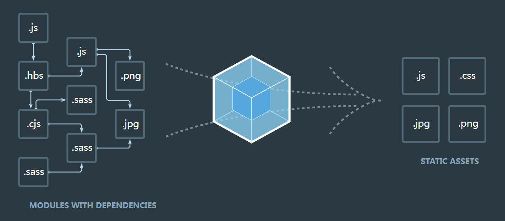
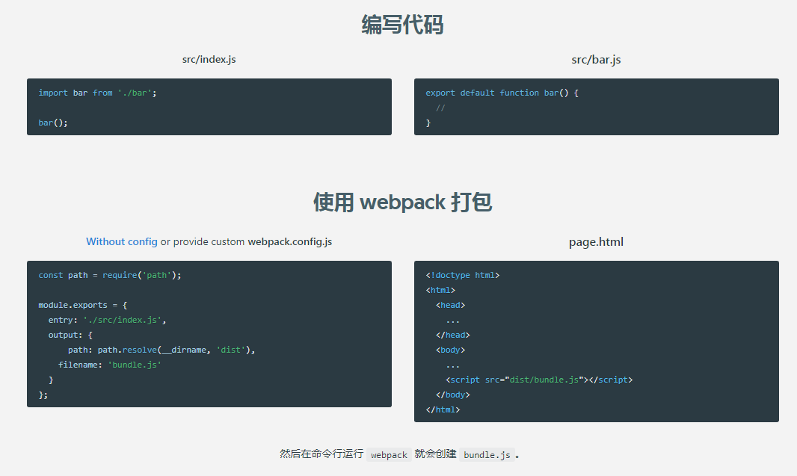

# 第1章 前端环境搭建  


## 1 十次方架构


**架构描述：以Node.js为核心的Vue.js前端技术生态架构**

---


## 2  Node.js

### 2.1 什么是Node.js

简单的说: <u>Node.js 就是运行在**"服务端"**的 JavaScript</u>。
Node.js 是一个基于Chrome JavaScript 运行时建立的一个平台。
Node.js是一个事件驱动I/O服务端JavaScript环境，基于Google的V8引擎，V8引擎执行Javascript的性能非常好。

### 2.2 Node.js安装

1、[官网](https://nodejs.org/en/download/)（本次版本8.11.1）

``` shell
node -v  查看版本
```

### 2.3 快速入门

#### 1 控制台输出

创建demo1.js

```js
var a=1;
var b=2;
console.log(a+b);
```

在当前文件目录下cmd，执行：

```shell
node js文件名
```

#### 2 使用函数

创建demo2.js,并执行

```js
var c=add(100,200);
console.log(c);
function add(a,b){
	return a+b;
}
```

#### 3 模块化编程

创建demo3_1.js（被调用的模块）

```js
exports.add=function(a,b){
	return a+b;
}
```

创建demo3_2.js,并执行

```js
var demo= require('./demo3_1');
console.log(demo.add(400,600));
```

#### 4 创建web服务器

```js
# demo4.js
var http = require('http');//http为node内置的web模块
http.createServer(function (request, response) {
    // 发送 HTTP 头部 
    // HTTP 状态值: 200 : OK
    // 内容类型: text/plain
    response.writeHead(200, {'Content-Type': 'text/plain'});
    // 发送响应数据 "Hello World"
    response.end('Hello World\n');
}).listen(8888);
// 终端打印如下信息
console.log('Server running at http://127.0.0.1:8888/');
```

服务启动后，http://localhost:8888/

#### 5 理解服务端渲染

```js
# demo5.js 将上边的例子写成循环的形式
var http = require('http');
http.createServer(function (request, response) {
    response.writeHead(200, {'Content-Type': 'text/plain'});
	for(var i=0;i<10;i++){
		response.write('Hello World\n');
	}  
	response.end('');	
}).listen(8888);
console.log('Server running at http://127.0.0.1:8888/');
```

右键“查看源代码”发现，并没有我们写的for循环语句，而是直接的10条Hello World ，这就说明这个循环是在服务端完成的，而非浏览器（客户端）来完成。也就是说，在**数据在服务端时已经处理完**，直接输出10条语句发到客户端，这样客户端接收到后是不用做其他js上的运算的。这与JSP很是相似。

#### 6 接收参数

```js
# demo6.js
var http = require('http');
var url = require('url');
http.createServer(function(request, response){
    response.writeHead(200, {'Content-Type': 'text/plain'});
    // 解析 url 参数
    var params = url.parse(request.url, true).query;
    response.write("name:" + params.name);
    response.write("\n");
    response.end();
}).listen(8888);
console.log('Server running at http://127.0.0.1:8888/');
```

# 3 包资源管理器NPM

## 3.1 什么是NPM

npm全称**Node Package Manager**，他是node包管理和分发工具。其实我们可以把NPM理解为前端的Maven .我们通过npm 可以很方便地下载js库，管理前端工程.
最近版本的node.js已经集成了npm工具

```shell
npm -v  #查看当前npm版本
```

## 3.2 NPM命令

### 3.2.1 初始化工程

建立一个空文件夹，执行命令初始化

```sh
npm init
```

按照提示输入相关信息，如果是用默认值则直接回车即可。

name: 项目名称

version: 项目版本号

description: 项目描述

keywords: {Array}关键词，便于用户搜索到我们的项目

最后会生成package.json文件(可手动修改)，这个是包的配置文件，相当于maven的pom.xml

### 3.2.2 本地安装

本地安装即只安装在当前目录。

```shell
# 如安装express模块（node的web框架）
npm install express  # 模块名
```

出现黄色的是警告信息，可以忽略。

在该目录下已经出现了一个**node_modules**文件夹 和**package-lock.json**

node_modules文件夹：用于存放下载的js库（相当于maven的本地仓库）

package-lock.json：是当 node_modules 或 package.json 发生变化时自动生成的文件。这个文件主要功能是确定当前安装的包的依赖，以便后续重新安装的时候生成相同的依赖，而忽略项目开发过程中有些依赖已经发生的更新。

再打开package.json文件，发现刚才下载的express已经添加到依赖列表中了.

关于版本号定义：

```
指定版本：比如1.2.2，遵循“大版本.次要版本.小版本”的格式规定，安装时只安装指定版本。

波浪号（tilde）+指定版本：比如~1.2.2，表示安装1.2.x的最新版本（不低于1.2.2），但是不安装1.3.x。

插入号（caret）+指定版本：比如ˆ1.2.2，表示安装1.x.x的最新版本（不低于1.2.2），但是不安装2.x.x。

latest：安装最新版本。
```

### 3.2.3 全局安装

全局安装会将库安装到你的全局目录下。

```shell
npm root -g  # 查看全局目录位置

# 如 全局安装jQuery模块
npm install jquery -g  # 后面加上 -g即可
```

### 3.2.4 批量下载

根据package.json文件下载js库（**类型maven的pom.xml文件下载jar**）

进入目录（package.json所在的目录）输入命令

```sh
npm install
```

### 3.2.5 淘宝镜像

输入命令，进行全局安装淘宝CNPM镜像。

```shell
npm install -g cnpm --registry=https://registry.npm.taobao.org
cnpm -v #查看cnpm的版本

# 使用cnpm和npm是一样的，只是把npm改成cnpm
cnpm install 需要下载的js库
```

### 3.2.6 运行工程

```sh
npm run dev
#dev：是开发阶段测试运行
#build：是构建编译工程
#lint ：是运行js代码检测 
这些脚本需要在package.json中的script键中定义（默认有）。
```

### 3.2.7 编译工程

```sh
npm run build	#编译后的代码会放在dist文件夹中
```

生成后我们会发现只有个静态页面，和一个static文件夹。

这种工程我们称之为单页Web应用（single page web application，SPA），就是只有一张Web页面的应用，是加载单个HTML 页面并在用户与应用程序交互时动态更新该页面的Web应用程序。

这里**底层其实是调用了webpack来实现打包**的.

# 4 Webpack

## 4.1 什么是Webpack

​	Webpack 是一个**前端资源加载/打包工具**。它将根据模块的依赖关系进行静态分析，然后将这些模块按照指定的规则生成对应的静态资源。Webpack 可以将多种静态资源 js、css、less 转换成一个静态文件，减少了页面的请求。



## 4.2 Webpack安装

```shell
cnpm install webpack -g
cnpm install webpack-cli -g  # webpack的命令界面， 4.0之前不用安装这个
# 安装后查看版本号
webpack -v
```

## 4.3 快速入门



### 4.3.1  JS打包

（1）创建src文件夹，创建bar.js

```js
exports.info=function(str){
   document.write(str);
}
```

（2）src下创建logic.js

```js
exports.add=function(a,b){
	return a+b;
}
```

（3）src下创建main.js

```js
var bar= require('./bar');
var logic= require('./logic');
bar.info( 'Hello world!'+ logic.add(100,200));
```

（4）创建配置文件webpack.config.js  ，该文件与src处于同级目录

```js
var path = require("path");
module.exports = {
	entry: './src/main.js',   // 入口
	output: {
		path: path.resolve(__dirname, './dist'), // webpack打包js文件生成的js文件的位置,__dirname是一个全局参数，表示当前文件夹的文件
		filename: 'bundle.js'  // 文件名
	}
};
```

以上代码的意思是：读取当前目录下src文件夹中的main.js（入口文件）内容，把对应的js文件打包，打包后的文件放入当前目录的dist文件夹下，打包后的js文件名为bundle.js

（5）执行编译命令

```sh
webpack # entry的同级目录下运行
```

执行后查看bundle.js 会发现里面包含了上面两个js文件的内容

（7）创建index.html ,引用bundle.js

```html
<!doctype html>
<html>
  <head>  
  </head>
  <body>   
    <script src="dist/bundle.js"></script>
  </body>
</html>
```

测试调用index.html，会发现有内容输出

### 4.3.2 CSS打包

（1）安装style-loader和 css-loader

**Webpack 本身只能处理 JavaScript 模块**，如果要处理其他类型的文件，就需要使用 loader 进行转换。所以webpack实际上是把**css脚本转换成了js脚本。**

Loader 可以理解为是模块和资源的转换器，它本身是一个函数，接受源文件作为参数，返回转换的结果。这样，我们就可以通过 require 来加载任何类型的模块或文件，比如 CoffeeScript、 JSX、 LESS 或图片。首先我们需要安装相关Loader插件，**css-loader 是将 css 装载到 javascript；style-loader 是让 javascript 认识css**

```sh
cnpm install style-loader css-loader --save-dev # -dev是用来开发环境使用的，区别生产环境
```

（2）修改webpack.config.js

```js
var path = require("path");
module.exports = {
	entry: './src/main.js',
	output: {
		path: path.resolve(__dirname, './dist'),
		filename: 'bundle.js'
	},
	module: {
		rules: [  
            {  
                test: /\.css$/,  
                use: ['style-loader', 'css-loader']
            }  
        ]  
	}
};
```

（3）在src文件夹创建css文件夹,css文件夹下创建css1

```css
body{
 background:red;
}
```

（4）修改main.js ，引入css1.css

```
require('./css1.css');
```

（5）重新运行webpack

（6）运行index.html看看背景是不是变成红色


# 5 开发工具VsCode

### 前端常用插件

``` shell
（1）HTML Snippets # 超级实用且初级的 H5代码片段以及提示
（2）HTML CSS Support # 让 html 标签上写class 智能提示当前项目所支持的样式  新版已经支持scss文件检索
（3）Debugger for Chrome # 让 vscode 映射 chrome 的 debug功能，静态页面都可以用 vscode 来打断点调试.
√（4）vetur # vue框架所需的插件  语法高亮、智能感知、Emmet等
（5）VueHelper # snippet代码片段
```


# 6 ES6

## 6.1 什么是ES6

ECMAScript是由ECMA（一个类似W3C的标准组织）参与进行标准化的语法规范。
编程语言JavaScript是ECMAScript的实现和扩展 。
ECMAScript 6.0（以下简称ES6）是JavaScript语言的下一代标准，2015年6月正式发布。它的目标，是使得JavaScript语言可以用来编写复杂的大型应用程序，成为企业级开发语言。

ECMAScript定义了：

[语言语法](https://developer.mozilla.org/en-US/docs/Web/JavaScript/Reference/Lexical_grammar) – 语法解析规则、关键字、语句、声明、运算符等。

[类型](https://developer.mozilla.org/en-US/docs/Web/JavaScript/Data_structures) – 布尔型、数字、字符串、对象等。

[原型和继承](https://developer.mozilla.org/en-US/docs/Web/JavaScript/Inheritance_and_the_prototype_chain)

内建对象和函数的[标准库](https://developer.mozilla.org/en-US/docs/Web/JavaScript/Reference/Global_Objects) – [JSON](https://developer.mozilla.org/en-US/docs/Web/JavaScript/Reference/Global_Objects/JSON)、[Math](https://developer.mozilla.org/en-US/docs/Web/JavaScript/Reference/Global_Objects/Math)、[数组方法](https://developer.mozilla.org/en-US/docs/Web/JavaScript/Reference/Global_Objects/Array)、[对象自省方法](https://developer.mozilla.org/en-US/docs/Web/JavaScript/Reference/Global_Objects/Object)等。

ECMAScript标准不定义HTML或CSS的相关功能，也不定义类似DOM（文档对象模型）的[Web API](https://developer.mozilla.org/en-US/docs/Web/API)，这些都在独立的标准中进行定义。ECMAScript涵盖了各种环境中JS的使用场景，无论是浏览器环境还是类似[node.js](http://nodejs.org/)的非浏览器环境。

ECMAScript标准的历史版本分别是1、2、3、5。

那么为什么没有第4版？其实，在过去确实曾计划发布提出巨量新特性的第4版，但最终却因想法太过激进而惨遭废除（这一版标准中曾经有一个极其复杂的支持泛型和类型推断的内建静态类型系统）。

ES4饱受争议，当标准委员会最终停止开发ES4时，其成员同意发布一个相对谦和的ES5版本，随后继续制定一些更具实质性的新特性。这一明确的协商协议最终命名为“Harmony”，因此，ES5规范中包含这样两句话

> ECMAScript是一门充满活力的语言，并在不断进化中。
>
> 未来版本的规范中将持续进行重要的技术改进

2009年发布的改进版本ES5，引入了[Object.create()](https://developer.mozilla.org/en-US/docs/Web/JavaScript/Reference/Global_Objects/Object/create)、[Object.defineProperty()](https://developer.mozilla.org/en-US/docs/Web/JavaScript/Reference/Global_Objects/Object/defineProperty)、[getters](https://developer.mozilla.org/en-US/docs/Web/JavaScript/Reference/Functions/get)和[setters](https://developer.mozilla.org/en-US/docs/Web/JavaScript/Reference/Functions/set)、[严格模式](https://developer.mozilla.org/en-US/docs/Web/JavaScript/Reference/Strict_mode)以及[JSON](https://developer.mozilla.org/en-US/docs/Web/JavaScript/Reference/Global_Objects/JSON)对象。


## 6.2 Node.js中使用ES6

ES6+ 有很多高级功能node是不支持的,就需要使用babel转换成ES5

 （1）babel转换配置,项目根目录添加.babelrc 文件

```json
{
  "presets" : ['es2015']
}
```

（2）安装es6转换模块

```
cnpm install babel-preset-es2015 --save-dev
```

（3）全局安装命令行工具

```
cnpm install  babel-cli -g
```

（4）使用

```
babel-node js文件名
```


## 6.3 语法新特性

### 6.3.1 变量声明let

我们都是知道在ES6以前，var关键字声明变量。无论声明在何处，都会被视为声明在函数的最顶部(不在函数内即在全局作用域的最顶部)。这就是**函数变量提升**，例如

```js
  function aa(bool) {
    if(bool) {
        var test = 'hello man'
    } else {
        console.log(test)
    }
  }
```

以上的代码实际上是:

```js
function aa(bool) {
    var test // 变量提升
    if(bool) {
        test = 'hello man'
    } else {
        //此处访问test 值为undefined
        console.log(test)
    }
  }
```


接下来ES6主角登场：

我们通常用let和const来声明，let表示变量、const表示常量。let和const都是**块级作用域**。

```js
 function aa(bool) {
    if(bool) {
       let test = 'hello man'
    } else {
        //test 在此处访问不到，报错
        console.log(test)
    }
  }
```

### 6.3.2 常量声明

const 用于声明常量，看以下代码

```js
const name = 'lux'
name = 'joe' //再次赋值此时会报错
```

### 6.3.3 模板字符串

es6模板字符简直是开发者的福音啊，解决了ES5在字符串功能上的痛点。

第一个用途，基本的字符串格式化。将表达式嵌入字符串中进行拼接。用${}来界定。

```js
    //es5 
    var name = 'lux'
    console.log('hello' + name)
    //es6
    const name = 'lux'
    console.log(`hello ${name}`) //hello lux
```

第二个用途，在ES5时我们通过反斜杠(\)来做多行字符串或者字符串一行行拼接。ES6反引号(``)直接搞定。

```js
    // es5
    var msg = "Hi \
    man!"
    // es6
    const template = `<div>
        <span>hello world</span>
    </div>`
```

### 6.3.4 函数默认参数

ES6为参数提供了默认值。在定义函数时便初始化了这个参数，以便在参数没有被传递进去时使用。

看例子代码

```js
    function action(num = 200) {
        console.log(num)
    }
    action() //200
    action(300) //300
```

### 6.3.5 箭头函数

ES6很有意思的一部分就是函数的快捷写法。也就是箭头函数。

箭头函数最直观的三个特点。

1不需要function关键字来创建函数

2省略return关键字

3继承当前上下文的 this 关键字

看下面代码（ES6）

```js
 (response,message) => {
    .......
 }
```

相当于ES5代码

```js
function(response,message){
    ......
}
```

### 6.3.6 对象初始化简写

ES5我们对于对象都是以键值对的形式书写，是有可能出现键值对重名的。例如

```js
function people(name, age) {
        return {
            name: name,
            age: age
        };
    }
```

以上代码可以简写为

```
  function people(name, age) {
        return {
            name,
            age
        };
    }
```

### 6.3.7 解构

数组和对象是JS中最常用也是最重要表示形式。为了简化提取信息，ES6新增了解构，这是将一个数据结构分解为更小的部分的过程

ES5我们提取对象中的信息形式如下

```js
    const people = {
        name: 'lux',
        age: 20
    }
    const name = people.name
    const age = people.age
    console.log(name + ' --- ' + age)
```

是不是觉得很熟悉，没错，在ES6之前我们就是这样获取对象信息的，一个一个获取。现在，ES6的解构能让我们从对象或者数组里取出数据存为变量，例如

```js
//对象
    const people = {
        name: 'lux',
        age: 20
    }
    const { name, age } = people
    console.log(`${name} --- ${age}`)
    //数组
    const color = ['red', 'blue']
    const [first, second] = color
    console.log(first) //'red'
    console.log(second) //'blue'
```

### 6.3.8 Spread Operator

ES6中另外一个好玩的特性就是Spread Operator 也是三个点儿...接下来就展示一下它的用途。 组装对象或者数组

```js
    //数组
    const color = ['red', 'yellow']
    const colorful = [...color, 'green', 'pink']
    console.log(colorful) //[red, yellow, green, pink]
    
    //对象
    const alp = { fist: 'a', second: 'b'}
    const alphabets = { ...alp, third: 'c' }
    console.log(alphabets) //{ "fist": "a", "second": "b", "third": "c"
```

### 6.3.9 import 和 export

import导入模块、export导出模块

lib.js

```js
let fn0=function(){
    console.log('fn0...');
}
export {fn0}
```

demo9.js

```js
import {fn0} from './lib'
fn0();
```

注意：node(v8.x)本身并不支持import关键字，所以我们需要使用babel的命令行工具来执行（配置详见6.2小节内容）

```
babel-node demo9
```


