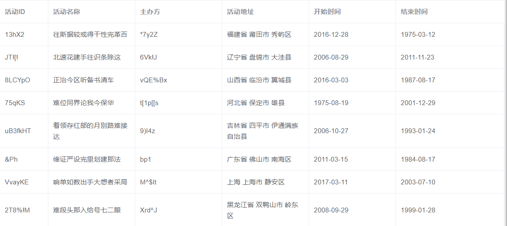
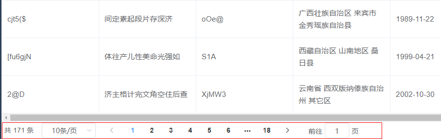
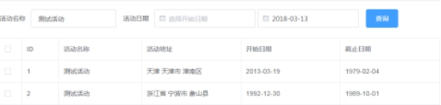
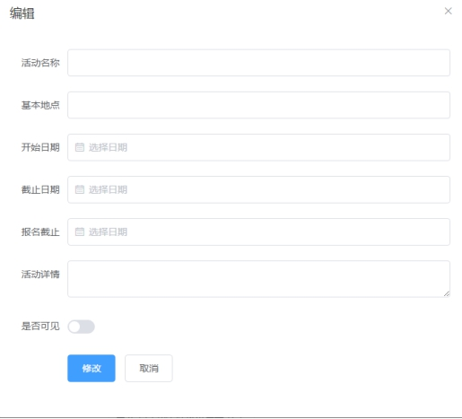
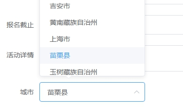
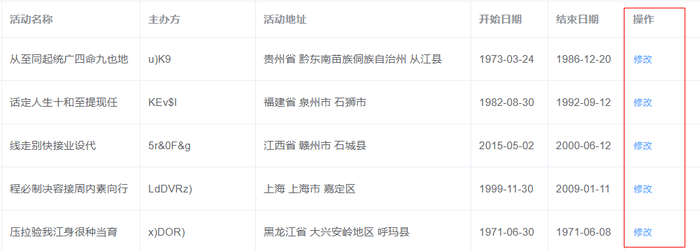

# 第3章-使用ElementUI开发管理后台-1  

学习目标：

- 掌握elementUI提供的脚手架搭建管理后台的方法

- 掌握elementUI的table组件的使用，实现列表功能

- 掌握elementUI的pagination组件的使用，实现分页功能

- 掌握elementUI的form相关组件的使用，实现条件查询功能

- 掌握elementUI的dialog组件和$message的使用，实现弹出窗口和消息提示功能

- 掌握elementUI的select组件的使用，实现下拉列表功能

- 实现新增数据和修改数据的功能

- 掌握confirm的使用，实现询问框，实现删除功能


# 1 管理后台搭建

我们的十次方管理后台就采用ElementUI来进行搭建.

## 1.1 什么是ElementUI

Element  饿了么前端出品的一套 Vue.js 后台组件库

官网： [http://element.eleme.io/#/zh-CN](http://element.eleme.io/#/zh-CN)

 

## 1.2 神奇的脚手架

### 1.2.1 快速搭建

​        官网上提供了非常基础的脚手架，如果我们使用官网的脚手架需要自己写很多代码比如登陆界面、主界面菜单等内容。 课程已经提供了功能完整的脚手架，我们可以拿过来在此基础上开发，这样可以极大节省我们开发的时间。

（1）解压vueAdmin-template-master

（2）在命令提示符进入该目录，输入命令：

```
cnpm install
```

这样下载安装所有的依赖，几分钟后下载完成。

（3）输入命令：

```
npm run dev
```

运行后自动弹出浏览器。

### 1.2.2 了解工程结构

以下是主要的目录结构：

| 目录名称       | 存储内容     |
| ---------- | -------- |
| build      | 构建工程相关脚本 |
| config     | 配置相关     |
| src        | 工程源码     |
| static     | 静态资源     |
| src/api    | 访问后端API  |
| src/utils  | 工具类      |
| src/views  | 页面       |
| src/router | 路由       |
|            |          |


## 1.3 项目初始化

### 1.3.1 关闭语法规范性检查

修改config/index.js ，将useEslint的值改为false。

此配置作用:  是否开启语法检查，语法检查是通过ESLint 来实现的。

我们现在科普一下,什么是ESLint :   ESLint 是一个语法规则和代码风格的检查工具，可以用来保证写出语法正确、风格统一的代码。如果我们开启了Eslint , 也就意味着要接受它非常苛刻的语法检查，包括空格不能少些或多些，必须单引不能双引，语句后不可以写分号等等，这些规则其实是可以设置的。我们作为前端的初学者，最好先关闭这种校验，否则会浪费很多精力在语法的规范性上。如果以后做真正的企业级开发，建议开启。

### 1.3.2 国际化设置

打开main.js  找到这句代码

```
import locale from 'element-ui/lib/locale/lang/en'
```

我们将en修改为zn-CN

```
import locale from 'element-ui/lib/locale/lang/zh-CN'
```

修改后组件都是按照中文的习惯展示

### 1.3.3 与easy-mock对接

（1）修改config下的dev.env.js中的BASE_API为easy-mock的Base URL

```js
....
BASE_API: '"http://192.168.184.133:7300/mock/5af314a4c612520d0d7650c7"',
....
```

（2）easy-mock添加登陆认证模拟数据

地址： /user/login

提交方式：post

内容：

```json
{
  "code": 20000,
  "data": {
    "token": "admin"
  }
}
```

（3）添加返回用户信息url模拟数据

地址：/user/info

提交方式：get

内容：

```json
{
  "code": 20000,
  "data": {
    "roles": ["admin"],
    "role": ["admin"],
    "name": "admin",
    "avatar": "https://wpimg.wallstcn.com/f778738c-e4f8-4870-b634-56703b4acafe.gif"
  }
}
```

### 1.3.4 更改标题与菜单

（1）修改index.html里的标题为"十次方后台管理系统"，修改后浏览器自动刷新。

这就是脚手架中已经为我们添加了热部署功能。

（2）修改src/router 下的index.js 中constantRouterMap的内容

```js
export const constantRouterMap = [
  { path: '/login', component: () => import('@/views/login/index'), hidden: true },
  { path: '/404', component: () => import('@/views/404'), hidden: true },
  {
    path: '/',
    component: Layout,
    redirect: '/dashboard',
    name: 'Dashboard',
    hidden: true,
    children: [{
      path: 'dashboard',
      component: () => import('@/views/dashboard/index')
    }]
  },
  {
    path: '/example',
    component: Layout,
    redirect: '/example/table',
    name: 'Example',
    meta: { title: '基本信息管理', icon: 'example' },
    children: [
      {
        path: 'table',
        name: 'Table',
        component: () => import('@/views/table/index'),
        meta: { title: '城市管理', icon: 'table' }
      },
      {
        path: 'tree',
        name: 'Tree',
        component: () => import('@/views/tree/index'),
        meta: { title: '标签管理', icon: 'tree' }
      }
    ]
  },
  {
    path: '/form',
    component: Layout,
    name: 'Example2',
    meta: { title: '活动管理', icon: 'example' },
    children: [
      {
        path: 'index',
        name: 'Form',
        component: () => import('@/views/form/index'),
        meta: { title: '活动管理', icon: 'form' }
      }
    ]
  },
  { path: '*', redirect: '/404', hidden: true }
]
```


# 2 活动管理-列表

## 2.1 需求分析

实现活动管理的列表页，包括分页，条件查询。


## 2.2 表格组件

我们在这一环节先实现一个简单的列表，如下图所示：



准备工作：我们将swaggerAPI同步到easyMock   然后修改/gathering/gathering  （ GET方法）的内容

```json
{
  "code": 20000,
  "flag": true,
  "message": "@string",
  "data|10": [{
    "id": "@string",
    "name": "@cword(8,12)",
    "summary": "@cword(20,40)",
    "detail": "@cword(20,40)",
    "sponsor": "@string",
    "image": "@image",
    "starttime": "@date",
    "endtime": "@date",
    "address": "@county(true)",
    "enrolltime": "@date",
    "state": "@string",
    "city": "@string"
  }]
}
```

代码实现步骤：

（1）在src/api创建gathering.js

```js
import request from "@/utils/request"
export default {
    getList(){
        return request({
            url:'/gathering/gathering',
            method:'get'
        })
    }
}
```

（2）创建gathering.vue中  ，编写脚本部分

```js
<template>
  
</template>
<script>
import gatheringApi from '@/api/gathering'
export default {
    data(){
      return {
          list:[]
      }  
    },
    created(){
        this.fetchData();
    },
    methods:{
        fetchData(){
           gatheringApi.getList().then(response => {
                this.list=response.data
           });
        }
    }
}
</script>
```

（3）修改gathering.vue，编写html代码部分

```html
<template>
  <el-table :data="list" border style="width: 100%">
    <el-table-column  prop="id"  label="活动ID"   width="180"></el-table-column>
    <el-table-column  prop="name"  label="活动名称"  width="180"></el-table-column>
    <el-table-column  prop="sponsor"  label="主办方"  width="180"></el-table-column>
    <el-table-column  prop="address"  label="活动地址"   width="180"></el-table-column>
    <el-table-column  prop="starttime"  label="开始日期"  width="180"></el-table-column>
    <el-table-column  prop="endtime"   label="结束日期"   width="180"></el-table-column>
  </el-table>
</template>
```

table组件的属性

| 参数   | 说明    | 类型    | 可选值  | 默认值  |
| ---- | ----- | ----- | ---- | ---- |
| data | 显示的数据 | array | —    | —    |

table-column组件的属性

| 参数    | 说明                          | 类型     | 可选值  | 默认值  |
| ----- | --------------------------- | ------ | ---- | ---- |
| label | 显示的标题                       | string | —    | —    |
| prop  | 对应列内容的字段名，也可以使用 property 属性 | string | —    | —    |
| width | 对应列的宽度                      | string | —    | —    |

以上属性为我们代码中使用到的属性，其他属性请查阅官方文档.

http://element-cn.eleme.io/#/zh-CN/component/table

## 2.3 分页组件

我们已经通过表格组件完成了列表的展示，接下来需要使用分页组件完成分页功能

 

准备工作：修改接口/gathering/gathering/search/{page}/{size}   method:POST

```json
{
  "code": 20000,
  "flag": true,
  "message": "@string",
  "data": {
    "total": "@integer(100,200)",
    "rows|10": [{
      "id": "@string",
      "name": "@cword(8,12)",
      "summary": "@cword(20,40)",
      "detail": "@cword(20,40)",
      "sponsor": "@string",
      "image": "@image",
      "starttime": "@date",
      "endtime": "@date",
      "address": "@county(true)",
      "enrolltime": "@date",
      "state": "1",
      "city": "@string"
    }]
  }
}
```

代码实现：

（1）修改src/api/gathering.js，增加方法导出

```js
    search(page,size,searchMap) {
        return request({
            url: `/gathering/gathering/search/${page}/${size}`,
            method: 'post',
            data: searchMap
        })
    }
```

（2）修改src/views/table/gathering.vue，编写脚本部分  

```js
import gatheringApi  from '@/api/gathering'
export default {
   data(){
     return {
         list:[],
         total:0,//总记录数
         currentPage:1,//当前页
         pageSize:10,//每页大小
         searchMap: {}//查询表单绑定变量
     }  
   },
   created(){
      this.fetchData()
   },
   methods:{
       fetchData(){
           gatheringApi.search(this.currentPage,this.pageSize,this.searchMap).then( response =>{
               this.list=response.data.rows
               this.total=response.data.total
           })
       }
   }
}
```

（3）修改src/views/table/gathering.vue，增加分页栏

```html
<template>
<div>
  <el-table :data="list" border style="width: 100%">
    <el-table-column  prop="id"  label="活动ID"   width="180"></el-table-column>
    <el-table-column  prop="name"  label="活动名称"  width="180"></el-table-column>
    <el-table-column  prop="sponsor"  label="主办方"  width="180"></el-table-column>
    <el-table-column  prop="address"  label="活动地址"   width="180"></el-table-column>
    <el-table-column  prop="starttime"  label="开始日期"  width="180"></el-table-column>
    <el-table-column  prop="endtime"   label="结束日期"   width="180"></el-table-column>
  </el-table>
  <el-pagination
      @size-change="fetchData"
      @current-change="fetchData"
      :current-page="currentPage"
      :page-sizes="[5, 10, 20]"
      :page-size="pageSize"
      layout="total, sizes, prev, pager, next, jumper"
      :total="total">
  </el-pagination>
</div>
</template>
```

currentPage为当前页 ， total为总记录数

注意：template里面要求必须有唯一的跟节点，我们这里用div将表格和分页控件包起来。

pagination的常用属性：

| 参数           | 说明                | 类型       | 可选值                                      | 默认值                                    |
| ------------ | ----------------- | -------- | ---------------------------------------- | -------------------------------------- |
| page-size    | 每页显示条目个数          | Number   | —                                        | 10                                     |
| total        | 总条目数              | Number   | —                                        | —                                      |
| current-page | 当前页数，支持 .sync 修饰符 | Number   | —                                        | 1                                      |
| layout       | 组件布局，子组件名用逗号分隔    | String   | `sizes`, `prev`, `pager`, `next`, `jumper`, `->`, `total`, `slot` | 'prev, pager, next, jumper, ->, total' |
| page-sizes   | 每页显示个数选择器的选项设置    | Number[] | —                                        | [10, 20, 30, 40, 50, 100]              |

pagination的常用事件：

| 事件名称           | 说明                 | 回调参数 |
| -------------- | ------------------ | ---- |
| size-change    | pageSize 改变时会触发    | 每页条数 |
| current-change | currentPage 改变时会触发 | 当前页  |

更多属性方法事件请查看官方文档：http://element-cn.eleme.io/#/zh-CN/component/pagination

## 2.4 条件查询

需求：在分页列表的基础上实现条件查询功能



代码实现：

修改src/views/table/gathering.vue，增加查询表单

```html
        <!--查询表单-->
        <el-form :inline="true" class="demo-form-inline">
          <el-form-item label="活动名称">
            <el-input v-model="searchMap.name" placeholder="活动名称"></el-input>
          </el-form-item>
          <el-form-item label="活动日期" >
            <el-date-picker  type="date" placeholder="选择开始日期" v-model="searchMap.starttime_1" ></el-date-picker>
            <el-date-picker  type="date" placeholder="选择截止日期" v-model="searchMap.starttime_2" ></el-date-picker>
          </el-form-item>
          <el-button type="primary" @click="fetchData()">查询</el-button>
        </el-form>
```

form（表单）组件属性详见官方文档：http://element-cn.eleme.io/#/zh-CN/component/form

input（文本框）组件属性详见官方文档：http://element-cn.eleme.io/#/zh-CN/component/input

date-picker（日期框）组件属性详见官方文档：http://element-cn.eleme.io/#/zh-CN/component/date-picker

# 3 活动管理-增加

## 3.1 需求分析

界面中加入"新增"按钮，点击弹出编辑窗口



点击“修改”按钮，关闭窗口并刷新表格，弹出提示（成功或失败）

## 3.2 弹出窗口

（1）修改src/api/gathering.js，在template中增加对话框组件

```html
<el-dialog  title="活动编辑" :visible.sync="dialogFormVisible" >

</el-dialog>
```

属性title为对话框标题，  visible为是否显示。

（2）变量dialogFormVisible用于控制对话框的显示。我们在脚本代码中定义

```js
data(){
     return {
        .....
        dialogFormVisible: false //对话框是否显示
     }  
}
```

（3）template中增加按钮，用于打开对话框

```html
<el-button type="primary" @click="dialogFormVisible = true">新增</el-button>
```

dialog属性详见官方文档：http://element-cn.eleme.io/#/zh-CN/component/dialog

## 3.3 编辑表单

修改src/views/table/gathering.vue，在弹出窗口添加编辑表单

```html
 <el-dialog title="编辑" :visible.sync="dialogFormVisible">
    <el-form label-width="80px">
      <el-form-item label="活动名称">
          <el-input v-model="pojo.name" placeholder="活动名称"></el-input>
      </el-form-item>
      <el-form-item label="基本地址">
          <el-input v-model="pojo.address"  placeholder="基本地址"></el-input>
      </el-form-item>
      <el-form-item label="开始日期">
          <el-date-picker type="date"  v-model="pojo.starttime" placeholder="开始日期"></el-date-picker>
      </el-form-item>
      <el-form-item label="截至日期">
          <el-date-picker type="date" v-model="pojo.endtime"  placeholder="截至日期"></el-date-picker>
      </el-form-item>
      <el-form-item label="报名截止">
          <el-date-picker type="date" v-model="pojo.enrolltime"  placeholder="报名截止"></el-date-picker>
      </el-form-item>
      <el-form-item label="活动详情">
         <el-input v-model="pojo.detail" placeholder="活动详情" type="textarea"  :rows="2"></el-input>
      </el-form-item>
       <el-form-item label="是否可见">
         <el-switch active-value="1" inactive-value="0" v-model="pojo.status"></el-switch>
      </el-form-item>
      <el-form-item>
        <el-button type="primary" >保存</el-button>
        <el-button @click="dialogFormVisible = false" >关闭</el-button>
      </el-form-item>
    </el-form>
  </el-dialog>
```

这里我们主要要掌握多行文本编辑框与开关组件switch的使用

## 3.4 下拉选择框

需求：在新增窗口实现城市下拉选择框

 

我们这里需要使用elementUI提供的下拉选择框

准备工作：修改easyMock 中的/base/city  (GET)  

```json
{
  "flag": true,
  "code": 20000,
  'message': "查询成功",
  'data|10': [{
    "id|+1": 1,
    "name": "@city",
    "ishot": "1",
  }]
}
```

代码实现

（1）创建src/api/city.js

```js
import request from '@/utils/request'
export default {
  getList(){
    return request({
      url: '/base/city',
      method: 'get'
    })
  }
}
```

（2）修改src/views/table/gathering.vue的js脚本部分

为data添加属性

```js
cityList: []
```

引入城市API

```js
import cityApi from '@/api/city'
```

修改created，增加对城市方法的调用

```js
    created() {
      this.fetchData()
      cityApi.getList().then(response =>{
        this.cityList = response.data
      })
    }
```

（3）修改src/views/table/gathering.vue，增加城市下拉框

```html
           <el-form-item label="城市">
              <el-select v-model="pojo.city" placeholder="请选择">
                <el-option
                  v-for="item in cityList"
                  :key="item.id"
                  :label="item.name"
                  :value="item.id">
                </el-option>
              </el-select>
            </el-form-item>
```


## 3.5 表单提交

（1）修改easymock中的/gathering/gathering （增加活动   POST）

```JSON
{
  "flag": true,
  "code": 20000,
  'message': "执行成功"
}
```

（2）修改src/api/gathering.js，增加方法导出

```js
  save(pojo) {
    return request({
      url: `/gathering/gathering`,
      method: 'post',
      data: pojo
    })
  }
```

（3）修改src/views/table/gathering.vue的js脚本部分   增加方法执行保存

```js
       handleSave(){
         gatheringApi.save(this.pojo).then(response=>{
           alert(response.message)
           if(response.flag){//如果成功
              this.fetchData()//刷新列表
           }           
         })
         this.dialogFormVisible=false//关闭窗口
       }
```

（4）修改弹出框中的“保存”按钮，调用保存方法

```html
<el-button type="primary" @click="handleSave()">保存</el-button>
```


# 4 活动管理-修改

## 4.1 需求分析

在表格的操作列增加"修改"按钮，点击修改按钮弹出窗口并显示数据，点击保存按钮保存修改并刷新表格。



## 4.2 根据ID加载数据

准备工作：修改easymock 接口 /gathering/gathering/{id}   （GET）

```JSON
{
  "flag": true,
  "code": 20000,
  'message': "查询成功",
  'data': {
    "id": "1",
    "name": "测试活动",
    "sponsor": "主办方",
    "image": "@image",
    "starttime": "@date",
    "endtime": "@date",
    "address": "@county(true)",
    "enrolltime": "@date",
    "state": "1"
  }
}
```

代码实现：

（1）修改src/api/gathering.js，增加方法定义

```js
  findById(id) {
    return request({
      url: `/gathering/gathering/${id}`,
      method: 'get'
    })
  }
```

（2）修改src/views/table/gathering.vue的js脚本部分

新增handleEdit方法

```js
handleEdit(id){
         this.dialogFormVisible=true//打开窗口        
          //调用查询
         gatheringApi.findById(id).then( response=>{
            if(response.flag){
                this.pojo=response.data
            }            
         })                     
 }
```

（3）在表格table中增加模板列  ,模板列中防止修改按钮，调用handleEdit方法 

```html
<el-table-column
      fixed="right"
      label="操作"
      width="100">
  <template slot-scope="scope">
  <el-button @click="handleEdit(scope.row.id)" type="text" size="small">修改</el-button>
  </template>
</el-table-column>
```

fixed="right"的作用是定义此列为右固定列  

slot-scope用于指定当前行的上下文。使用scope.row可以获取行对象

## 4.3 新增窗口表单清空

测试：我们在点开修改后，关闭窗口，再次新增打开窗口，会发现表单里依然有数据。这样显然是不行的。所以我们要在点击新增时清空表单。这个逻辑我们我们在handleEdit方法中实现

```js
handleEdit(id){
         this.dialogFormVisible=true//打开窗口
         if(id!=''){
          //调用查询
          gatheringApi.findById(id).then( response=>{
            if(response.flag){
                this.pojo=response.data
            }            
          }) 
         }else{
           this.pojo={}//清空表单 
         }               
 }
```

修改新增按钮，调用handleEdit方法时传递空字符串

```html
<el-button type="primary" @click="handleEdit('')">新增</el-button>
```

## 4.4 保存修改

准备工作：修改easymock 接口 /gathering/gathering/{id} （PUT）

```json
{
  "flag": true,
  "code": 20000,
  'message': "修改成功"
}
```

代码：

（1）修改src/api/gathering.js，增加方法定义

```js
  update(id,pojo) {
    return request({
      url: `/gathering/gathering/${id}`,
      method: 'put',
      data: pojo
    })
  }
```

（2）修改src/views/table/gathering.vue的js脚本部分

增加属性id

```js
   data(){
     return {
		 ......
         id:''//当前编辑的ID
     }  
   }
```

修改handleEdit,增加

```js
this.id=id
```

修改方法handleSave

```js
       handleSave(){
         if(this.id!=''){//修改
            gatheringApi.update(this.id,this.pojo).then(response=>{
              alert(response.message)
              if(response.flag){//如果成功
                  this.fetchData()//刷新列表
              }           
            })
         }else{//新增
            gatheringApi.save(this.pojo).then(response=>{
              alert(response.message)
              if(response.flag){//如果成功
                  this.fetchData()//刷新列表
              }           
            })
         }        
         this.dialogFormVisible=false//关闭窗口
       }
```

以上代码我们可以做一下优化：

修改src/api/gathering.js

```js
    update(id,pojo){
        if(id == null || id == ''){
            return save(pojo)
        }
        return request({
            url: `/gathering/gathering/${id}`,
            method: 'put',
            data: pojo
        })
    }
```

修改src/views/table/gathering.vue的handleSave

```js
       handleSave(){       
          gatheringApi.update(this.id,this.pojo).then(response=>{
            alert(response.message)
            if(response.flag){//如果成功
                this.fetchData()//刷新列表
            }           
          })          
         this.dialogFormVisible=false//关闭窗口
       }
```

## 4.5 消息提示框

js原生的alert简直是丑爆了，有没有更漂亮的弹出框呀！当然有，用了elementUI提供了消息提示框，真是美呆了！   alert(response.message)可以替换为以下代码：

```js
this.$message({
    message: response.message,
    type: (response.flag?'success':'error')
});
```

$message详见官方文档：http://element-cn.eleme.io/#/zh-CN/component/message

你可以尝试着参照文档做出更丰富的效果哦~

# 5 活动管理-删除

## 5.1 需求分析

在表格的操作列增加”删除“按钮，点击删除按钮弹出提示框，确定后执行删除并刷新表格。

## 5.2 EasyMock接口

URL:gathering/:id     Method: delete

```json
{
  "flag": true,
  "code": 20000,
  'message': "执行成功"
}
```

## 5.3 代码实现

（1）修改src/api/gathering.js，增加方法定义

```js
    deleteById(id){
        return request({
            url: `/gathering/gathering/${id}`,
            method: 'delete'
        }) 
    }
```

（2）修改src/views/table/gathering.vue的js脚本部分

增加方法

```js
      handleDelete(id){        
        this.$confirm('确定要删除此纪录吗?', '提示', {
          confirmButtonText: '确定',
          cancelButtonText: '取消',
          type: 'warning'
        }).then(() => {          
          gatheringApi.deleteById(id).then(response=>{
            this.$message({
               message: response.message,
              type: (response.flag?'success':'error')
            })  
            if(response.flag){
              this.fetchData()// 刷新数据
            }
         })
        }).catch(() => {                
        });
     }
```

（3）修改src/views/table/gathering.vue ，在操作列增加删除按钮

```html
<el-button @click="handleDelete(scope.row.id)" type="text" size="small">删除</el-button>
```

# 6 代码优化

我们看一下现在的API代码

```js
import request from "@/utils/request"
export default {
    getList(){
        return request(
            {
                url:'/gathering/gathering',
                method:'get'
            }
        );
    },
    search(page,size,searchMap){
        return request(
            {
                url: `/gathering/gathering/search/${page}/${size}`,
                method: 'post',
                data: searchMap
            }
        );
    },
    save(pojo){
        return request({
            url: `/gathering/gathering`,
            method: 'post',
            data: pojo
        })
    },
    findById(id){
        return request({
            url: `/gathering/gathering/${id}`,
            method: 'get'
        })     
    },
    update(id,pojo){
        if(id==null || id==''){
            return this.save(pojo)
        }
        return request({
            url: `/gathering/gathering/${id}`,
            method: 'put',
            data: pojo
        }) 
    },
    deleteById(id){
        return request({
            url: `/gathering/gathering/${id}`,
            method: 'delete'
        }) 
    }
}
```

这里面的url地址都是一样的，如果以后地址发生了变化，需要逐个修改，不利于维护，所以我们这里把此字符串提取出来定义为常量，运用es6的模板字符串特性来进行拼接即可。

修改后代码如下：

```js
import request from "@/utils/request"
const group_name='gathering'
const api_name='gathering'
export default {
    getList(){
        return request(
            {
                url:`/${group_name}/${api_name}`,
                method:'get'
            }
        );
    },
    search(page,size,searchMap){
        return request(
            {
                url: `/${group_name}/${api_name}/search/${page}/${size}`,
                method: 'post',
                data: searchMap
            }
        );
    },
    save(pojo){
        return request({
            url: `/${group_name}/${api_name}`,
            method: 'post',
            data: pojo
        })
    },
    findById(id){
        return request({
            url: `/${group_name}/${api_name}/${id}`,
            method: 'get'
        })     
    },
    update(id,pojo){
        if(id==null || id==''){
            return this.save(pojo)
        }
        return request({
            url: `/${group_name}/${api_name}/${id}`,
            method: 'put',
            data: pojo
        }) 
    },
    deleteById(id){
        return request({
            url: `/${group_name}/${api_name}/${id}`,
            method: 'delete'
        }) 
    }
}
```


