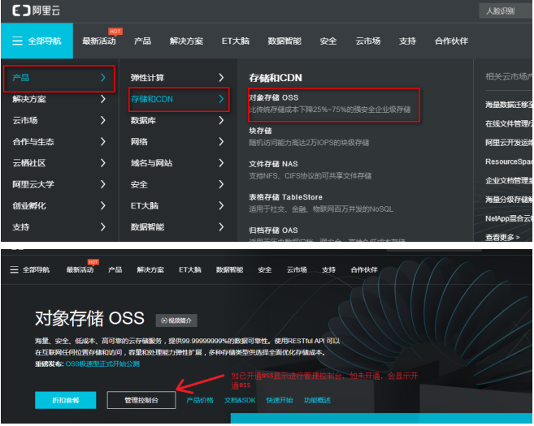
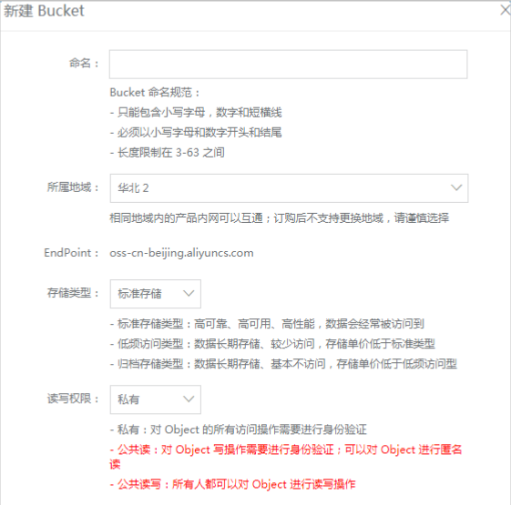

# 第7章 网站前台-吐槽与问答  

学习目标：

- 完成吐槽列表与详细页
- 完成发吐槽与评论功能，掌握富文本编辑器的使用
- 完成问答频道功能
- 掌握DataURL和阿里云OSS


# 1 吐槽列表与详细页

## 1.1 吐槽列表页

### 1.1.1 吐槽列表页数据渲染

吐槽列表页已经构建，我们现在来实现数据的渲染

（1）easyMock模拟数据

URL: spit/spit/search/{page}/{size}

Method: post

```JSON
{
  "code": 20000,
  "flag": true,
  "message": "查询成功",
  "data": {
    "total": "@integer(60, 100)",
    "rows|10": [{
      "id": "@string",
      "content": "@cword(100,300)",
      "publishtime": "@datetime",
      "userid": "@string",
      "nickname": "小雅",
      "visits": "@integer(60, 100)",
      "thumbup": "@integer(60, 100)",
      "share": "@integer(60, 100)",
      "comment": "@integer(60, 100)",
      "state": "@string",
      "parentid": "@string"
    }]
  }
}
```

（2）api目录下创建spit.js

```js
import request from '@/utils/request'
const group_name = 'spit'
const api_name = 'spit'
export default {
    search(page, size, searchMap) {
        return request({
          url: `/${group_name}/${api_name}/search/${page}/${size}`,
          method: 'post',
          data: searchMap
        })
    }
}
```

（3）修改pages/spit/index.vue

```html
<template>
    <div>
   <div class="wrapper tag-item"> 
    <div class="fl left-list"> 
     <div class="tc-data-list"> 
      <div class="tc-list"> 
       <ul class="detail-list"> 
        <li class="qa-item" v-for="(item,index) in items" :key="index"> 
         <div class="fl record"> 
          <div class="number"> 
           <div class="border useful"> 
            <p class="usenum"><a href="#" class="zan"><i class="fa fa-thumbs-up " aria-hidden="true"></i></a></p> 
            <p class="zannum"> {{item.thumbup}} </p> 
           </div> 
           <div class="border answer"> 
            <a href="#" class="star"><i class="fa fa-star-o" aria-hidden="true"></i></a> 
           </div> 
          </div> 
         </div> 
         <div class="info"> 
          <p class="text"> <a href="~/assets/spit-detail.html" target="_blank"> {{item.content}} </a> </p> 
          <div class="other"> 
           <div class="fl date"> 
            <span>{{item.publishtime}}</span> 
           </div> 
           <div class="fr remark"> 
            <a href="#" data-toggle="modal" data-target="#shareModal" class="share"><i class="fa fa-share-alt" aria-hidden="true"></i> 分享</a> 
            <a href="#" data-toggle="modal" data-target="#remarkModal" class="comment"><i class="fa fa-commenting" aria-hidden="true"></i> 回复</a> 
           </div> 
          </div> 
         </div> 
         <div class="clearfix"></div> </li>  
       </ul> 
       <div class="modal fade" id="shareModal" tabindex="-1" role="dialog" aria-labelledby="myModalLabel"> 
        <div class="modal-dialog" role="document"> 
         <div class="modal-content"> 
          <div class="modal-header"> 
           <button type="button" class="close" data-dismiss="modal" aria-label="Close"><span aria-hidden="true">&times;</span></button> 
           <h4 class="modal-title" id="myModalLabel">分享到</h4> 
          </div> 
          <div class="modal-body" style="overflow:hidden"> 
           <div class="jiathis_style_32x32"> 
            <a class="jiathis_button_qzone"></a> 
            <a class="jiathis_button_tsina"></a> 
            <a class="jiathis_button_weixin"></a> 
            <a class="jiathis_button_cqq"></a> 
           </div> 
          </div> 
         </div> 
        </div> 
       </div> 
       <div class="modal fade" id="remarkModal" tabindex="-1" role="dialog" aria-labelledby="myModalLabel"> 
        <div class="modal-dialog" role="document"> 
         <div class="modal-content"> 
          <div class="modal-header"> 
           <button type="button" class="close" data-dismiss="modal" aria-label="Close"><span aria-hidden="true">&times;</span></button> 
           <h4 class="modal-title" id="myModalLabel">发表评论</h4> 
          </div> 
          <div class="modal-body"> 
           <div class="comment"> 
            <span class="who">匿名评论</span>: 今天入职腾讯，产品岗，普通非985211大学，上家是不到五十人创业小公司！16年毕业！找内推腾讯给的面试机会，五轮面试！可能是我把运气攒一起了！ 
           </div> 
           <div class="form"> 
            <textarea class="form-control" rows="5" placeholder="匿名评论"></textarea> 
            <div class="remark"> 
             <button class="sui-btn btn-info">发表</button> 
            </div> 
           </div> 
          </div> 
         </div> 
        </div> 
       </div> 
      </div> 
     </div> 
    </div> 
    <div class="fl right-tag"> 
     <div class="block-btn"> 
      <p>来个匿名吐槽，发泄一下你心中的怒火吧！</p> 
      <a class="sui-btn btn-block btn-share" href="~/assets/spit-submit.html" target="_blank">发吐槽</a> 
     </div> 
    </div> 
    <div class="clearfix"></div> 
   </div>
    </div>
</template>
<script>
import '~/assets/css/page-sj-spit-index.css'
import spitApi from '@/api/spit'
export default {
    asyncData(){
        return spitApi.search(1,10, {state:'1'} ).then( res=> {
            return {items:res.data.data.rows}
        })
    }
}
</script>
```

### 1.1.2 吐槽列表瀑布流

修改页面pages/spit/index.vue

```html
 <div class="tc-list" v-infinite-scroll="loadMore" >
```

修改pages/spit/index.vue ,添加pageNo用于记录页码   增加方法

```js
    data(){
        return {
            pageNo: 1
        }
    },
    methods:{
        loadMore(){
           this.pageNo++ 
           spitApi.search( this.pageNo,10,{state:'1'} ).then( res=>{
               this.items=this.items.concat( res.data.data.rows  )
           })
        }
    }
```

## 1.2 吐槽详情页

### 1.2.1 构建吐槽详情页

（1）根据spit-detail.html创建pages/spit/_id.vue ，内容略

（2）修改pages/spit/index.vue 页面链接

```HTML
<router-link :to="'/spit/'+item.id"> {{item.content}} </router-link>
```

### 1.2.2 吐槽详情页数据渲染

（1）easyMock模拟数据

URL: spit/spit/{id}

Methos:  GET

```JSON
{
  "code": 20000,
  "flag": true,
  "message": "@string",
  "data": {
    "id": "@string",
    "nikename": "小雅",
    "content": "@cword(100,300)",
    "publishtime": "@datetime",
    "thumbup": "@integer(60, 100)",
    "share": "@integer(60, 100)",
    "comment": "@integer(60, 100)"
  }
}
```

URL: spit/spit/commentlist/{id}   

Method: GET

```JSON
{
  "code": 20000,
  "flag": true,
  "message": "@string",
  "data|10": [{
    "id": "@string",
    "content": "我要评论我要评论我要评论我要评论我要评论我要评论",
    "nikename": "小雅",
    "publishtime": "@datetime",
    "thumbup": "@integer(60, 100)"
  }]
}
```

（2）修改api/spit.js

```js
  findById(id){
    return request({
      url: `/${api_group}/${api_name}/${id}`,
      method: 'get'
    })
  },
  commentlist(id){
    return request({
      url: `/${api_group}/${api_name}/commentlist/${id}`,
      method: 'get'
    })
  }
```

（3）修改pages/spit/_id.vue 

```html
<template>
    <div class="wrapper tc-detail"> 
    <div class="fl left-list"> 
     <div class="tc-detail"> 
      <!-- 标题区 --> 
      <div class="detail-tit"> 
       <div class="detail-author"> 
        <a href="javascript:;">{{pojo.nickname}}</a> 发布 
       </div> 
       <div class="detail-content"> 
        <p>{{pojo.content}}</p> 
       
       </div> 
       <div class="detail-tool"> 
        <ul> 
         <li><span class="star"><i class="fa fa-thumbs-o-up" aria-hidden="true"></i> {{pojo.thumbup}}</span></li> 
         <li><a href="#" data-toggle="modal" data-target="#shareModal"><i class="fa fa-share-alt" aria-hidden="true"></i> {{pojo.share}}</a></li> 
         <li><a data-toggle="modal" data-target="#remarkModal"><i class="fa fa-commenting" aria-hidden="true"></i> {{pojo.comment}}</a></li> 
        </ul> 
       </div> 
      </div>       
      <!-- 评论区 --> 
      <div class="comment-area"> 
       <div class="comment-tit"> 
        <span>评论</span> 
       </div> 
       <ul class="comment-list"> 
        <li v-for="(item,index) in commentlist" :key="index"> 
         <div class="item-photo"> 
           
         </div> 
         <div class="item-content"> 
          <p class="author"><a href="javascript:;">{{item.nickname}}</a> 发布</p> 
          <p class="content">{{item.content}}</p> 
         </div> 
         <div class="item-thumb"> 
          <div>
           <i class="fa fa-thumbs-o-up" aria-hidden="true"></i> {{item.thumbup}}
          </div> 
         </div> </li> 
        
       </ul> 
      </div> 
     </div> 
    </div> 
    <div class="fl right-tag"> 
     <div class="block-btn"> 
      <p>来个匿名吐槽，发泄一下你心中的怒火吧！</p> 
      <a class="sui-btn btn-block btn-share" href="~/assets/spit-submit.html" target="_blank">发吐槽</a> 
     </div> 
    </div> 
    <div class="clearfix"></div> 
   </div> 
</template>
<script>
import '~/assets/css/page-sj-spit-detail.css'
import spitApi from '@/api/spit'
import axios from 'axios'
export default {
    asyncData({params}){
        return axios.all( [ spitApi.findById(params.id),spitApi.commentlist(params.id)  ] ).then( 
            axios.spread( function( pojo,commentlist ){
                return {
                    pojo: pojo.data.data,
                    commentlist: commentlist.data.data
                } 
            })
         )
    }
}
</script>
```

## 1.3 吐槽点赞

### 1.3.1 基本功能

（1）easyMock模拟数据

URL:  spit/spit/thumbup/{id}

Method: put

```json
{
  "code": 20000,
  "flag": true,
  "message": "执行成功"
}
```

（2）api/spit.js  增加方法

```js
  thumbup(id) {
    return request({
      url: `/${api_group}/${api_name}/thumbup/${id}`,
      method: 'put'
    })
  }
```

（3）修改pages/spit/index.vue

```js
    methods: {
        thumbup(index){
            spitApi.thumbup(this.items[index].id).then( res=>{
                if(res.data.flag){
                   this.items[index].thumbup++
                }
            })
        }
    }
```

（4）点赞调用

```html
<p class="usenum" @click="thumbup(index)"><a href="#" class="zan"><i class="fa fa-thumbs-up " aria-hidden="true"></i></a></p>    
```

### 1.3.2 样式处理

实现点赞后，大拇指图标变色。样式表已经写好，在li 的样式上加上color 即可

（1）修改pages/spit/index.vue  的代码部分

```js
import '~/assets/css/page-sj-spit-index.css'
import spitApi from '@/api/spit'
export default {
    asyncData(){
        return spitApi.search(1,10, {state:'1'} ).then( res=> {
            let tmp= res.data.data.rows.map( item=>{
                return {
                    ...item,
                    zan: ''
                }
            })
            return {items:tmp}
        })
    },
    data(){
        return {
            pageNo: 1
        }
    },
    methods:{
        loadMore(){
           this.pageNo++ 
           spitApi.search( this.pageNo,10,{state:'1'} ).then( res=>{
                let tmp= res.data.data.rows.map( item=>{
                    return {
                        ...item,
                        zan: ''
                    }
                })
               this.items=this.items.concat( tmp  )
           })
        },
        thumbup(index){
            this.items[index].zan='color'
            spitApi.thumbup(this.items[index].id).then( res=>{
                if(res.data.flag){
                   this.items[index].thumbup++
                }
            })
        }
    }
}
```

（2）修改pages/spit/index.vue的html部分 

```html
<a href="#" class="zan">
   <i :class="'fa fa-thumbs-up '+item.zan" aria-hidden="true"></i>
</a>
```

### 1.3.3 判断是否登陆

要求：点赞必须要在用户登陆的情况下执行，非登陆状态下不能点赞。并且不可重复点赞

导入getUser

```js
import {getUser} from '@/utils/auth'
```

修改thumbup（点赞）方法

```js
       thumbup(index){
            if(getUser().name===undefined){
                this.$message({
                    message:'必须登陆才可以点赞哦~',
                    type:"warning"
                })
                return 
            }
            if( this.items[index].zan==='color'){
                this.$message({
                    message:'不可以重复点赞哦~',
                    type:"warning"
                })
                return 
            }
            this.items[index].zan='color'
            spitApi.thumbup(this.items[index].id).then( res=>{
                if(res.data.flag){
                   this.items[index].thumbup++
                }
            })
        }
```

### 1.3.4 提交token

修改utils/request.js  ,每次请求将token添加到header里

```js
import axios from 'axios'
import {getUser} from '@/utils/auth'
// 创建axios实例
const service = axios.create({
    baseURL: 'http://192.168.184.133:7300/mock/5af314a4c612520d0d7650c7', // api的base_url
    timeout: 30000, // 请求超时时间
    headers: { 'Authorization': 'Bearer '+getUser().token  }
  })
export default service
```

# 2 发吐槽与吐槽评论

## 2.1 发吐槽

### 2.1.1 构建页面

我们这里用到VUE常用的富文本编辑器vue-quill-editor

详见文档： https://www.npmjs.com/package/vue-quill-editor

（1）安装vue-quill-editor

```
cnpm install vue-quill-editor --save
```

（2）plugins下创建nuxt-quill-plugin.js 

```js
import Vue from 'vue'
import VueQuillEditor from 'vue-quill-editor/dist/ssr'
Vue.use(VueQuillEditor)
```

（3）修改nuxt.config.js ,配置插件和样式

```js
  plugins: [
    { src: '~plugins/nuxt-quill-plugin.js', ssr: false }
  ],
  // some nuxt config...
  css: [
    'quill/dist/quill.snow.css',
    'quill/dist/quill.bubble.css',
    'quill/dist/quill.core.css'
  ],
```

（4）pages/spit/submit.vue 

```html
<template>
  <div class="wrapper release-tc"> 
   <div class="release-box"> 
    <h3>发布吐槽</h3> 
    <div class="editor"> 
     <div class="quill-editor" 
         :content="content"
         @change="onEditorChange($event)"
         @blur="onEditorBlur($event)"
         @focus="onEditorFocus($event)"
         @ready="onEditorReady($event)"
         v-quill:myQuillEditor="editorOption">
     </div>

     <div class="btns"> 
      <button class="sui-btn btn-danger btn-release">发布</button> 
     </div> 
     <div class="clearfix"></div> 
    </div> 
   </div> 
   <div class="clearfix"></div> 
  </div> 

</template>
<script>
import '~/assets/css/page-sj-spit-submit.css'
  export default {
    data () {
      return {
        content: '',
        editorOption: {
          // some quill options
          modules: {
            toolbar: [
              [{ 'size': ['small', false, 'large'] }],
              ['bold', 'italic'],
              [{ 'list': 'ordered'}, { 'list': 'bullet' }],
              ['link', 'image']
            ]
          }
        }
      }
    },
    mounted() {
      console.log('app init, my quill insrance object is:', this.myQuillEditor)
      /*setTimeout(() => {
        this.content = 'i am changed'
      }, 3000)*/
    },
    methods: {
      onEditorBlur(editor) {
        console.log('editor blur!', editor)
      },
      onEditorFocus(editor) {
        console.log('editor focus!', editor)
      },
      onEditorReady(editor) {
        console.log('editor ready!', editor)
      },
      onEditorChange({ editor, html, text }) {
        console.log('editor change!', editor, html, text)
        this.content = html
      }
    }
  }
</script>
<style>
.quill-editor {
      min-height: 200px;
      max-height: 400px;
      overflow-y: auto;
    }

</style>
```

（5）修改pages/spit/index.vue  链接到此页面

```html
<router-link class="sui-btn btn-block btn-share" to="/spit/submit">发吐槽</router-link>
```

### 2.1.2 提交吐槽

（1）easyMock模拟数据

URL:spit/spit 

Method: post

```json
{
  "code": 20000,
  "flag": true,
  "message": "执行成功"
}
```

（2）修改api/spit.js ，增加提交吐槽的方法

```js
    save(pojo) {
        return request({
          url: `/${group_name}/${api_name}`,
          method: 'post',
          data: pojo
        })
    }
```

（2）修改pages/spit/submit.vue  引入API

```JS
import spitApi from '@/api/spit'
```

在methods增加方法

```js
      save(){
          spitApi.save({ content:this.content }  ).then(res=>{
              this.$message({
                  message: res.data.message,
                  type: (res.data.flag?'success':'error')
              })
              if(res.data.flag){
                  this.$router.push('/spit')
              }
          })
      }
```

$router.push()的作用是路由跳转。

（3）发布按钮调用方法

```html
<button class="sui-btn btn-danger btn-release" @click="save">发布</button> 
```

## 2.2 吐槽评论

### 2.2.1 评论弹出框

我们这里的评论弹出框使用elementUI的弹出框来实现

（1）修改pages/spit/_id.vue ,添加弹出框,  弹出框中放置富文本编辑器

```html
    <el-dialog
        title="评论"
        :visible.sync="dialogVisible"
        width="40%" >
        <div class="quill-editor" 
            :content="content"
            @change="onEditorChange($event)"
            v-quill:myQuillEditor="editorOption">
        </div> 
        <span slot="footer" class="dialog-footer">
            <el-button @click="dialogVisible = false">取 消</el-button>
            <el-button type="primary" @click="dialogVisible = false">确 定</el-button>
        </span>
    </el-dialog>
```

为富文本编辑框添加样式：

```html
<style>
.quill-editor {
      min-height: 200px;
      max-height: 400px;
      overflow-y: auto;
    }
</style>
```

（2）修改pages/spit/index.vue代码部分

```js
   data(){
        return {
            dialogVisible: false,
            content: '',
            editorOption: {
            // some quill options
                modules: {
                    toolbar: [
                    [{ 'size': ['small', false, 'large'] }],
                    ['bold', 'italic'],
                    [{ 'list': 'ordered'}, { 'list': 'bullet' }],
                    ['link', 'image']
                    ]
                }
            }
        }
    },
    methods:{
      onEditorChange({ editor, html, text }) {
        console.log('editor change!', editor, html, text)
        this.content = html
      }
    }
```

（3）修改pages/spit/_id.vue 中的回复链接

```html
<a @click="dialogVisible=true;content=''"><i  class="fa fa-commenting" aria-hidden="true"></i> {{pojo.comment}}</a>
```

### 2.2.2 提交评论

修改pages/spit/_id.vue ，增加提交回复的方法 

```js
      save(){
          spitApi.save({ content:this.content,parentid: this.pojo.id }  ).then(res=>{
              this.$message({
                  message: res.data.message,
                  type: (res.data.flag?'success':'error')
              })
              if(res.data.flag){
                this.dialogVisible=false
                spitApi.commentlist(this.pojo.id).then(res=>{
                    this.commentlist=res.data.data
                })
              }
          })
      }
```

编辑提交按钮

```html
<el-button type="primary" @click="save">提交</el-button>
```


# 3 问答频道

## 3.1 嵌套布局与标签导航

### 3.1.1 嵌套布局

（1）创建pages/qa.vue

```html
<template>
    <div>
      <div class="tab-nav "> 
        <div class="wrapper"> 
          <ul class="fl sui-nav nav-tabs navbar-dark"> 
          <li class="active"><a href="#index" data-toggle="tab">首页</a></li> 
          <li><a href="#php" data-toggle="tab">Php</a></li> 
          <li><a href="#js" data-toggle="tab">Javascript </a></li> 
          <li><a href="#python" data-toggle="tab">Python</a></li> 
          <li><a href="#java" data-toggle="tab">Java</a></li> 
          </ul> 
          <span class="fr more"><a href="./qa-allTag.html" target="_blank">更多</a></span> 
          <div class="clearfix"></div> 
        </div> 
     </div>
     <nuxt-child/>
    </div>
</template>
<script>
import '~/assets/css/page-sj-qa-logined.css'
export default {
    
}
</script>
```

（2）创建pages/qa/label/_label.vue

```html
<template>
  <div class="wrapper qa-content"> 
   <div class="fl left-list"> 
    <div class="tab-content"> 
     <div id="index" class="tab-pane active"> 
      <div class="tab-bottom-line"> 
       <ul class="sui-nav nav-tabs"> 
        <li class="active"><a href="#new" data-toggle="tab">最新回答</a></li> 
        <li><a href="#hot" data-toggle="tab">热门回答</a></li> 
        <li><a href="#wait" data-toggle="tab">等待回答</a></li> 
       </ul> 
       <div class="qa-list"> 
        <div class="tab-content"> 
         <div id="new" class="tab-pane active"> 
          <ul class="detail-list"> 
           <li class="qa-item"> 
            <div class="fl record"> 
             <div class="number"> 
              <div class="border useful"> 
               <p class="usenum">12</p> 
               <p>有用</p> 
              </div> 
              <div class="border answer"> 
               <p class="ansnum">9</p> 
               <p>回答</p> 
              </div> 
             </div> 
            </div> 
            <div class="fl info"> 
             <div class="question"> 
              <p class="author"><span class="name">luckness</span><span>3</span>分钟前回答</p> 
              <p class="title"><a href="./qa-detail.html" target="_blank">有关PHP初级进阶的问题？</a></p> 
             </div> 
             <div class="other"> 
              <ul class="fl sui-tag"> 
               <li>Php</li> 
               <li>Javascript</li> 
              </ul> 
              <div class="fr brower"> 
               <p>浏览量 50 | 2017-07-05 15:09 来自 <a href="#">毕鹏 </a></p> 
              </div> 
             </div> 
            </div> 
            <div class="clearfix"></div> </li> 
           <li class="qa-item"> 
            <div class="fl record"> 
             <div class="number"> 
              <div class="border useful"> 
               <p class="usenum">12</p> 
               <p>有用</p> 
              </div> 
              <div class="border answer"> 
               <p class="ansnum">9</p> 
               <p>回答</p> 
              </div> 
             </div> 
            </div> 
            <div class="fl info"> 
             <div class="question"> 
              <p class="author"><span class="name">牛奶糖</span><span>3</span>分钟前回答</p> 
              <p class="title"><a href="./qa-detail.html" target="_blank">springMVC的controller接收json数据失败</a></p> 
             </div> 
             <div class="other"> 
              <ul class="fl sui-tag"> 
               <li>Php</li> 
               <li>Javascript</li> 
              </ul> 
              <div class="fr brower"> 
               <p>浏览量 50 | 2017-07-05 15:09 来自 <a href="#">毕鹏 </a></p> 
              </div> 
             </div> 
            </div> 
            <div class="clearfix"></div> </li> 
           <li class="qa-item"> 
            <div class="fl record"> 
             <div class="number"> 
              <div class="border useful"> 
               <p class="usenum">12</p> 
               <p>有用</p> 
              </div> 
              <div class="border answer"> 
               <p class="ansnum">9</p> 
               <p>回答</p> 
              </div> 
             </div> 
            </div> 
            <div class="fl info"> 
             <div class="question"> 
              <p class="author"><span class="name">大白兔</span><span>3</span>分钟前回答</p> 
              <p class="title"><a href="./qa-detail.html" target="_blank">监听器中timer查询数据库</a></p> 
             </div> 
             <div class="other"> 
              <ul class="fl sui-tag"> 
               <li>Php</li> 
               <li>Javascript</li> 
              </ul> 
              <div class="fr brower"> 
               <p>浏览量 50 | 2017-07-05 15:09 来自 <a href="#">毕鹏 </a></p> 
              </div> 
             </div> 
            </div> 
            <div class="clearfix"></div> </li> 
           <li class="qa-item"> 
            <div class="fl record"> 
             <div class="number"> 
              <div class="border useful"> 
               <p class="usenum">34</p> 
               <p>有用</p> 
              </div> 
              <div class="border answer"> 
               <p class="ansnum">9</p> 
               <p>回答</p> 
              </div> 
             </div> 
            </div> 
            <div class="fl info"> 
             <div class="question"> 
              <p class="author"><span class="name">luckness</span><span>3</span>分钟前回答</p> 
              <p class="title"><a href="./qa-detail.html" target="_blank">服务器上安装了一个考试系统ASP.NET,安装完成后访问不了，求助</a></p> 
             </div> 
             <div class="other"> 
              <ul class="fl sui-tag"> 
               <li>Php</li> 
               <li>Javascript</li> 
              </ul> 
              <div class="fr brower"> 
               <p>浏览量 50 | 2017-07-05 15:09 来自 <a href="#">毕鹏 </a></p> 
              </div> 
             </div> 
            </div> 
            <div class="clearfix"></div> </li> 
           <li class="qa-item"> 
            <div class="fl record"> 
             <div class="number"> 
              <div class="border useful"> 
               <p class="usenum">12</p> 
               <p>有用</p> 
              </div> 
              <div class="border answer"> 
               <p class="ansnum">9</p> 
               <p>回答</p> 
              </div> 
             </div> 
            </div> 
            <div class="fl info"> 
             <div class="question"> 
              <p class="author"><span class="name">牛奶糖</span><span>3</span>分钟前回答</p> 
              <p class="title"><a href="./qa-detail.html" target="_blank">springMVC的controller接收json数据失败</a></p> 
             </div> 
             <div class="other"> 
              <ul class="fl sui-tag"> 
               <li>Php</li> 
               <li>Javascript</li> 
              </ul> 
              <div class="fr brower"> 
               <p>浏览量 50 | 2017-07-05 15:09 来自 <a href="#">毕鹏 </a></p> 
              </div> 
             </div> 
            </div> 
            <div class="clearfix"></div> </li> 
           <li class="qa-item"> 
            <div class="fl record"> 
             <div class="number"> 
              <div class="border useful"> 
               <p class="usenum">12</p> 
               <p>有用</p> 
              </div> 
              <div class="border answer"> 
               <p class="ansnum">9</p> 
               <p>回答</p> 
              </div> 
             </div> 
            </div> 
            <div class="fl info"> 
             <div class="question"> 
              <p class="author"><span class="name">大白兔</span><span>3</span>分钟前回答</p> 
              <p class="title"><a href="./qa-detail.html" target="_blank">监听器中timer查询数据库</a></p> 
             </div> 
             <div class="other"> 
              <ul class="fl sui-tag"> 
               <li>Php</li> 
               <li>Javascript</li> 
              </ul> 
              <div class="fr brower"> 
               <p>浏览量 50 | 2017-07-05 15:09 来自 <a href="#">毕鹏 </a></p> 
              </div> 
             </div> 
            </div> 
            <div class="clearfix"></div> </li> 
          </ul> 
         </div> 
         <div id="hot" class="tab-pane"> 
          <p>热门回答</p> 
         </div> 
         <div id="wait" class="tab-pane"> 
          <p>等待回答</p> 
         </div> 
        </div> 
       </div> 
      </div> 
     </div> 
     <div id="php" class="tab-pane">
       php 
     </div> 
     <div id="js" class="tab-pane">
       Javascript 
     </div> 
     <div id="python" class="tab-pane">
       python 
     </div> 
     <div id="java" class="tab-pane">
       java 
     </div> 
    </div> 
   </div> 
   <div class="fl right-tag"> 
    <div class="block-btn"> 
     <p>今天，有什么好东西要和大家分享么?</p> 
     <a class="sui-btn btn-block btn-share" href="./qa-submit.html" target="_blank">发布问题</a> 
    </div> 
    <div class="hot-tags"> 
     <div class="head"> 
      <h3 class="title">热门标签</h3> 
     </div> 
     <div class="tags"> 
      <ul class="sui-tag"> 
       <li>Php</li> 
       <li>Javascript</li> 
       <li>Gif</li> 
       <li>Java</li> 
       <li>C#</li> 
       <li>iOS</li> 
       <li>C++</li> 
      </ul> 
     </div> 
    </div> 
   </div> 
   <div class="clearfix"></div> 
  </div>     
</template>
```

（3）创建pages/qa/index.vue

```html
<template>
    <div></div>
</template>
<script>
export default {
    created(){
        this.$router.push('/qa/label/0')
    }
}
</script>
```

### 3.1.2 标签导航

（1）easyMock模拟数据

URL: base/label/toplist

Method: GET

```JSON
{
  "flag": true,
  "code": 20000,
  "data": [{
      "id": "1",
      "labelname": "JAVA"
    },
    {
      "id": "2",
      "labelname": "PHP"
    },
    {
      "id": "3",
      "labelname": "前端"
    },
    {
      "id": "4",
      "labelname": "Python"
    }
  ]
}
```

（2）编写标签API  创建api/label.js

```js
import request from '@/utils/request'
import {getUser} from '@/utils/auth'
const api_group = 'base'
const api_name = 'label'
export default {
  toplist() {   
    return request({
      url: `/${api_group}/${api_name}/toplist`,
      method: 'get'
    })
  }
}
```

（3）修改pages/qa.vue

```html
<template>
  <div>
    <div class="tab-nav "> 
        <div class="wrapper"> 
            <ul class="fl sui-nav nav-tabs navbar-dark">            
            <router-link tag="li" to="/qa" active-class="active" exact  ><a> 首页</a></router-link>
            <router-link tag="li" :to="'/qa/label/'+item.id" active-class="active" v-for="(item,index) in labelList" :key="index"  >                
                <a>{{item.labelname}} </a>
            </router-link>            
            </ul> 
            <span class="fr more"><a href="./qa-allTag.html" target="_blank">更多</a></span> 
            <div class="clearfix"></div> 
        </div> 
    </div> 
    <nuxt-child/>
  </div>
</template>
<script>
import labelApi from '@/api/label'
export default {
    asyncData ({ params, error}) {        
        return labelApi.toplist().then((res) => {
            return {labelList: res.data.data  } 
        })      
    }
}
</script>
```

（4）创建pages/qa/index.vue

```html
<template>
  <div>
      这里是问答列表
  </div>
</template>
```


## 3.2 问答列表

### 3.2.1 最新问答列表

（1）easy-mock模拟数据

URL:/qa/problem/newlist/{label}/{page}/{size}

Method:GET

```json
{
  "code": "@integer(60, 100)",
  "flag": "@boolean",
  "message": "@string",
  "data": {
    "total": "@integer(60, 100)",
    "rows|10": [{
      "id": "@integer(1, 1000)",
      "title": "@cword(20,30)",
      "content": "@string",
      "createtime": "@datetime",
      "updatetime": "@datetime",
      "userid": "@integer(1, 1000)",
      "nickname": "小马",
      "visits": "@integer(60, 100)",
      "thumbup": "@integer(60, 100)",
      "reply": "@integer(60, 100)",
      "solve": "@string",
      "replyname": "小牛",
      "replytime": "@datetime"
    }]
  }
}
```

（2）API编写  创建api/problem.js

```js
import request from '@/utils/request'
const group_name = 'qa'
const api_name = 'problem'
export default {
    list(type,label,page,size){
        return request({
            url:`/${group_name}/${api_name}/${type}/${label}/${page}/${size}`,
            method: 'get'
        })
    }
}
```

（3）修改pages/qa/label/_label.vue 脚本部分

```js
import problemApi from '@/api/problem'
import axios from 'axios'
export default {
  asyncData({params}){
    return axios.all([problemApi.list('newlist',params.label,1,10),
      problemApi.list('hotlist',params.label,1,10),
        problemApi.list('waitlist',params.label,1,10)  ] ).then( axios.spread(function(newlist,hotlist,waitlist ){
          return {
            newlist:newlist.data.data.rows,
            hotlist:hotlist.data.data.rows,
            waitlist:waitlist.data.data.rows
          }
        }))
  }
}
```

（4）修改pages/qa/label/_label.vue 模板部分

```html
          <ul class="detail-list"> 
           <li class="qa-item" v-for="(item,index) in newlist" :key="index"> 
            <div class="fl record"> 
             <div class="number"> 
              <div class="border useful"> 
               <p class="usenum">{{item.thumbup}}</p> 
               <p>有用</p> 
              </div> 
              <div class="border answer"> 
               <p class="ansnum">{{item.reply}}</p> 
               <p>回答</p> 
              </div> 
             </div> 
            </div> 
            <div class="fl info"> 
             <div class="question"> 
              <p class="author"><span class="name">{{item.replyname}}</span><span>{{item.replytime}}</span>回答</p> 
              <p class="title"><a href="./qa-detail.html" target="_blank">{{item.title}}</a></p> 
             </div> 
             <div class="other">  
              <div class="fr brower"> 
               <p>浏览量 {{item.visits}} | {{item.createtime}} 来自 <a href="#">{{item.nickname}} </a></p> 
              </div> 
             </div> 
            </div> 
            <div class="clearfix"></div> </li>  
          </ul> 
```

### 3.2.2 热门回答和等待回答列表

（1）定义属性type  ,默认值为new

```js
  data(){
    return {
      type:'new'
    }
  }
```

（2）修改选项卡

```html
       <ul class="sui-nav nav-tabs"> 
        <li :class="type=='new'?'active':''"><a @click="type='new'">最新回答</a></li> 
        <li :class="type=='hot'?'active':''"><a @click="type='hot'">热门回答</a></li> 
        <li :class="type=='wait'?'active':''"><a @click="type='wait'">等待回答</a></li> 
       </ul> 
```

（3）修改div的样式为动态获取 

最新回答列表

```html
         <div id="new" :class="'tab-pane '+(type=='new'?'active':'')">
         .....
         </div>
```

热门回答列表

```html
  <div id="hot" :class="'tab-pane '+(type=='hot'?'active':'')"> 
```

等待回答列表

```html
  <div id="wait" :class="'tab-pane '+(type=='wait'?'active':'')"> 
```

（4）参照最新问答列表编写热门回答列表与等待回答列表内容

```html
<li class="qa-item" v-for="(item,index) in hotlist" :key="index"> 
.....
<li class="qa-item" v-for="(item,index) in waitlist" :key="index"> 
```

### 3.2.3 问答列表瀑布流

（1）修改pages/qa/label/_label.vue模板部分

```html
 <div class="qa-list"  v-infinite-scroll="loadMore"> 
 ....
```

（2）修改pages/qa/label/_label.vue脚本部分

```js
import problemApi from '@/api/problem'
import axios from 'axios'
export default {
  asyncData({params}){
    return axios.all([problemApi.list('newlist',params.label,1,10),
      problemApi.list('hotlist',params.label,1,10),
        problemApi.list('waitlist',params.label,1,10)  ] ).then( axios.spread(function(newlist,hotlist,waitlist ){
          return {
            newlist:newlist.data.data.rows,
            hotlist:hotlist.data.data.rows,
            waitlist:waitlist.data.data.rows,
            label:params.label //标签ID，我们需要记录下来
          }
        }))
  },
  data(){
    return {
      type:'new',
      page_new: 1,//记录最新问题列表的页码
      page_hot: 1,//记录热门问题列表的页码
      page_wait: 1//记录等待回答列表的页码
    }
  },
  methods:{
    loadMore(){
      if(this.type==='new'){
        this.page_new++
        problemApi.list('newlist',this.label,this.page_new,10).then( res=>{
          this.newlist=this.newlist.concat( res.data.data.rows )
        })
      }
      if(this.type==='hot'){
        this.page_hot++
        problemApi.list('hotlist',this.label,this.page_hot,10).then( res=>{
          this.hotlist=this.hotlist.concat( res.data.data.rows )
        })
      }
      if(this.type==='wait'){
        this.page_wait++
        problemApi.list('waitlist',this.label,this.page_wait,10).then( res=>{
          this.waitlist=this.waitlist.concat( res.data.data.rows )
        })
      }
    }
  }
}
```

## 3.3 问答详细页

学员实现

## 3.4 发布问题页

学员实现。使用富文本编辑器（参见吐槽模块的实现）

## 3.5 标签列表与关注标签

学员实现

# 4 图片上传

## 4.1 Data URL 

[Data URL](http://en.wikipedia.org/wiki/Data_URL)给了我们一种很巧妙的将图片“嵌入”到HTML中的方法。跟传统的用`img`标记将服务器上的图片引用到页面中的方式不一样，在Data URL协议中，图片被转换成[base64](http://en.wikipedia.org/wiki/Base64)编码的字符串形式，并存储在URL中，冠以mime-type。

传统方式：

```

```

这种方式中，`img`标记的`src`属性指定了一个远程服务器上的资源。当网页加载到浏览器中 时，浏览器会针对每个外部资源都向服务器发送一次拉取资源请求，占用网络资源。大多数的浏览器都有一个并发请求数不能超过4个的限制。这意味着，如果一个 网页里嵌入了过多的外部资源，这些请求会导致整个页面的加载延迟。而使用Data URL技术，图片数据以base64字符串格式嵌入到了页面中，与HTML成为一体，它的形式如下

```html
<img src="data:image/png;base64,iVBORw0KGgoAAAANSUhEUgAAAM8AAAA4CAYAAABaFqz+AAAAGXRFWHRTb2Z0d2FyZQBBZG9iZSBJbWFnZVJlYWR5ccllPAAAAyJpVFh0WE1MOmNvbS5hZG9iZS54bXAAAAAAADw/eHBhY2tldCBiZWdpbj0i77u/IiBpZD0iVzVNME1wQ2VoaUh6cmVTek5UY3prYzlkIj8+IDx4OnhtcG1ldGEgeG1sbnM6eD0iYWRvYmU6bnM6bWV0YS8iIHg6eG1wdGs9IkFkb2JlIFhNUCBDb3JlIDUuMy1jMDExIDY2LjE0NTY2MSwgMjAxMi8wMi8wNi0xNDo1NjoyNyAgICAgICAgIj4gPHJkZjpSREYgeG1sbnM6cmRmPSJodHRwOi8vd3d3LnczLm9yZy8xOTk5LzAyLzIyLXJkZi1zeW50YXgtbnMjIj4gPHJkZjpEZXNjcmlwdGlvbiByZGY6YWJvdXQ9IiIgeG1sbnM6eG1wPSJodHRwOi8vbnMuYWRvYmUuY29tL3hhcC8xLjAvIiB4bWxuczp4bXBNTT0iaHR0cDovL25zLmFkb2JlLmNvbS94YXAvMS4wL21tLyIgeG1sbnM6c3RSZWY9Imh0dHA6Ly9ucy5hZG9iZS5jb20veGFwLzEuMC9zVHlwZS9SZXNvdXJjZVJlZiMiIHhtcDpDcmVhdG9yVG9vbD0iQWRvYmUgUGhvdG9zaG9wIENTNiAoV2luZG93cykiIHhtcE1NOkluc3RhbmNlSUQ9InhtcC5paWQ6OUQyRTkxNThFRDEyMTFFNjhENUY5QjM0OUZGQzEwN0IiIHhtcE1NOkRvY3VtZW50SUQ9InhtcC5kaWQ6OUQyRTkxNTlFRDEyMTFFNjhENUY5QjM0OUZGQzEwN0IiPiA8eG1wTU06RGVyaXZlZEZyb20gc3RSZWY6aW5zdGFuY2VJRD0ieG1wLmlpZDo5RDJFOTE1NkVEMTIxMUU2OEQ1RjlCMzQ5RkZDMTA3QiIgc3RSZWY6ZG9jdW1lbnRJRD0ieG1wLmRpZDo5RDJFOTE1N0VEMTIxMUU2OEQ1RjlCMzQ5RkZDMTA3QiIvPiA8L3JkZjpEZXNjcmlwdGlvbj4gPC9yZGY6UkRGPiA8L3g6eG1wbWV0YT4gPD94cGFja2V0IGVuZD0iciI/Po4slv0AABviSURBVHja7F0JfBRF1u/puXJxCqIiiID4LawIIq6KgooICh7ITRIIN6ui6KcsiiugCPrJp6KuohwJhFtQDhUPRFg5FJRDkfUAOUQFTAhKyDFX7/tnXieVSs9Mz6TD4W8ev6Knq6urqqvqX++oVxWbUkWUNmRoPbvD/ojd7minBQJHfT5vevbMmX8ocYrTn4QcVmaWOnhwEoHlCZfLNVC1qc5iT/EiT3Fx53mz4qCJ05+PbFZk0n/Q4EtcLuf0xISkG7x+b15xUfHY7JkzZsabN05x8IQGTX3iMkuSEhOv9fn9xYWFhRMJNFPCvXNr97ucdLmCQmsKzSk0pFCPQqKQ7CiFwxR+ofA1hc9Xv718T7y74nTWg6dfRobqsDveSEpOHmRTVbWooGC9x+fttmD27PwQgKlFl54U7qRwkwQUs5RL4SMKyymsIDAVxbsvTmcVePplDGqTkJDwYYI7obbP7/MVFBQMnj97VnYI0LSiy4MU+lJwWVjv3ynMpvAigehgvBvjdMaDJ3Xw4PFJSSnj7apq83g9OSSmXb0wK3OvAWguo8tTzGmqkrwUZlEYTyA6Gu/OOJ2R4EkbMvSd5KTkrorNphQVFX7n8RS3XJiV5ZFAk0KXyRTuoWA/hd9xnMIjBKC4kSJOZw54+gwcqLqcri8TE5NaIXFhceFuj8dz2aKsrIAEnL/RZSGFiytRnzUUbg7xrIBCFgMzFK2gkEEgOh7v2jhVNamREriczq8SExJbKZqmFBYV7vEUGwJnCF0+ZeD4TZRrlOZlCotDpN9IAfpTgwj5QkzcQvVpEu/aOJ1W8JCOs8adkNhCUzSFdJzjxHFaL5pTATj/pAvEJZigv2AdRCZYxuZT6M4gyJOez2HDwl+keFjY/k6hPYfbTXzTJRQ2s94VpzidevD0yxg0lUS1joQbJUBUVFR0PQEnXwLOGLo8ybf7KHRGtJAEOhHWfRqQKJVGAWbm8RTq8HMfhbEUBlEAKO/geFjTJlJoQu9Mp+tVFP4VxXfVhQhI9bs43sVxOqU6T58BA29LSU5516YGH58sODlxYWbmBAk4feiySIi6m8JOCrr17TMK6eLiJr1zJV228u0HrOR/LeQ3jrnYbIrP53hwkLUC4KKh7yi0pbxORPMSlYm1qIYWtnM+1WGpQTkwsPS0IP+DlP/aCN9k4za8kEJjTEzMpffwxBRtPXZTmVuirSjV4yW6DBCi3qd8+sby0ZTXXSzJVJaWUx12cJ6YqJtLDADfeTmlWcZpsE7Zp4JvW+/0AUkJbvcSWNXAdYo9xQcMgIMZfYYQtV8JLl62F8Sw4VSYR8oeFXsGoKNnO6Vn/6a4xVI50QAHouDrFK6mcAPHXUrhDTDSKBvzfsVaM/sBCksN4vFdmRbkn8XtJA+uJBalUc45ISSNg6xrRluPaTyoFIM+C2dp3UZhlDjk6B2Ml1/DvFNIY+M7g3iAZ6AF7Yfxu8NgDMxk8FyHsYVxT/WA10tXTPAVwGN32Fc6HM5kTdOCsPN6+hjMYPjYakL0h5SpRs+8/GwQ7uW8Ke7VULWnZ79K5TSjy3oKtcJ8dA6nwcBcSQEWv39IafpSXm9S/m/9iSWIX0K0aQFzt7ph3gWHbWphXWA4qhGl9PNehDQ7LeIwEYm56RbmagtguaXfGRjjFHqwYQu69zZHea6T3jbBndBR/6Li4qIdi+fM+VxWhyhcL8XtEj5yuBFwYviI75nDtebOxewJL4UjFA6xuPG9XhalbcpGCSNRdBo9X01pC2OoyhzW6+ZRgHf43TwojwuDBDPSfoqbSr9bsg7XycRs/gfP4NESxN92wv1PYdJCFzWyUsLVaTXakMJv0rPxzJFkGsvc/EwkjAuz4l9TSXIyQwD4ndTHc1k/zy8HHofTudBG4hqsazb65/X5hkrcABa1SSFEJgz4kxbPAjAcrOMQTva9kjnP+SGSQM7H+tD/x2hUQd4t+H4VlXerQR2G0eV/+fYbCi+Z+L5jdBlN797MooFOi+nZf8J873MSeH4OU0waG2Zyddmd4zGrZnF+jaR3Vuo6gFRuRpTg2RJBHDNL+0ykKaI6rzOpK8WyDoiJF14so1nSecQhcJ2Obqe7CaQ1qDsej+fw4rlzvjSQMY0sWI7TMdVQIzhYTHtCiew79xCUVWpgb5TFBJhdb6JQWwk6tg6V0rSlMF24f5HlaLPUR8rz4wjpZU7ycxiA/iS0l9n63MF+iTKdJ/wuNpHPFLawngpqGAUo7AZ9bIZgIJvFom4ZeBwOx8vBX1qJ5OP1eecZvBxqdb/GaQCOjcWiNJOvXMCKXtSdCWWVyuvHivUoup9H95OFJFt58L8CmZieT+BZ2ixdKN3/ZBV4qB5Zkn6j01B6phtWXpFem2iizodM9hPK+KQSXT0R7WlSd4p1HG43iMO6o26lXSmI2ddhAqbvGloCnp5pafVdTtf/6NgJEPsJBPxTpEaA0tkhxMx8yj2b2UAxgHUSmMm7KJFdg/rHAJ4uVM46QXzAoANQUqQZqYgH/dWc/rwoyqgv/NYiiGH6RKCTl9riSJi0oaxR7QTRLyvKNsHywtwzQM85yHp2rAQxbIa+XCKNr32SeK3TXo7bUwIeu2p/WoGyw+TzeY8tyc4+JuXX1UAZBxJ7U0YfnI6WY2PBGg4AeE0l6KVwIRsY3NLM9DBEPXrPF0Ux9TiEo78Jvy8NYS0KR6Ku9ms40ZI5bn2T+o5ZymEjRySCWxXM7puiaMN84ftd3D+HWAeTCf13kVmRiurwBIvsp4WC4LHbuwZ1naDI5vf7vwoxU8lKXNdwiq1IvdLSMZBT3pyXnVuFYILMu9lgwGGmXsgzNqxh2yJk9bmJ4roKuh4sVwUGaVAfrE+8FgYMbqX8OlZditsfwYDhFLmWlH4ptcPDwn1rvkKMfECyqOniyLFIRhlZzGT96SgsjxH6BOtMrSg9RKoVDJ4UFg1nCdbSdLo8LwEV9/8Xot3gT3m7hcPnpUgLzRXA0zM1LcVhd9Qp03ZK3HE2G6RtI1lRAJycKMpKhVJNIBpIAFp4ivSi6nS5l8KjStm61BXhwEPvQJlczSEcdRRENxgIfgmTthHlu9tg0VgW2RQGxkVRfKac3ikN3h3MrboYiTws/mYpsS02djcQg50h0gLEjQQOA1NxOpUN6y3cvG6WxMLBDLxQhMVYKxeyo9aFHSStDQ1KbJqiabYS7qNpgY8M0ooLae9GCRxdL4Di9xoBaAUBqKAKQXOjEnQB6U0hSXocydRaLYQCGY7eNZHm4hAWuPMt/nwjke9Og+9+HJZD1t+sJLG9fxdAvI7Kgl79MJcNjguPlA+F9JhcnmYrnVc5w8mhqrYbFZHt4KemfGkwg1eTFK2oCGAh0ABAj7Do9FkVflcCGxGSTsFgrayouVGpxEEsBtYs2XkXouVkg1ebcADXepNFTJGuFnQ5WJ1mG+SxVypLXi6oLln7dPrCQA3QdUP43c2QzOoHWb8JRdD7rouy6apX0tgAzqOWs1AFNE2jgS6fsya7yPwnxvJ0blNcxQNyNTV+Z5bj3QZKaTg6yeJIJJovgHOEiQnlqDDI8N4tFnwqdLPEEG2sk7jVA3qEvMaB2R+W1DaiBwbVcYIAnmP0bLSJ+sgWRluU4mBbDkagCgceHzw8JCBfJHH6e0X3MDYuKZUEj62u7lEA9kP6jtFGNXFmxMDfGmN56Ch4I+w+BTP6ZyxPPyU3dJhZvGkUM5hNmsU8EdLDAXIL1Qvffi6Fty34TCOQe4TvqSF8/z7mSvo+p2eV4NoU6o6Fv9ek2V5cJK1jwEG20be8ZCCaipSrnD6SOdtWqwsAeJJL7zRTcvQnkSwsIaxtWCOCiHgPcTbLOU/XHndfS8DvzMrmeqoj/LVeZquSWQ8IACcWL+fnTKZ7sAomDnlhUNQzfmdLHPSdmawD6vStEtw/lciDfGqYMpINOAhm7nDgCfCADbf2JrrdTGPDi8L99anAyd6PUpR1sBFCpyLF2BpaOfDo1pEy7mNI4ppPZgzAgWy9gG//SffrCUCWDqJatWrflpubM05owK0sp3/FFjaxIU83oSNXWJAP/MYuCcV5dHWTQfuGBB6AaxO3lVUey1cJv3/ks/X2hxnk4u1xXfRi74zzhP56IQrgOHmMXi7pwLvoGcbCQh6LeZLOcywWzlN+VtYMEaQjNy9akx4BBYrnW2xVAfdpROE9im9FALLsoI6kxKSmeapdEaTOUPJzONeXpawn2dmCBo/j6QK3wCx9G0844kZAiELpPEPqawXYPzNcCboP9eeOOsaDFvrPXVZ8Nw2IsVKUvPEPC9hYGM4J5dvGTqA2Kd8JzLVBByhNIxPVEc3NO2L8HpdQLuj1EB4U4PZZ4oTBxhPEXxki+5Yc4D2zkft2ITsgx8R5NOzdKfWmVm1GG5nuZOV4dIi1ilDAGcDseDAB5W26h+EBTo+tlbIjqiwhqnsNt9utFBZG5M77wuhJ0AnyqRPuZ1EH4XZWnOvxrJXMotFrLBa9ziBR+LsWcGe+r5SZh2F+vdLsKaeUZwelbHEzFDlZzLxDiv9Ruv+MRdlQZWHh2MipVlSoHQae17qifojzaSNxwY0RvvGaUMq/ErSUYh3tBtbNjPrqZ8rjJHOYDvT7bonb6AYVSCMYh30k45HunvQCvfsWc6u1lG/ANHgCAc2nqmULWxDdeqamNVg6f544Qz/OM2dmFMCBzAmbficCTsliF13zKB4fgf0/Q+n3UxRnhcs6XIwamgTP9gid2pQHu05Y08LmKHhUq4KegYNJnuE20cGDdx+g9M8yAHW3pRbcho9HYQh4IIZm2EVl75IGmU/UgwzoPYNBJ1P9EJPOAaVs4XOM9GyV1K6zGRS/s3YtO8Pmc30D3EfbjfQwyqcn9885HIwowPruWJ6wPqb3HmQQDVfKHzSTwJIBwmqWLEyRSlynZDbUd46WAMhm6yBUtguLJQPM+jMRKDBIHsPsoQOnVACfl/0Dz+AAbFerOI/d7qjndES0C8AU+2UERRN1SxHSP8CdCpFrjpAcfnLJsOpJ+ssYWLkoHmJqthRflQeSYBLqp5w++lSwZG6k799rwAUw6cCz+yKlvMncK4MtDEGcrhYCOB7uP5w3MFrk9Og/CjieuTlztBWSiQy/J0UltmlaII9wU0t3C4XoptpsyFzfkgD7PlZ8vzIJHMzIsMl3IaCEEhdWsvXmCit67eHH/mnz+/21VXvEQ0o/DSd2YnKgAf4oNyJEtcekQQBrENZ0vmDdD2IARIeJrM9hy0KWIEOPYd0GOtME0VM3AmGX7HqTYvdhTjs3Rtl9vhKdX5uhIYnKfoXaDv29hHUKxQA8cv38bNCZFOKMAqM+KqRyxrMBRGGDxGbWqfEHAPJM5IH2Ws9SBsZ3BvfbpmjBg8Ibl2NHqirKo03YYmMGOJBTsTfkQQJOOCc7fZG1rhXgycs7dmutWrVtJLpFSrrcRMOWeGmz3vGp9Az7eurSNVeK307x9WRg0v1hHIhB1wPRfA8GolJxj40VJG6l+JbLes6qzDEo6XtbGLlusVGipkVFZbIa8X1lToflk53u47MHo3YHcgQ0bYMS3B2p6IYDu8PRTEgD14+nqYCl4WY2Ak5dVpbfY3nTxIylWfIX41S7OpzFzXDJ0DjLohkIIeJzQ8R7QsQfUM4QiuBoaVUZOaegDIiHWyzMLy+mcacFAnODTqHlOI+DwNCfb7PZ0vRUhLxe4FkNi6CRDgCpJiiclSa3O6FTCRQDYYtdEf9LCnGyktRlCxbsJX2h9OAO3XBgt9t1X6INLFfeQ9yntQHHOZcCTpfBloOnCTg/mSi3Getqn1T2AzJGjuzrdrlLfMz8gbDHZD8f7+44WQoe/Ofz+zYEgVP2wOl0XtorLa01b1Z6na0jWwlAgwXg3K2UHXb4imJ6JVi7lpXijZX9gMSExKlBzqlhB2yoZHDX2Xw2dtCy5pfeR2GKFHe+8LsDhRcp1LeoPOTVPw4Nc9YaJeD3j6EB2FlfZNZ1H4fdiVX0S2ngPUOgWcCWpVK9h7gMFpeiOkyQAIejSHEazYQ3580LVKbyGSNGDiTwlA4ajyekIe0fZ3EfYV0D7jOP8uCGPxkWR3VLJaQBmNOzFGu2ZCOvOUqZO1WcwnEeEt2+8nq9FfQPp8vZrHda+ihWqrCnIjfK/f9GXKcDW3oWVA44I9zJySkl25uDDBN/AsVwAT+T6vz5WdxH3ZTyO0XbKyb+NEwlCF4g98ShYZLzlIhuPu8oEtVWBneTllPGn++ZmrZy6fx5VlmNYMlLJa5TqVNFnU7Xv10uVyKzSoieRmLb4Wi4Ds3qMNnDM+ClHru/+5HuIarClLuB7t/iNDgoA5ZF6HYXU/xkjse6EBYpp1LcIbpH3aawWAsXn/co/mNOi9ndSfdTddGLLl3o/tEQnAdOks9Qugn8W+HfordxAsXB6tiO55MSx1jKs1D4Phh04IMH3y+srGPBei6+VcgH6x4wKy+n9OB4WKd6la8Qt6FYwpy/iEE9jK/getmU1y6hPHgRwKMEC5PQS4+zDr2Y0vki9MUNPHHge2HoWUvvvCM8T+L2hu8kXKawrXwRpdkhpBnN+jq+byDnhfvpXF+835G/Cda7zEj1qsB5mPus8ng9u2TDgU21Odwu186eaWkpViCHQPMGhUq5hw8a+fcXUpJTrsIQ0RF4It/wD3Fn8NYEswSwYZG3B99jkMGtYwx3BqYVgAVrX7AYTqI4/fCOISzy6KeJ3sj3hSxmjeI83Ayqp3kAKAzYUL5sGUrwmFtQIyXoh+bi39WFdG/zwAf7bcA66FquM8qFnx0Wa59h/fUwD+zd9KyXkM94pcxptRXfb+Q6Qi5uyVIDwLONgYH4kRiAPAGhPDiJfs/tCXEfZzzAU2WeUt5TQwaNjcJcNia14fewfXsVxU/nNGj/b/gbEzgN2n07PXtCmghe4PpDvIea8BADBQv18ILxcr2w6Do1arFNJ7/P1y1ACpAm8QSHw1nD5XDtIQBVP92skvScSdWrVeddjWUVPXGiwpLRlGiPxKJZp4AbWncb0nd7tqVOqcF6BmYv5IsVbQxM3ReqE19vFsStXOYASN+JgQPOkMgAuI7iXPzu+ybql8Ez7EH8piDu/8eC7mUUN4JCR9aBMCvrxwRjySGF0+BdHA0MnzasqmcKk4ARYba+nN4ZzhMB1nKwvaE3xXWnACPSCP4u/aAR5H+M37sf5VHAu+uU8H/OpDtzR3DwGymMoXAbG61GUD3/qgQXSdEP19CzdAoPc9/Aw2Micy1FmHA6UZq+SKsEzx0/j0HXEu3FHPUHnkxiAw9xnwOkdD8hcx+2vtVzu9wHeqWlnbY/WUgcJ4uAM67EA1yvm4a/5OBV8k+W4zxwERkXYzEYxO2oA2ryoP6c2+kGFr/A1tdQo+/nmfU2SnsJdxLS3sSzPQD4EaULMNCSWF8BuI6w2HAzx1VTotzwZaTbUVmirV63Ltah+qBu2J4BP7zGGFw8wK7lOkPs6Rwm7/l63nQt5oF2jH6vEdJ8y9dzOd2tFC6kcJLKuoDCtRQAsnOU8Ecj6yfiyFzgIa4n2g5/aGCFKKJx/Z4URF2dfqBn4nkZunfLEuGbAmz9TYxJ59GJdJvJvdMHdHa53O1Ffzd4Wzscjpqqqn7XOz195JLs7FP2l6fThw471+12rU1KSmlR0YdAU/Lyyi36g90PrMRfasBAhxs8zPDXsNhWh2Vj3G+mxtbZ3Ac8S25kuRk+cas4Dg6Q+kSEzvuDAXU9z77FnCcG0gHK89tKNpO8ACyaHvXjeW9iwMj0uyQCynTcIO8TEXSWv3A7duSJo5BFraQI31EiXlF7HDGQCpCvfoqT0XqifvxX3TDtYtQ+RvfRcZ5S8c3vu9Hr9R40GKeKqtrtSUnJM/pnDN5JIGpY1cAZMGz42GopKT8lJSa3kDkirl6fV8k7nicCp5vZfTMhaCfPbhN5clnHoQfrQO9LQKvJOhFcXz7iQTJZAJfCSiiMBb1Yt/mY69qa46w4cTXcCrHuMjOD6lJTDDzQatHv16zqMzaWfMJAHcE6YjKV0Zb1JN14EaquKnN+Mc96FPAnRPTtM0bHGdczAIyvqsamIXhIfAv4fN4WNDCPlA7UUv0i6MpDnKAlDej9/TIGres9YEDjKuA29w27b1ROjeo1ppDO5VKkWuh05OgRHUwQ1brEcr6CNMNpDIoLuSO/4cF+gSDWiWD1ctp1LNJs4tlzJ90fFtJ+wHnY+L11/Btxq4VBUo1CJN2yWpSfBa4G7/BUyruhqJwrwa3qHvrdzsLua8wDeTW1wTxY89CubH3TdUJ3GLEZJJ8nB8MDthvUYAB2F7iQTvpJqWuVU0AhN8AsWzA/v0f/VChnu11OV12R+yg2vhAluBM60O+9qUOG7PP7/JmBQGDakuy5MTl8pg0Z2tZut49zu923UJmJZefIBRdty58tpyl/nPhDyc8/EWAu8ZQVf1RL4CgQvdZzp+tuRLDcbReABnl+A1vW1nH0OhZVVhvkCfqZ3tvDg/dHFu/WSop/TaVsk5lMWDK4g979MJzVSp4QKD1MtXDa3Ua/Z7Mx4xYW5aAvbbRwXEEXxBaDPlTWUb5vwpZDjI1aLArnsjcDTOHdqA4b2BoHo8Fz9Ew/3RUcui/rXmtZd1rD1r2Z3C9d+FtmKDGc/mkpeBhAOT1SUxvTQP3S7XI3Ew8JEc+2xrim5xfbXLYnKe2T6cOG5wb8/l0BLbBFC2hbKclOeuHgojlzSsSp/oMG0eCwNSdAtCYd6moCTGun09XU6XC4S0Ci4wSmaJvxwSRFxUXK0aNHsAEMfzT4Y4vb5QMemG/y4DtMnQST537mTCL9iy1gGwSTcVPmhOIA3kd5TFPKb5OGUnyeoEOVKOeS4rpUKX/+NkzG2Bd0PoswAPM0peJfd9vN8Ye4/I1UfnNel2nDuhbyuZOerRTeE//WqJ6HvLENdaotxf3GaT+j/LxUVns2FUPc/isDqBub0gcrZWcBHuYJ57gu4tK73RksXfkdpElj8zjS7KQ0yBfWv6vYpI78J9Ez0V9ytlLxYI+9XE/5AJpVSpTnEZo+qZL0m1fd7oSRKv5Eti34qmoTsrAFQYSHGF0qgyD4yMaF2YLp9PTBS7k8VN1KYdPTK6Xg0YEFN5xffv15Aell91ZmP0ec4lQZiuqY156pqS2JQ7xDIlWDMrCUjvSSwV1uoOsl6EBh8CgCaGzl0gr3+nMJPMXFxfk5x3L6LZs//51498XprAGPTr3S0oc6nc4pBKQ6pdxHGuzluU95EMTCfYjLFBUUFLyYk/vbYxbqNnGK06kFTymI0tMHkZ4yzuV0N9G5RQXuo5cgcR9bGfupwH108JDOpBGn+cHr82YF/IFn58+eFYh3WZz+FOAp40RptVXV/ojdrnZ2OJzNnA5ncnkOY477wAjh9flO+HzebwIB/3J/IPDygtmzC+LdFKc/LXgMjAspNpvanrjJNaqqtlBVWwP6XcOmqtV0GGlYTNS0E5qmHdUCga8DmraJfn+0MCszbgCI01lB/xVgAOX9ozl3Z9A5AAAAAElFTkSuQmCC">
```

vue-quill-editor的图片上传默认采用Data URL方式。

## 4.2 辅助插件vue-quill-editor-upload

如果你不想使用Data URL方式存储图片，我们可以通过一个辅助插件[vue-quill-editor-upload](https://github.com/NextBoy/vue-quill-editor-upload) 来让vue-quill-editor实现传统方式的上传。

（1）安装：

```
cnpm install vue-quill-editor-upload --save
```

（2）修改submit.vue 引入插件

```
import {quillRedefine} from 'vue-quill-editor-upload'
```

（3）将editorOption的值改为{}

```js
    data () {
      return {
        content: '',
        editorOption:{}//修改此处！
      }
    }
```

（4）新增created 钩子函数

```js
    created () {
      this.editorOption = quillRedefine(
        {
          // 图片上传的设置
          uploadConfig: {
            action: 'http://localhost:3000/upload',  // 必填参数 图片上传地址
            // 必选参数  res是一个函数，函数接收的response为上传成功时服务器返回的数据
            // 你必须把返回的数据中所包含的图片地址 return 回去
            res: (respnse) => {
              return respnse.info
            },
            name: 'img'  // 图片上传参数名
          }
        }
      )
    }
```


## 4.3 Multer（了解）

课程中提供了上传图片的服务端代码  upload-server  ，我们可以先测试运行后，对照在线文档阅读并理解代码（课程不要求学员独立编写此段代码）

```
cnpm install 
npm run start 
```

这段代码主要应用两项技术：

（1）Express --node.js的web框架 在线文档： http://www.expressjs.com.cn/4x/api.html

（2）Multer  --Express官方推出的，用于multipart/form-data请求数据处理的中间件  在线文档： https://github.com/expressjs/multer/blob/master/doc/README-zh-cn.md


## 4.4 云存储解决方案-阿里云OSS

为了能够解决海量数据存储与弹性扩容，我们在十次方项目中采用云存储的解决方案- 阿里云OSS。

### 4.4.1 准备工作

（1）申请阿里云账号并完成实名认证： 可以使用我们之前发短信用的阿里云账号。

（2）开通OSS:  登录阿里云官网。将鼠标移至产品找到并单击对象存储OSS打开OSS产品详情页面。在OSS产品详情页中的单击立即开通。开通服务后，在OSS产品详情页面单击管理控制台直接进入OSS管理控制台界面。您也可以单击位于官网首页右上方菜单栏的控制台，进入阿里云管理控制台首页，然后单击左侧的对象存储OSS菜单进入OSS管理控制台界面。



（3）创建存储空间

新建Bucket，命名为tensquare ，读写权限为公共读




### 4.4.2 代码编写

（1）安装ali-oss 

```
cnpm install ali-oss --save
cnpm install co --save
```

（2）修改file-upload-demo-master的server.js  

```js
var co = require('co');
var OSS = require('ali-oss');
var client = new OSS({
  accessKeyId: 'LTAIWaEERTRWSD2',
  accessKeySecret: 'PznrHXxYvTcADAFFDDDJnoAokJ0NSWEWF',
  endpoint: 'oss-cn-beijing.aliyuncs.com',
  bucket: 'tensquare'
});
```

```js
app.post('/upload', upload.single('img'), (req, res) => {	

  // 没有附带文件
  if (!req.file) {
    res.json({ ok: false });
    return;
  }

	co(function* () {
      var stream = fs.createReadStream(req.file.path);
	  var result = yield client.putStream(req.file.originalname, stream);
	  console.log("result:"+result);
	    
	  res.json({ ok: true , info: result.url})
	}).catch(function (err) {
	  console.log(err);
	}); 
  
});
```

co ：已同步的方式调用异步的代码  配合yield关键字使用，将异步结果直接返回。

