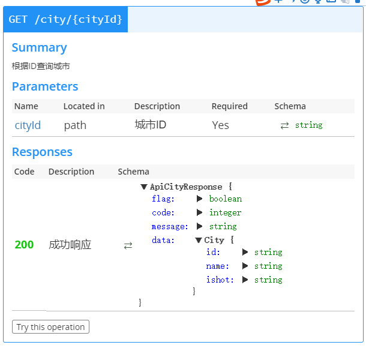

# 第2章 API文档与模拟数据接口  

学习目标：

- 理解RESTful架构
- 运用Swagger编写API文档
- 掌握Mock.js基本语法
- 运用easyMock实现模拟接口的编写


# 1 RESTful

## 1.1 什么是RESTful架构

​	RESTful架构，就是目前最流行的一种互联网软件架构。它结构清晰、符合标准、易于理解、扩展方便，所以正得到越来越多网站的采用。REST这个词，是[Roy Thomas Fielding](http://en.wikipedia.org/wiki/Roy_Fielding)在他2000年的[博士论文](http://www.ics.uci.edu/~fielding/pubs/dissertation/top.htm)中提出的


​	Fielding是一个非常重要的人，他是HTTP协议（1.0版和1.1版）的主要设计者、Apache服务器软件的作者之一、Apache基金会的第一任主席。所以，他的这篇论文一经发表，就引起了关注，并且立即对互联网开发产生了深远的影响。

​	Fielding将他对互联网软件的架构原则，定名为REST，即Representational State Transfer的缩写。我对这个词组的翻译是"表现层状态转化"。如果一个架构符合REST原则，就称它为RESTful架构。

## 1.2 理解RESTful架构 	

**要理解RESTful架构，最好的方法就是去理解Representational State Transfer这个词组到底是什么意思，它的每一个词代表了什么涵义。**

（1）**资源（Resources）**

REST的名称"表现层状态转化"中，省略了主语。"表现层"其实指的是"资源"（Resources）的"表现层"。

**所谓"资源"，就是网络上的一个实体，或者说是网络上的一个具体信息。**它可以是一段文本、一张图片、一首歌曲、一种服务，总之就是一个具体的实在。你可以用一个URI（统一资源定位符）指向它，每种资源对应一个特定的URI。要获取这个资源，访问它的URI就可以，因此URI就成了每一个资源的地址或独一无二的识别符。

所谓"上网"，就是与互联网上一系列的"资源"互动，调用它的URI。

（2）**表现层（Representation）**

"资源"是一种信息实体，它可以有多种外在表现形式。**我们把"资源"具体呈现出来的形式，叫做它的"表现层"（Representation）。**

比如，文本可以用txt格式表现，也可以用HTML格式、XML格式、JSON格式表现，甚至可以采用二进制格式；图片可以用JPG格式表现，也可以用PNG格式表现。

URI只代表资源的实体，不代表它的形式。严格地说，有些网址最后的".html"后缀名是不必要的，因为这个后缀名表示格式，属于"表现层"范畴，而URI应该只代表"资源"的位置。它的具体表现形式，应该在HTTP请求的头信息中用Accept和Content-Type字段指定，这两个字段才是对"表现层"的描述。

（3）**状态转化（State Transfer）**

访问一个网站，就代表了客户端和服务器的一个互动过程。在这个过程中，势必涉及到数据和状态的变化。

互联网通信协议HTTP协议，是一个无状态协议。这意味着，所有的状态都保存在服务器端。因此，**如果客户端想要操作服务器，必须通过某种手段，让服务器端发生"状态转化"（State Transfer）。而这种转化是建立在表现层之上的，所以就是"表现层状态转化"。**

客户端用到的手段，只能是HTTP协议。具体来说，就是HTTP协议里面，四个表示操作方式的动词：GET、POST、PUT、DELETE。它们分别对应四种基本操作：**GET用来获取资源，POST用来新建资源（也可以用于更新资源），PUT用来更新资源，DELETE用来删除资源。**


综合上面的解释，我们总结一下什么是RESTful架构：

　　（1）每一个URI代表一种资源；

　　（2）客户端和服务器之间，传递这种资源的某种表现层；

​    　（3）客户端通过四个HTTP动词，对服务器端资源进行操作，实现"表现层状态转化"。

## 1.3 常见错误

（1）URI包含动词

```
POST /accounts/1/transfer/500/to/2
```

正确的写法是把动词transfer改成名词transaction

（2）URI包含版本

```
http://www.example.com/app/1.0/foo

http://www.example.com/app/1.1/foo

http://www.example.com/app/2.0/foo
```

因为不同的版本，可以理解成同一种资源的不同表现形式，所以应该采用同一个URI。版本号可以在HTTP请求头信息的Accept字段中进行区分

```
Accept: vnd.example-com.foo+json; version=1.0

Accept: vnd.example-com.foo+json; version=1.1

Accept: vnd.example-com.foo+json; version=2.0
```

# 2 运用Swagger编写API文档

## 2.1 Swagger

### 2.1.1什么是Swagger

​	随着互联网技术的发展，现在的网站架构基本都由原来的后端渲染，变成了：前端渲染、先后端分离的形态，而且前端技术和后端技术在各自的道路上越走越远。 
​	前端和后端的唯一联系，变成了API接口；API文档变成了前后端开发人员联系的纽带，变得越来越重要，`swagger`就是一款让你更好的书写API文档的框架。

### 2.1.2 SwaggerEditor安装与启动

（1）下载 https://github.com/swagger-api/swagger-editor/releases/download/v2.10.4/swagger-editor.zip。我在资源中已经提供。

（2）解压swagger-editor,

（3）全局安装http-server(http-server是一个简单的零配置命令行http服务器)

```
npm install -g http-server
```

（4）启动swagger-editor

```
http-server swagger-editor
```

（5）浏览器打开： http://localhost:8080  


### 2.1.3 语法规则


（1）固定字段

| 字段名          | 类型                                     | 描述                                       |
| ------------ | -------------------------------------- | ---------------------------------------- |
| swagger      | string                                 | 必需的。使用指定的规范版本。                           |
| info         | Info Object                            | 必需的。提供元数据API。                            |
| host         | string                                 | 主机名或ip服务API。                             |
| basePath     | string                                 | API的基本路径                                 |
| schemes      | [string]                               | API的传输协议。 值必须从列表中:"http","https","ws","wss"。 |
| consumes     | [string]                               | 一个MIME类型的api可以使用列表。值必须是所描述的Mime类型。       |
| produces     | [string]                               | MIME类型的api可以产生的列表。  值必须是所描述的Mime类型。      |
| paths        | [路径对象](#pathsObject)                   | 必需的。可用的路径和操作的API。                        |
| definitions  | [定义对象](#definitionsObject)             | 一个对象数据类型生产和使用操作。                         |
| parameters   | [参数定义对象](#parametersDefinitionsObject) | 一个对象来保存参数,可以使用在操作。 这个属性不为所有操作定义全局参数。     |
| responses    | [反应定义对象](#responsesDefinitionsObject)  | 一个对象响应,可以跨操作使用。 这个属性不为所有操作定义全球响应。        |
| externalDocs | [外部文档对象](#externalDocumentationObject) | 额外的外部文档。                                 |
| summary      | string                                 | 什么操作的一个简短的总结。 最大swagger-ui可读性,这一领域应小于120个字符。 |
| description  | string                                 | [详细解释操作的行为。GFM语法可用于富文本表示。](https://help.github.com/articles/github-flavored-markdown) |
| operationId  | string                                 | 独特的字符串用于识别操作。 id必须是唯一的在所有业务中所描述的API。 工具和库可以使用operationId来唯一地标识一个操作,因此,建议遵循通用的编程的命名约定。 |
| deprecated   | boolean                                | 声明该操作被弃用。 使用声明的操作应该没有。 默认值是false。        |


（2）字段类型与格式定义

| 普通的名字    | type    | format    | 说明                              |
| -------- | ------- | --------- | ------------------------------- |
| integer  | integer | int32     | 签署了32位                          |
| long     | integer | int64     | 签署了64位                          |
| float    | number  | float     |                                 |
| double   | number  | double    |                                 |
| string   | string  |           |                                 |
| byte     | string  | byte      | base64编码的字符                     |
| binary   | string  | binary    | 任何的八位字节序列                       |
| boolean  | boolean |           |                                 |
| date     | string  | date      | 所定义的full-date- - - - - -RFC3339 |
| dateTime | string  | date-time | 所定义的date-time- - - - - -RFC3339 |
| password | string  | password  | 用来提示用户界面输入需要模糊。                 |


## 2.2 基础模块-城市API文档

### 2.2.1 新增城市

编写新增城市的API , post提交城市实体

URL： /city

Method: post

编写后的文档内容如下：


代码如下：

```yaml
swagger: '2.0'
info:
  version: "1.0.0"
  title: 基础模块-城市API
basePath: /base
host: api.tensquare.com
paths:
  /city:
    post:
      summary: 新增城市
      parameters:
        - name: "body"
          in: "body"
          description: 城市实体类
          required: true
          schema:
            $ref: '#/definitions/City'
      responses:
        200:
          description: 成功
          schema:
            $ref: '#/definitions/ApiResponse'
definitions:
  City: 
    type: object
    properties: 
      id: 
        type: string
        description: "ID"
      name:
        type: string
        description: "名称"
      ishot:
        type: string
        description: 是否热门
  ApiResponse: 
    type: object
    properties: 
      flag: 
        type: boolean
        description: 是否成功
      code:
        type: integer
        format: int32
        description: 返回码
      message:
        type: string
        description: 返回信息
```

编辑后可以在右侧窗口看到显示的效果

### 2.2.2 修改城市

URL： /city/{cityId} 

Method: put

编写后的文档内容如下：


代码如下：

```yaml
  /city/{cityId}:
    put:
      summary: 修改城市
      parameters:
        - name: cityId
          in: path
          description: 城市ID
          required: true
          type: string
        - name: body
          in: body
          description: 城市
          schema:
            $ref: '#/definitions/City'
      responses:
        200:
          description: 成功响应
          schema:
            $ref: '#/definitions/ApiResponse'  
```

### 2.2.3 删除城市

删除城市地址为/city/{cityId} ，与修改城市的地址相同，区别在于使用delete方法提交请求


代码如下：  （/city/{cityId} 下增加delete）

```yaml
    delete:
      summary: 根据ID删除
      description: 返回是否成功
      parameters:
        - name: cityId
          in: path
          description: 城市ID
          required: true
          type: string
      responses:
        '200':
          description: 成功
          schema:
            $ref: '#/definitions/ApiResponse'
```

### 2.2.4 根据ID查询城市

URL: /city/{cityId}   

Method: get    

返回的内容结构为： {flag:true,code:20000, message:"查询成功",data: {.....} }

data属性返回的是city的实体类型



代码实现如下：

（1）在definitions下定义城市对象的响应对象

```yaml
  ApiCityResponse:
    type: "object"
    properties:
      code:
        type: "integer"
        format: "int32"
      flag:
        type: "boolean"
      message:
        type: "string"
      data:
        $ref: '#/definitions/City'
```

（2）/city/{cityId} 下新增get方法API

```yaml
    get:
      summary: 根据ID查询
      description: 返回一个城市
      parameters:
        - name: cityId
          in: path
          description: 城市ID
          required: true
          type: string
      responses:
        '200':
          description: 操作成功
          schema:
            $ref: '#/definitions/ApiCityResponse'
```


### 2.2.5 城市列表

URL: /city  

Method: get    

返回的内容结构为： {flag:true,code:20000, message:"查询成功",data:[{.....},{.....},{.....}] }

data属性返回的是city的实体数组  


实现步骤如下：

（1）在definitions下定义城市列表对象以及相应对象

```yaml
  CityList:
    type: "array"
    items: 
      $ref: '#/definitions/City'
  ApiCityListResponse:
    type: "object"
    properties:
      code:
        type: "integer"
        format: "int32"
      flag:
        type: "boolean"
      message:
        type: "string"
      data:
        $ref: '#/definitions/CityList'
```

（2）在/city增加get

```yaml
    get:
      summary: "城市全部列表"
      description: "返回城市全部列表"
      responses:
        200:
          description: "成功查询到数据"
          schema: 
            $ref: '#/definitions/ApiCityListResponse'
```

### 2.2.6 根据条件查询城市列表

实现API效果如下:


代码如下：

```yaml
  /city/search:
    post:
      summary: 城市列表(条件查询)
      parameters:
        - name: body
          in: body
          description: 查询条件
          required: true
          schema:
            $ref: "#/definitions/City"
      responses:
        200:
          description: 查询成功
          schema:
            $ref: '#/definitions/ApiCityListResponse'
```


### 2.2.7 城市分页列表

实现API效果如下：


 实现如下：

（1）在definitions下定义城市分页列表响应对象

```yaml
  ApiCityPageResponse:
    type: "object"
    properties:
      code:
        type: "integer"
        format: "int32"
      flag:
        type: "boolean"
      message:
        type: "string"
      data:
        properties:
          total:
            type: "integer"
            format: "int32"
          rows:
            $ref: '#/definitions/CityList'
```

（2）新增节点

```yaml
  /city/search/{page}/{size}:
    post:
      summary: 城市分页列表
      parameters:
        - name: page
          in: path
          description: 页码
          required: true
          type: integer
          format: int32
        - name: size
          in: path
          description: 页大小
          required: true
          type: integer
          format: int32
        - name: body
          in: body
          description: 查询条件
          required: true
          schema:
            $ref: "#/definitions/City"
      responses:
        200:
          description: 查询成功
          schema:
            $ref: '#/definitions/ApiCityPageResponse'
```

## 2.3 批量生成API文档

我们使用《黑马程序员代码生成器》自动生成所有表的yml文档

自动生成的文档中类型均为string ，我们这里需要再对类型进行修改即可。

步骤：

（1）执行建表脚本

（2）使用《黑马程序员代码生成器》生成脚本

## 2.4 其它模块API

请学员参见本章的扩展文档来实现部分功能。

## 2.5 SwaggerUI 

SwaggerUI是用来展示Swagger文档的界面，以下为安装步骤

（1）在本地安装nginx  

（2）下载SwaggerUI源码   https://swagger.io/download-swagger-ui/

（3）解压，将dist文件夹下的全部文件拷贝至 nginx的html目录

（4）启动nginx

（5）浏览器打开页面  http://localhost即可看到文档页面  


（6）我们将编写好的yml文件也拷贝至nginx的html目录，这样我们就可以加载我们的swagger文档了


# 3 Mock.js

## 3.1 什么是Mock.js

Mock.js （官网http://mockjs.com/）是一款模拟数据生成器，旨在帮助前端攻城师独立于后端进行开发，帮助编写单元测试。提供了以下模拟功能：

根据数据模板生成模拟数据

模拟 Ajax 请求，生成并返回模拟数据

基于 HTML 模板生成模拟数据

**Mock.js具有以下特点：**

前后端分离

让前端攻城师独立于后端进行开发。

增加单元测试的真实性

通过随机数据，模拟各种场景。

开发无侵入

不需要修改既有代码，就可以拦截 Ajax 请求，返回模拟的响应数据。

用法简单

符合直觉的接口。

数据类型丰富

支持生成随机的文本、数字、布尔值、日期、邮箱、链接、图片、颜色等。

方便扩展

支持支持扩展更多数据类型，支持自定义函数和正则。

## 3.2 Mock.js安装

在命令提示符下用npm安装mockjs

```
cnpm install mockjs
```

## 3.3 快速入门

需求：生成列表数据，数据条数为5条。

显示效果如下：

```
{
    "list": [
        {
            "id": 1,
            "name": "测试"
        },
        {
            "id": 1,
            "name": "测试"
        },
        {
            "id": 1,
            "name": "测试"
        },
        {
            "id": 1,
            "name": "测试"
        },
        {
            "id": 1,
            "name": "测试"
        }
    ]
}
```

新建demo1.js 代码如下

```js
let Mock=require('mockjs')
let data=Mock.mock({
    'list|5':[
        {
            'id':1,
            'name':'测试'
        }
    ]
})
console.log(JSON.stringify(data,null,2 ))
```

执行命令`node demo1`   查看运行效果。

我们在本例中产生了5条相同的数据，这些数据都是相同的，如果我们需要让这些数据是按照一定规律随机生成的，需要按照Mock.js的语法规范来定义。

Mock.js 的语法规范包括两部分：

1.数据模板定义规范（Data Template Definition，DTD）

2.数据占位符定义规范（Data Placeholder Definition，DPD）

## 3.4 数据模板定义规范DTD

数据模板中的每个属性由 3 部分构成：属性名、生成规则、属性值

```
// 属性名   name
// 生成规则 rule
// 属性值   value
'name|rule': value
```

属性名 和 生成规则 之间用竖线 | 分隔。

生成规则 是可选的。

生成规则 有 7 种格式：

'name|min-max': value

'name|count': value

'name|min-max.dmin-dmax': value

'name|min-max.dcount': value

'name|count.dmin-dmax': value

'name|count.dcount': value

'name|+step': value

生成规则的含义需要依赖属性值的类型才能确定。

属性值 中可以含有 @占位符。

属性值 还指定了最终值的初始值和类型

### 3.4.1 属性值是字符串

（1）'name|count': string

通过重复 string 生成一个字符串，重复次数等于 count

```js
// 使用 Mock
let Mock = require('mockjs')
let data = Mock.mock({
    'list|5': [{
        'id': 1,
        'name':'测试',
        'phone|11':'1'
    }]
})
// 输出结果
console.log(JSON.stringify(data,null,2))
```

（2）'name|min-max': string

通过重复 string 生成一个字符串，重复次数大于等于 min，小于等于 max

```js
// 使用 Mock
let Mock = require('mockjs')
let data = Mock.mock({
    'list|5': [{
        'id': 1,
        'name|2-4':'测试',
        'phone|11':'1'
    }]
})
// 输出结果
console.log(JSON.stringify(data,null,2))
```

### 3.4.2 属性值是数字number

（1）'name|+1': number

属性值自动加 1，初始值为 number。

```js
// 使用 Mock
let Mock = require('mockjs')
let data = Mock.mock({
    'list|5': [{
        'id|+1': 1,
        'name|2-3':'测试',
        'phone|11':'1'
    }]
})
// 输出结果
console.log(JSON.stringify(data,null,2))
```

（2）'name|min-max': number

生成一个大于等于 min、小于等于 max 的整数，属性值 number 只是用来确定类型

```js
// 使用 Mock
let Mock = require('mockjs')
let data = Mock.mock({
    'list|5': [{
        'id|+1': 1,
        'name|2-3':'测试',
        'phone|11':'1',
        'point|122-500':0
    }]
})
// 输出结果
console.log(JSON.stringify(data,null,2))
```

（3）'name|min-max.dcount': value     生成一个浮点数，整数部分大于等于 min、小于等于 max，小数部分为dcount位

```js
// 使用 Mock
let Mock = require('mockjs')
let data = Mock.mock({
    'list|5': [{
        'id|+1': 1,
        'name|2-3':'测试',
        'phone|11':'1',
        'point|122-500':0,
        'money|3000-8000.2':0
    }]
})
// 输出结果
console.log(JSON.stringify(data,null,2))
```

（4）'name|min-max.dmin-dmax': number

生成一个浮点数，整数部分大于等于 min、小于等于 max，小数部分保留 dmin 到 dmax 位。

```js
// 使用 Mock
let Mock = require('mockjs')
let data = Mock.mock({
    'list|5': [{
        'id|+1': 1,
        'name|2-3':'测试',
        'phone|11':'1',
        'point|122-500':0,
        'money|3000-8000.2':0,
        'money2|1000-5000.2-4':0,
    }]
})
// 输出结果
console.log(JSON.stringify(data,null,2))
```

### 3.4.3 属性值是布尔

（1）'name|1': boolean

随机生成一个布尔值，值为 true 的概率是 1/2，值为 false 的概率同样是 1/2

```js
// 使用 Mock
let Mock = require('mockjs')
let data = Mock.mock({
    'list|5': [{
        'id|+1': 1,
        'name|2-3':'测试',
        'phone|11':'1',
        'point|122-500':0,
        'money|3000-8000.2':0,
        'status|1':true
    }]
})
// 输出结果
console.log(JSON.stringify(data,null,2))
```

（2）'name|min-max': value

随机生成一个布尔值，值为 value 的概率是 min / (min + max)

```js
// 使用 Mock
let Mock = require('mockjs')
let data = Mock.mock({
    'list|5': [{
        'id|+1': 1,
        'name|2-3':'测试',
        'phone|11':'1',
        'point|122-500':0,
        'money|3000-8000.2':0,
        'status|1':true,
        'default|1-3':true
    }]
})
// 输出结果
console.log(JSON.stringify(data,null,2))
```

### 3.4.4 属性值是Object

（1）'name|count': object

从属性值 object 中随机选取 count 个属性。

```js
// 使用 Mock
let Mock = require('mockjs')
let data = Mock.mock({
    'list|5': [{
        'id|+1': 1,
        'name|2-3':'测试',
        'phone|11':'1',
        'point|122-500':0,
        'money|3000-8000.2':0,
        'status|1':true,
        'default|1-3':true,
        'detail|2':{'id':1,'date':'2005-01-01','content':'记录'}
    }]
})
// 输出结果
console.log(JSON.stringify(data,null,2))
```

（2）'name|min-max': object

从属性值 object 中随机选取 min 到 max 个属性

```js
// 使用 Mock
let Mock = require('mockjs')
let data = Mock.mock({
    'list|5': [{
        'id|+1': 1,
        'name|2-3':'测试',
        'phone|11':'1',
        'point|122-500':0,
        'money|3000-8000.2':0,
        'status|1':true,
        'default|1-3':true,
        'detail|2-3':{'id':1,'date':'2005-01-01','content':'记录'}
    }]
})
// 输出结果
console.log(JSON.stringify(data,null,2))
```

### 3.4.5 属性值是数组

（1）'name|count': array

通过重复属性值 array 生成一个新数组，重复次数为 count

（2）'name|min-max': array

通过重复属性值 array 生成一个新数组，重复次数大于等于 min，小于等于 max。

```js
// 使用 Mock
let Mock = require('mockjs')
let data = Mock.mock({
    'list|5-10': [{
        'id|+1': 1,
        'name|2-3':'测试',
        'phone|11':'1',
        'point|122-500':0,
        'money|3000-8000.2':0,
        'status|1':true,
        'default|1-3':true,
        'detail|2-3':{'id':1,'date':'2005-01-01','content':'记录'}
    }]
})
// 输出结果
console.log(JSON.stringify(data,null,2))
```

## 3.5 数据占位符定义规范DPD

Mock.Random 是一个工具类，用于生成各种随机数据。

Mock.Random 的方法在数据模板中称为『占位符』，书写格式为 @占位符(参数 [, 参数]) 。

内置方法列表：

| **Type******  | **Method******                           |
| ------------- | ---------------------------------------- |
| Basic         | boolean, natural, integer, float, character, string, range, date, time, datetime, now |
| Image         | image, dataImage                         |
| Color         | color                                    |
| Text          | paragraph, sentence, word, title, cparagraph, csentence, cword, ctitle |
| Name          | first, last, name, cfirst, clast, cname  |
| Web           | url, domain, email, ip, tld              |
| Address       | area, region                             |
| Helper        | capitalize, upper, lower, pick, shuffle  |
| Miscellaneous | guid, id                                 |

 下面我们讲解每种内置方法的使用：

### 3.5.1 基本方法

可以生成随机的基本数据类型

string 字符串

integer 整数

date 日期

```js
// 使用 Mock
let Mock = require('mockjs')
let data = Mock.mock({
    'list|10': [{
        'id|+1': 1,
        'name':'@string',
        'point':'@integer',
        'birthday':'@date'
    }]
})
// 输出结果
console.log(JSON.stringify(data,null,2))
```

### 3.5.2 图像方法

image 随机生成图片地址

```js
// 使用 Mock
let Mock = require('mockjs')
let data = Mock.mock({
    'list|10': [{
        'id|+1': 1,
        'name':'@string',
        'point':'@integer',
        'birthday':'@date',
        'pic':'@image'
    }]
})
// 输出结果
console.log(JSON.stringify(data,null,2))
```

### 3.5.3 文本方法

@title: 标题

@cword(100)  :文本内容 参数为字数

```js
// 使用 Mock
let Mock = require('mockjs')
let data = Mock.mock({
    'list|10': [{
        'id|+1': 1,
        'name':'@string',
        'point':'@integer',
        'birthday':'@date',
        'pic':'@image',
        'title':'@title',
        'content':'@cword(100)'
    }]
})
// 输出结果
console.log(JSON.stringify(data,null,2))
```

### 3.5.4 名称方法

cname :中文名称

cfirst:中文姓氏

Last:英文姓氏

```js
// 使用 Mock
let Mock = require('mockjs')
let data = Mock.mock({
    'list|10': [{
        // 属性 id 是一个自增数，起始值为 1，每次增 1
        'id|+1': 1,
        'name':'@cname',
        'ename':'@last',
        'cfirst':'@cfirst',
        'point':'@integer',
        'birthday':'@date',
        'pic':'@image',
        'title':'@title',
        'content':'@cword(100)'
    }]
})
// 输出结果
console.log(JSON.stringify(data,null,2))
```

### 3.5.5 网络方法

可以生成url ip email等网络相关信息

```js
// 使用 Mock
let Mock = require('mockjs')
let data = Mock.mock({
    'list|10': [{
        'id|+1': 1,
        'name':'@cname',
        'ename':'@last',
        'cfirst':'@cfirst',
        'point':'@integer',
        'birthday':'@date',
        'pic':'@image',
        'title':'@title',
        'content':'@cword(100)',
        'url':"@url",
        'ip':"@ip",
        'email':"@email"
    }]
})
// 输出结果
console.log(JSON.stringify(data,null,2))
```

### 3.5.6 地址方法

@region 区域

@county 省市县

```js
// 使用 Mock
let Mock = require('mockjs')
let data = Mock.mock({
    'list|10': [{
        'id|+1': 1,
        'name':'@cname',
        'ename':'@last',
        'cfirst':'@cfirst',
        'point':'@integer',
        'birthday':'@date',
        'pic':'@image',
        'title':'@title',
        'content':'@cword(100)',
        'url':"@url",
        'ip':"@ip",
        'email':"@email",
        'area':'@region',
        'address':'@county(true)'
    }]
})
// 输出结果
console.log(JSON.stringify(data,null,2))
```


# 4 EasyMock 

## 4.1 什么是EasyMock

​	Easy Mock 是杭州大搜车无线团队出品的一个极其简单、高效、可视化、并且能快速生成模拟数据的`在线 mock 服务`。以项目管理的方式组织 Mock List，能帮助我们更好的管理 Mock 数据。

地址：https://www.easy-mock.com

在线文档：https://www.easy-mock.com/docs

## 4.2 EasyMock基本入门 

### 4.2.1初始设置

（1）登录或注册。

浏览器打开https://www.easy-mock.com  输出用户名和密码，如果不存在会自动注册。**注意：请牢记密码，系统没有找回密码功能！**


登录后进入主界面


（2）创建项目：点击右下角的加号


填写项目名称，点击创建按钮


创建完成后可以在列表中看到刚刚创建的项目

### 4.2.2接口操作

（1）创建接口。点击列表中的项目


进入项目工作台页面


点击“创建接口” ,左侧区域输出mock数据，右侧定义Method 、 Url 、描述等信息。


我们可以将我们在Mock.js入门案例中的对象放入左侧的编辑窗口

```
{
  'list|10': [{
    "id|+1": 1,
    "name": "@cname",
    "cfirst": "@cfirst",
    "Last": "@Last",
    "point": "@integer",
    "birthday": "@date",
    "pic": "@image",
    "content": "@cword(30,200)",
    "url": "@url",
    "ip": "@ip",
    "email": "@email",
    "region": "@region",
    "county": "@county"
  }]
}
```

填写url   Method  和描述 ，点击创建按钮

（2）克隆接口和修改接口


（3）预览接口和复制接口地址


（4）删除接口


## 4.3 本地部署EasyMock 

### 4.3.1 Centos部署node.js

（1）将node官网下载的node-v8.11.1-linux-x64.tar.xz 上传至服务器

（2）解压xz文件

```
xz -d node-v8.11.1-linux-x64.tar.xz
```

（3）解压tar文件

```
tar -xvf node-v8.11.1-linux-x64.tar
```

（4）目录重命名

```
mv node-v8.11.1-linux-x64 node
```

（5）移动目录到/usr/local下

```
mv node /usr/local/
```

（6）配置环境变量

```
vi /etc/profile
```

填写以下内容

```
#set for nodejs  
export NODE_HOME=/usr/local/node  
export PATH=$NODE_HOME/bin:$PATH
```

执行命令让环境变量生效

```
source /etc/profile
```

查看node版本看是否安装成功

```
node -v
```

### 4.3.2 MongoDB安装与启动

我们使用yum方式安装mongoDb

（1）配置yum

```
vi /etc/yum.repos.d/mongodb-org-3.2.repo
```

编辑以下内容：

```
[mongodb-org-3.2]
name=MongoDB Repository
baseurl=https://repo.mongodb.org/yum/redhat/$releasever/mongodb-org/3.2/x86_64/
gpgcheck=1
enabled=1
gpgkey=https://www.mongodb.org/static/pgp/server-3.2.asc
```

（2）安装MongoDB

```
yum install -y mongodb-org
```

（3）启动MongoD 

```
systemctl start mongod
```


### 4.3.3 Redis安装与启动

（1）下载fedora的epel仓库

```
yum install epel-release
```

（2）下载安装redis

```
yum install redis
```

（3）启动redis服务

```
systemctl start redis
```


### 4.3.4 本地部署easy-mock

（1）项目下载地址：  https://github.com/easy-mock/easy-mock

（2）将easy-mock-dev.zip上传至服务器

（3）安装zip 和unzip 

```
yum install zip unzip
```

（4）解压

```
unzip easy-mock-dev.zip
```

（3）进入其目录，安装依赖

```
npm install
```

（4）执行构建

```
npm run build
```

（5）启动

```
npm run start
```

（6）打开浏览器  http://192.168.184.131:7300


## 4.4 导入SwaggerAPI文档

（1）将我们的SwaggerAPI文档扩展名改为yml

（2）在easyMock中点击“设置”选项卡

（3）SwaggerDocs API 选择Upload 


（4）将SwaggerAPI文档拖动到上图的虚线区域，点击保存

（5）回到主界面后点击“同步Swagger”


