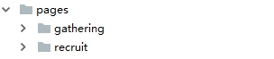

# 第5章 网站前台-活动与招聘  

学习目标：

- 掌握NUXT框架的基本使用方法
- 完成十次方网站前台的搭建
- 完成十次方网站前台活动模块的功能
- 完成十次方网站前台招聘模块的功能

# 1 服务端渲染技术NUXT

## 1.1 什么是服务端渲染

​	服务端渲染又称SSR  (Server Side Render)是在服务端完成页面的内容，而不是在客户端通过AJAX获取数据。

​	与传统 SPA（Single-Page Application - 单页应用程序）相比，服务器端渲染(SSR)的优势主要在于：**更好的 SEO**，由于搜索引擎爬虫抓取工具可以直接查看完全渲染的页面。

​	请注意，截至目前，Google 和 Bing 可以很好对同步 JavaScript 应用程序进行索引。在这里，同步是关键。如果你的应用程序初始展示 loading 菊花图，然后通过 Ajax 获取内容，抓取工具并不会等待异步完成后再行抓取页面内容。也就是说，如果 SEO 对你的站点至关重要，而你的页面又是异步获取内容，则你可能需要服务器端渲染(SSR)解决此问题。

​	更快的内容到达时间(time-to-content)，特别是对于缓慢的网络情况或运行缓慢的设备。无需等待所有的 JavaScript 都完成下载并执行，才显示服务器渲染的标记，所以你的用户将会更快速地看到完整渲染的页面。通常可以产生更好的用户体验，并且对于那些「内容到达时间(time-to-content)与转化率直接相关」的应用程序而言，服务器端渲染(SSR)至关重要。

## 1.2 什么是NUXT

Nuxt.js 是一个基于 Vue.js 的轻量级应用框架,可用来创建服务端渲染 (SSR) 应用,也可充当静态站点引擎生成静态站点应用,具有优雅的代码结构分层和热加载等特性。

官网网站：

[https://zh.nuxtjs.org/](https://zh.nuxtjs.org/)

## 1.3 NUXT环境搭建

（1）我们从网站上[下载模板的压缩包](https://github.com/nuxt-community/starter-template/archive/master.zip)  starter-template-master.zip 解压，修改template目录目录的package.json中的名称

（2）在命令提示符下进入该目录下的template目录 

（3）安装依赖

```
cnpm install
```

（4）修改package.json 

```
 ......
 "name": "tensquare",
 ......
```

（5）修改nuxt.config.js

```
......
title: '十次方'
......
```

（6）测试运行

```sh
npm run dev
```

## 1.4 NUXT目录结构

（1）资源目录 assets

 用于组织未编译的静态资源如 LESS、SASS 或 JavaScript。

（2）组件目录 components

用于组织应用的 Vue.js 组件。Nuxt.js 不会扩展增强该目录下 Vue.js 组件，即这些组件不会像页面组件那样有 asyncData 方法的特性。

（3）布局目录 layouts

用于组织应用的布局组件。

（4）页面目录 pages

用于组织应用的路由及视图。Nuxt.js 框架读取该目录下所有的 .vue 文件并自动生成对应的路由配置。

（5）插件目录 plugins

用于组织那些需要在 根vue.js应用 实例化之前需要运行的 Javascript 插件。

（6）nuxt.config.js 文件

nuxt.config.js 文件用于组织Nuxt.js 应用的个性化配置，以便覆盖默认配置。

## 1.5 NUXT快速入门

### 1.5.1 定义布局

我们通常的网站头部和尾部都是相同的，我们可以把头部为尾部提取出来，形成布局页

修改layouts目录下default.vue

```html
<template>
  <div>
      <header>NUXT入门小Demo</header>
        <nuxt/>
      <footer>--黑马程序员--</footer>
  </div>
</template>
```

<**nuxt**/>为内容的区域

### 1.5.2 页面路由

在page目录创建文件夹

 

recruit目录创建index.vue

```html
<template>
  <div>
    招聘列表
  </div>
</template>
```

gathering目录创建index.vue

```html
<template>
  <div>
    活动列表
  </div>
</template>
```

NUXT的路由是根据目录自动生成的，无需手写。

修改default.vue，header中添加导航链接

```html
      <router-link to="/">首页</router-link>
      <router-link to="/recruit">招聘</router-link>
      <router-link to="/gathering">活动</router-link>
```

点击导航链接，测试路由效果

### 1.5.3 数据渲染

（1）安装axios，用于异步获取数据

```sh
cnpm install axios --save
```

（2）修改gathering目录的index.vue

```html
<template>
  <div>
    活动列表
    <div v-for="(item,index) in items" :key="index" >{{item.name}}</div>
  </div>
</template>
<script>
import axios from 'axios'
export default {
    asyncData () {
        return axios.get('http://192.168.184.133:7300/mock/5af314a4c612520d0d7650c7/gathering/gathering')
           .then( res => {
                return { items: res.data.data }
           })
    }
}
</script>
```

asyncData是用于异步加载数据的方法

### 1.5.4 动态路由

如果我们需要根据ID查询活动详情，就需要使用动态路由。NUXT的动态路由是以下划线开头的vue文件，参数名为下划线后边的文件名 

创建pages/gathering/item/_id.vue

```html
<template>
  <div>
    活动详情
    {{item.id}}
    <hr>
    {{item.name}}

  </div>
</template>
<script>
import axios from 'axios'
export default {
    asyncData( {params} ){
        //params.id
        return axios.get(`http://192.168.184.133:7300/mock/5af314a4c612520d0d7650c7/gathering/gathering/${params.id}`).then(
            res =>{              
              return {item: res.data.data}
            }
        )
    }
}
</script>
```

我们在地址栏输入 [http://localhost:3000/gathering/item/1](http://localhost:3000/gathering/item/1) 即可看到运行结果

在活动列表页点击链接进入详情页

```html
    活动列表
    <div v-for="(item,index) in items" :key="index">
        <nuxt-link :to="'/gathering/item/'+item.id">{{item.name}}</nuxt-link>
    </div>
```

目前 `nuxt-link` 的作用和 [`router-link`](https://router.vuejs.org/zh-cn/api/router-link.html) 一致    ，都是进行路由的跳转。

# 2 十次方网站前台搭建

## 2.1 网站整体布局

（1）拷贝静态资源：将静态原型中的css、img、plugins目录拷贝至assets目录下 。

（2）我们参照静态原型中的activiti-index.html页面来编写网站的通用布局，即网站的头部和尾部

修改layouts下的default.vue，内容如下：

```html
<template>
  <div>
      <header>
        <div class="activity-head">
          <div class="wrapper">
            <div class="sui-navbar">
                <div class="navbar-inner">
                  <a href="index-logined.html" class="sui-brand"></a>
                  <ul class="sui-nav">
                    <li class="active"><a href="~/assets/headline-logined.html">头条</a></li>
                    <li><a href="~/assets/qa-logined.html" >问答</a></li>
                    <li><a href="~/assets/activity-index.html" >活动</a></li>
                    <li><a href="~/assets/makeFriends-index.html" >交友</a></li>
                    <li><a href="~/assets/spit-index.html" >吐槽</a></li>
                    <li><a href="~/assets/recruit-index.html"  >招聘</a></li>
                  </ul>
                  <form class="sui-form sui-form pull-left">
                    <input type="text" placeholder="输入关键词...">
                    <span class="btn-search fa fa-search"></span>
                  </form>
                  <div class="sui-nav pull-right info">
                      <li><a href="~/assets/other-notice.html" target="_blank" class="notice">通知</a></li>
                      <li class="hover">
                        <span class="fa fa-plus "></span>
                        <ul class="hoverinfo">
                          <li><i class="fa fa-share-alt" aria-hidden="true"></i> <a href="~/assets/headline-submit.html">去分享</a></li>
                          <li><i class="fa fa-question-circle" aria-hidden="true"></i> <a href="~/assets/qa-submit.html" target="_blank">提问题</a></li>
                          <li><i class="fa fa-comments" aria-hidden="true"></i><a href="~/assets/spit-submit.html" target="_blank">去吐槽</a></li>
                          <li><i class="fa fa-heartbeat" aria-hidden="true"></i> <a href="~/assets/makeFriends-submit.html" target="_blank">发约会</a></li>
                        </ul>
                      </li>
                      <li><a href="~/assets/person-homepage.html" target="_blank" class="homego"></a></li> 
                  </div>
              </div>
            </div>
          </div>
        </div>
      </header>
      <nuxt/>
      <footer>
        <!--底部版权-->
        <div class="footer">
            <div class="wrapper">
                <div class="footer-bottom">
            <div class="link">
              <dl>
                <dt>网站相关</dt>
                <dd>关于我们</dd>
                <dd>服务条款</dd>
                <dd>帮助中心</dd>
                <dd>编辑器语法</dd>
              </dl>
              <dl>
                <dt>常用链接</dt>
                <dd>传智播客</dd>
                <dd>传智论坛</dd>
              </dl>
              <dl>
                <dt>联系我们</dt>
                <dd>联系我们</dd>
                <dd>加入我们</dd>
                <dd>建议反馈</dd>
              </dl>
              <dl>
                <dt>关注我们</dt>
                <dd>微博</dd>
                <dd>twitter</dd>
              </dl>

              <div class="xuke">
                <h3>内容许可</h3>
                <p>除特别说明外，用户内容均采用知识共享署名-非商业性使用-禁止演绎4.0 国际许可协议 (CC BY-NC-ND 4.0) 进行许可</p>
                <p>本站由 传智研究院 提供更新服务</p>
              </div>
            </div>


            <p class="Copyright">Copyright © 2017 传智问答社区 当前版本 0.0.1</p>
          </div>
            </div>
        </div>

      </footer>
  </div>
</template>
<script>
import '~/assets/plugins/normalize-css/normalize.css'
import '~/assets/plugins/yui/cssgrids-min.css'
import '~/assets/plugins/sui/sui.min.css'
import '~/assets/plugins/sui/sui-append.min.css'
import '~/assets/plugins/font-awesome/css/font-awesome.min.css'
import '~/assets/css/widget-base.css'
import '~/assets/css/widget-head-foot.css'
export default {
}
</script>
```

## 2.2 头条页面

修改pages/index.vue  ,内容如下：

```html
<template>
<div class="sui-container wrapper">
<div class="sj-content"> 
    <div class="left-nav"> 
     <div class="float-nav" id="float-nav"> 
      <ul class="sui-nav nav-tabs nav-xlarge tab-navbar tab-vertical"> 
       <li class="active"><a>热门</a></li> 
       <li><a href="#">牛人专区</a></li> 
       <li><a href="#">机器学习</a></li> 
       <li><a href="#">后端开发</a></li> 
       <li><a href="#">人工智能</a></li> 
       <li><a href="#">虚拟现实</a></li> 
       <li><a href="#">商业预测</a></li> 
       <li><a href="#">前端开发</a></li> 
      </ul> 
     </div> 
    </div> 
    <div class="right-content"> 
     <div class="fl middle"> 
      <div class="carousel"> 
       <div id="myCarousel" data-ride="carousel" data-interval="4000" class="sui-carousel slide"> 
        <ol class="carousel-indicators"> 
         <li data-target="#myCarousel" data-slide-to="0" class="active"></li> 
         <li data-target="#myCarousel" data-slide-to="1"></li> 
         <li data-target="#myCarousel" data-slide-to="2"></li> 
        </ol> 
        <div class="carousel-inner"> 
         <div class="active item"> 
           
         </div> 
         <div class="item"> 
           
         </div> 
         <div class="item"> 
           
         </div> 
        </div> 
       </div> 
      </div> 
      <div class="data-list"> 
       <ul class="headline fixed" id="headline"> 
        <li class="headline-item"> 
         <div class="fl indexImg"> 
           
         </div> 
         <div class="words"> 
          <h3>Drive.ai融资5000万吴恩达加入董事会 <span></span></h3> 
          <h5 class="author"> 
           <div class="fl"> 
            <span class="authorName">  玻璃通 </span> 
            <span>6月22日 12:01</span> 
           </div> 
           <div class="fr attention"> 
            <span class="attentionText">关注</span> 
            <span class="beforeclose"> <i class="fa fa-times delete" aria-hidden="true"></i> <i class="nolike">不感兴趣</i> </span> 
           </div> 
           <div class="clearfix"></div> </h5> 
         </div> <p class="content">滴滴与360都开源了各自的插件化框架，VirtualAPK与RePlugin,作为一个插件化方面的狂热研究者，在周末就迫不及待的下载了Virtualapk框架来进行研究，本篇博客带的……</p> </li> 
        <li class="headline-item"> 
         <div class="fl indexImg"> 
           
         </div> 
         <div class="words"> 
          <h3>Drive.ai融资5000万吴恩达加入董事会 <span></span></h3> 
          <h5 class="author"> 
           <div class="fl"> 
            <span class="authorName">  玻璃通 </span> 
            <span>6月12日 13：34</span> 
           </div> 
           <div class="fr attention"> 
            <span class="attentionText">关注</span> 
            <span class="beforeclose"> <i class="fa fa-times delete" aria-hidden="true"></i> <i class="nolike">不感兴趣</i> </span> 
           </div> 
           <div class="clearfix"></div> </h5> 
         </div> <p class="content">滴滴与360都开源了各自的插件化框架，VirtualAPK与RePlugin,作为一个插件化方面的狂热研究者，在周末就迫不及待的下载了Virtualapk框架来进行研究，本篇博客带的……</p> </li> 
        <li class="headline-item"> 
         <div class="fl indexImg"> 
           
         </div> 
         <div class="words"> 
          <h3>Drive.ai融资5000万吴恩达加入董事会 <span></span></h3> 
          <h5 class="author"> 
           <div class="fl"> 
            <span class="authorName">  玻璃通 </span> 
            <span>6月12日 13：34</span> 
           </div> 
           <div class="fr attention"> 
            <span class="attentionText">关注</span> 
            <span class="beforeclose"> <i class="fa fa-times delete" aria-hidden="true"></i> <i class="nolike">不感兴趣</i> </span> 
           </div> 
           <div class="clearfix"></div> </h5> 
         </div> <p class="content"></p> </li> 
        <li class="headline-item"> 
         <div class="fl indexImg"> 
           
         </div> 
         <div class="words"> 
          <h3>Drive.ai融资5000万吴恩达加入董事会 <span></span></h3> 
          <h5 class="author"> 
           <div class="fl"> 
            <span class="authorName">  玻璃通 </span> 
            <span>6月7日 10：34</span> 
           </div> 
           <div class="fr attention"> 
            <span class="attentionText">关注</span> 
            <span class="beforeclose"> <i class="fa fa-times delete" aria-hidden="true"></i> <i class="nolike">不感兴趣</i> </span> 
           </div> 
           <div class="clearfix"></div> </h5> 
         </div> <p class="content">滴滴与360都开源了各自的插件化框架，VirtualAPK与RePlugin,作为一个插件化方面的狂热研究者，在周末就迫不及待的下载了Virtualapk框架来进行研究，本篇博客带的……</p> </li> 
        <li class="headline-item"> 
         <div class="fl indexImg"> 
           
         </div> 
         <div class="words"> 
          <h3>Drive.ai融资5000万吴恩达加入董事会 <span></span></h3> 
          <h5 class="author"> 
           <div class="fl"> 
            <span class="authorName">  玻璃通 </span> 
            <span>6月12日 13：34</span> 
           </div> 
           <div class="fr attention"> 
            <span class="attentionText">关注</span> 
            <span class="beforeclose"> <i class="fa fa-times delete" aria-hidden="true"></i> <i class="nolike">不感兴趣</i> </span> 
           </div> 
           <div class="clearfix"></div> </h5> 
         </div> <p class="content"></p> </li> 
        <li class="headline-item"> 
         <div class="fl indexImg"> 
           
         </div> 
         <div class="words"> 
          <h3>Drive.ai融资5000万吴恩达加入董事会 <span></span></h3> 
          <h5 class="author"> 
           <div class="fl"> 
            <span class="authorName">  玻璃通 </span> 
            <span>6月7日 10：34</span> 
           </div> 
           <div class="fr attention"> 
            <span class="attentionText">关注</span> 
            <span class="beforeclose"> <i class="fa fa-times delete" aria-hidden="true"></i> <i class="nolike">不感兴趣</i> </span> 
           </div> 
           <div class="clearfix"></div> </h5> 
         </div> <p class="content">滴滴与360都开源了各自的插件化框架，VirtualAPK与RePlugin,作为一个插件化方面的狂热研究者，在周末就迫不及待的下载了Virtualapk框架来进行研究，本篇博客带的……</p> </li> 
       </ul> 
       <div class="stop"> 
        <a href="javascript:;">32分钟前看到这里，点击刷新 <i class="fa fa-refresh" aria-hidden="true"></i></a> 
       </div> 
       <ul id="data-list-down" class="headline loading"> 
        <li class="headline-item"> 
         <div class="fl indexImg"> 
           
         </div> 
         <div class="words"> 
          <h3>Drive.ai融资5000万吴恩达加入董事会 <span></span></h3> 
          <h5 class="author"> 
           <div class="fl"> 
            <span class="authorName">  玻璃通 </span> 
            <span>6月22日 12:01</span> 
           </div> 
           <div class="fr attention"> 
            <span class="attentionText">关注</span> 
            <span class="beforeclose"> <i class="fa fa-times delete" aria-hidden="true"></i> <i class="nolike">不感兴趣</i> </span> 
           </div> 
           <div class="clearfix"></div> </h5> 
         </div> <p class="content">滴滴与360都开源了各自的插件化框架，VirtualAPK与RePlugin,作为一个插件化方面的狂热研究者，在周末就迫不及待的下载了Virtualapk框架来进行研究，本篇博客带的……</p> </li> 
        <li class="headline-item"> 
         <div class="fl indexImg"> 
           
         </div> 
         <div class="words"> 
          <h3>Drive.ai融资5000万吴恩达加入董事会 <span></span></h3> 
          <h5 class="author"> 
           <div class="fl"> 
            <span class="authorName">  玻璃通 </span> 
            <span>6月12日 13：34</span> 
           </div> 
           <div class="fr attention"> 
            <span class="attentionText">关注</span> 
            <span class="beforeclose"> <i class="fa fa-times delete" aria-hidden="true"></i> <i class="nolike">不感兴趣</i> </span> 
           </div> 
           <div class="clearfix"></div> </h5> 
         </div> <p class="content">滴滴与360都开源了各自的插件化框架，VirtualAPK与RePlugin,作为一个插件化方面的狂热研究者，在周末就迫不及待的下载了Virtualapk框架来进行研究，本篇博客带的……</p> </li> 
        <li class="headline-item"> 
         <div class="fl indexImg"> 
           
         </div> 
         <div class="words"> 
          <h3>Drive.ai融资5000万吴恩达加入董事会 <span></span></h3> 
          <h5 class="author"> 
           <div class="fl"> 
            <span class="authorName">  玻璃通 </span> 
            <span>6月12日 13：34</span> 
           </div> 
           <div class="fr attention"> 
            <span class="attentionText">关注</span> 
            <span class="beforeclose"> <i class="fa fa-times delete" aria-hidden="true"></i> <i class="nolike">不感兴趣</i> </span> 
           </div> 
           <div class="clearfix"></div> </h5> 
         </div> <p class="content"></p> </li> 
        <li class="headline-item"> 
         <div class="fl indexImg"> 
           
         </div> 
         <div class="words"> 
          <h3>Drive.ai融资5000万吴恩达加入董事会 <span></span></h3> 
          <h5 class="author"> 
           <div class="fl"> 
            <span class="authorName">  玻璃通 </span> 
            <span>6月7日 10：34</span> 
           </div> 
           <div class="fr attention"> 
            <span class="attentionText">关注</span> 
            <span class="beforeclose"> <i class="fa fa-times delete" aria-hidden="true"></i> <i class="nolike">不感兴趣</i> </span> 
           </div> 
           <div class="clearfix"></div> </h5> 
         </div> <p class="content">滴滴与360都开源了各自的插件化框架，VirtualAPK与RePlugin,作为一个插件化方面的狂热研究者，在周末就迫不及待的下载了Virtualapk框架来进行研究，本篇博客带的……</p> </li> 
        <li class="headline-item"> 
         <div class="fl indexImg"> 
           
         </div> 
         <div class="words"> 
          <h3>Drive.ai融资5000万吴恩达加入董事会 <span></span></h3> 
          <h5 class="author"> 
           <div class="fl"> 
            <span class="authorName">  玻璃通 </span> 
            <span>6月12日 13：34</span> 
           </div> 
           <div class="fr attention"> 
            <span class="attentionText">关注</span> 
            <span class="beforeclose"> <i class="fa fa-times delete" aria-hidden="true"></i> <i class="nolike">不感兴趣</i> </span> 
           </div> 
           <div class="clearfix"></div> </h5> 
         </div> <p class="content"></p> </li> 
        <li class="headline-item"> 
         <div class="fl indexImg"> 
           
         </div> 
         <div class="words"> 
          <h3>Drive.ai融资5000万吴恩达加入董事会 <span></span></h3> 
          <h5 class="author"> 
           <div class="fl"> 
            <span class="authorName">  玻璃通 </span> 
            <span>6月7日 10：34</span> 
           </div> 
           <div class="fr attention"> 
            <span class="attentionText">关注</span> 
            <span class="beforeclose"> <i class="fa fa-times delete" aria-hidden="true"></i> <i class="nolike">不感兴趣</i> </span> 
           </div> 
           <div class="clearfix"></div> </h5> 
         </div> <p class="content">滴滴与360都开源了各自的插件化框架，VirtualAPK与RePlugin,作为一个插件化方面的狂热研究者，在周末就迫不及待的下载了Virtualapk框架来进行研究，本篇博客带的……</p> </li> 
       </ul> 
       <ul id="loaded" class="headline"> 
       </ul> 
      </div> 
      <!-- <script src="~/assets/data-list.js" type="text/javascript"></script> --> 
     </div> 
     <div class="fl right"> 
      <div class="activity"> 
       <div class="acti">
        
       </div> 
       <div class="acti">
        
       </div> 
      </div> 
      <div class="block-btn"> 
       <p>今天，有什么好东西要和大家分享么?</p> 
       <a class="sui-btn btn-block btn-share" href="~/assets/headline-submit.html" target="_blank">发布分享</a> 
      </div> 
      <div class="question-list"> 
       <h3 class="title">热门回答</h3> 
       <div class="lists"> 
        <ul> 
         <li class="list-item"> <p class="list-title">关于系统问答你都应该都应该都应该注意些什么吗？</p> <p class="authorInfo"> <span class="authorName">玻璃筒</span> <span>6月22日 12:01</span> </p> </li> 
         <li class="list-item"> <p class="list-title">关于系统问答你都应该注意吗？</p> <p class="authorInfo"> <span class="authorName">玻璃筒</span> <span>6月22日 12:01</span> </p> </li> 
         <li class="list-item"> <p class="list-title">关于系统问答你都应该注意吗？</p> <p class="authorInfo"> <span class="authorName">玻璃筒</span> <span>6月22日 12:01</span> </p> </li> 
         <li class="list-item"> <p class="list-title">关于系统问答你都应该注意吗？</p> <p class="authorInfo"> <span class="authorName">玻璃筒</span> <span>6月22日 12:01</span> </p> </li> 
         <li class="list-item"> <p class="list-title">关于系统问答你都应该注意吗？</p> <p class="authorInfo"> <span class="authorName">玻璃筒</span> <span>6月22日 12:01</span> </p> </li> 
        </ul> 
        <a class="sui-btn btn-block btn-bordered btn-more">查看更多</a> 
       </div> 
      </div> 
      <div class="card-list"> 
       <div class="head"> 
        <h3 class="title">遇见TA</h3> 
       </div> 
       <div class="list"> 
        <ul> 
         <li class="card-item"> 
          <div class="attention"> 
           <span>关注匹配度：<i class="degree">83%</i></span> 
           <span class="fr"><i class="fa fa-heart-o" aria-hidden="true"></i><i class="fa fa-times close" aria-hidden="true"></i></span> 
          </div> 
          <div class="img"> 
            
          </div> 
          <div class="info"> 
           <div class="fl photo">
            
           </div> 
           <div class="fl intro"> 
            <p>【馨儿】发布了雕刻时光约会邀请</p> 
            <p class="name">玻璃通 <span class="date">6月22日 12:01</span></p> 
           </div> 
           <div class="clearfix"></div> 
          </div> </li> 
         <li class="card-item"> 
          <div class="attention"> 
           <span>关注匹配度：<i class="degree">86%</i></span> 
           <span class="fr"><i class="fa fa-heart-o" aria-hidden="true"></i><i class="fa fa-times close" aria-hidden="true"></i></span> 
          </div> 
          <div class="img"> 
            
          </div> 
          <div class="info"> 
           <div class="fl photo">
            
           </div> 
           <div class="fl intro"> 
            <p>【馨儿】发布了雕刻时光约会邀请</p> 
            <p class="name">玻璃通 <span class="date">6月22日 12:01</span></p> 
           </div> 
           <div class="clearfix"></div> 
          </div> </li> 
         <li class="card-item"> 
          <div class="attention"> 
           <span>关注匹配度：<i class="degree">78%</i></span> 
           <span class="fr"><i class="fa fa-heart-o" aria-hidden="true"></i><i class="fa fa-times close" aria-hidden="true"></i></span> 
          </div> 
          <div class="img"> 
            
          </div> 
          <div class="info"> 
           <div class="fl photo">
            
           </div> 
           <div class="fl intro"> 
            <p>【馨儿】发布了雕刻时光约会邀请</p> 
            <p class="name">玻璃通 <span class="date">6月22日 12:01</span></p> 
           </div> 
           <div class="clearfix"></div> 
          </div> </li> 
        </ul> 
        <a class="sui-btn btn-block btn-bordered btn-more">查看更多</a> 
       </div> 
      </div> 
      <div class="activity-list"> 
       <h3 class="title">活动日历</h3> 
       <div class="list"> 
        <ul> 
         <li class="list-item"> <p class="list-time"> 2017/06/30 北京</p> 
          <div class="list-content clearfix"> 
           <div class="fl img"> 
             
           </div> 
           <div> 
            <p>在线峰会 | 前端开发重难点技术剖析与创新实践</p> 
           </div> 
          </div> </li> 
         <li class="list-item"> <p class="list-time"> 2017/06/30 北京</p> 
          <div class="list-content clearfix"> 
           <div class="fl img"> 
             
           </div> 
           <div> 
            <p>在线峰会 | 前端开发重难点技术剖析与创新实践</p> 
           </div> 
          </div> </li> 
         <li class="list-item"> <p class="list-time"> 2017/06/30 北京</p> 
          <div class="list-content clearfix"> 
           <div class="fl img"> 
             
           </div> 
           <div> 
            <p>在线峰会 | 前端开发重难点技术剖析与创新实践</p> 
           </div> 
          </div> </li> 
         <li class="list-item"> <p class="list-time"> 2017/06/30 北京</p> 
          <div class="list-content clearfix"> 
           <div class="fl img"> 
             
           </div> 
           <div> 
            <p>在线峰会 | 前端开发重难点技术剖析与创新实践</p> 
           </div> 
          </div> </li> 
        </ul> 
        <a class="sui-btn btn-block btn-bordered btn-more">查看更多</a> 
       </div> 
      </div> 
      <div class="ad-carousel"> 
       <div class="carousel"> 
        <div id="myCarousel" data-ride="carousel" data-interval="4000" class="sui-carousel slide"> 
         <ol class="carousel-indicators"> 
          <li data-target="#myCarousel" data-slide-to="0" class="active"></li> 
          <li data-target="#myCarousel" data-slide-to="1"></li> 
          <li data-target="#myCarousel" data-slide-to="2"></li> 
         </ol> 
         <div class="carousel-inner"> 
          <div class="active item"> 
            
          </div> 
          <div class="item"> 
            
          </div> 
          <div class="item"> 
            
          </div> 
         </div> 
         <span class="adname">广告</span> 
        </div> 
       </div> 
      </div> 
      <!-- <link rel="import" href=".~/assets/.~/assets/modules/ui-modules/footer/footer.html?__inline"> --> 
     </div> 
    </div> 
   </div> 
</div>
</template>

<script>
import '~/assets/css/page-sj-headline-login.css'
</script>
```

参考headline-login.html页面构建，拷贝代码后将./批量替换为~/assets/

## 2.4 其它频道页

按照上述方法构建以下页面

（1）建立pages/qa/index.vue （问答首页）

（2）建立pages/gathering/index.vue（活动首页）

（3）建立pages/friends/index.vue（交友首页）

（4）建立pages/spit/index.vue （吐槽首页） 

（5）建立pages/recruit/index.vue （招聘首页）

## 2.5 网站导航

修改layouts/default.vue

```html
<ul class="sui-nav">
    <router-link to="/" tag="li" active-class="active" exact><a>头条</a></router-link>
    <router-link to="/qa" tag="li" active-class="active"><a>问答</a></router-link>
    <router-link to="/gathering" tag="li" active-class="active"><a>活动</a></router-link>
    <router-link to="/friends" tag="li" active-class="active"><a>交友</a></router-link>
    <router-link to="/spit" tag="li" active-class="active"><a>吐槽</a></router-link>
    <router-link to="/recruit" tag="li" active-class="active"><a>招聘</a></router-link>    </ul>
```

详见官方文档：

https://router.vuejs.org/zh-cn/api/router-link.html  

# 3 活动模块

## 3.1 活动列表页

### 3.1.1 数据渲染

我们这一步将读取模拟的动态数据来完成服务端数据渲染部分

（1）创建utils文件夹，utils下创建request.js ，用于封装axios

```js
import axios from 'axios'
// 创建axios实例
const service = axios.create({
    baseURL: 'http://192.168.184.133:7300/mock/5af314a4c612520d0d7650c7', // api的base_url
    timeout: 30000 // 请求超时时间
  })
export default service
```

（2）创建api文件夹，将管理后台工程的api/gathering.js 拷贝到api文件夹

（3）修改pages/gathering/index.vue 

```js
<template>
<div class="wrapper activities"> 
   <div class="activity-card-list"> 
    <div class="top-title"> 
     <h4 class="latest">最新活动</h4>      
     <div class="clearfix"></div> 
    </div> 
    <div class="activity-list"> 
     <ul class="activity"> 
      <li class="activity-item" v-for="(item,index) in items" :key="index"> 
       <div class="activity-inner"> 
        <a href="http://"></a> 
        <div class="img">
         <a :href="'/gathering/item/'+item.id" target="_blank"></a>
        </div> 
        <div class="text"> 
         <p class="title">{{item.name}}</p> 
         <div class="fl goin"> 
          <p>时间：{{item.starttime}}</p> 
          <p>城市：{{item.city}}</p> 
         </div> 
         <div class="fr btn"> 
          <span class="sui-btn btn-bao">立即报名</span> 
         </div> 
         <div class="clearfix"></div> 
        </div> 
       </div> </li> 
     </ul> 
    </div> 
   </div> 
  </div> 
</template>
<script>
import '~/assets/css/page-sj-activity-index.css'
import gatheringApi from '@/api/gathering'
export default {
    asyncData(){
      return  gatheringApi.search(1,12,{state:'1'}).then( res => {
          return {items: res.data.data.rows }
       })
    }
}
</script>
```

（4）为了实现完美的测试效果，我们修改easyMock接口

URL:/gathering/gathering/search/{page}/{size}   (post)

```json
{
  "flag": true,
  "code": 20000,
  "message": "@string",
  "data": {
    "total": "@integer(60, 100)",
    "rows|12": [{
      "id": "@string",
      "name": "@cword(8,12)",
      "summary": "@cword(20,40)",
      "detail": "@cword(20,40)",
      "sponsor": "@string",
      "image": "https://img-ads.csdn.net/2018/201805171739161420.jpg",
      "starttime": "@date",
      "endtime": "@date",
      "address": "@county(true)",
      "enrolltime": "@date",
      "state": "1",
      "city": "@city"
    }]
  }
}
```

### 3.1.2 瀑布流组件

我们这里使用的瀑布流组件vue-infinite-scroll，安装：

```
cnpm install vue-infinite-scroll --save
```

代码实现

（1）plugins下创建vue-infinite-scroll.js

```js
import Vue from 'vue'
import infiniteScroll from 'vue-infinite-scroll'
Vue.use(infiniteScroll)
```

（2）修改nuxt.config.js

```js
  plugins: [
    ......
    { src: '~plugins/vue-infinite-scroll', ssr: false }
  ],
```

（3）修改页面pages/gathering/index.vue

```html
 <div class="activity-list" v-infinite-scroll="loadMore" >
```

添加pageNo用于记录页码

```js
  data() {
      return {
        pageNo: 1
      }
  },
```

编写方法loadMore

```js
    methods: {
      loadMore(){
        this.pageNo++
        gatheringApi.search(this.pageNo,12,{state:'1'}).then( res => {
          this.items = this.items.concat( res.data.data.rows )
        })
      }
    }
```

## 3.2 活动详情页

### 3.2.1 活动详情页构建

修改pages/gathering/item/_id.vue   内容根据静态原型页面activity-detail.html构建  ，代码略

### 3.2.2 数据渲染

修改pages/gathering/item/_id.vue

```html
<template>
  <div class="wrapper activities"> 
   <h1>{{item.name}}</h1> 
   <div class="img-text"> 
    <div class="left-img"> 
      
    </div> 
    <div class="right-txt"> 
     <p>开始时间： {{item.starttime}}</p> 
     <p>结束时间： {{item.endtime}}</p> 
     <p>举办地点： {{item.address}}</p> 
     <p>主办方：{{item.sponsor}}</p> 
     <p>报名截止：{{item.enrolltime}} 
     <div class="join"> 
      <button class="sui-btn btn-danger">立即报名</button> 
      <span class="will">报名即将开始</span> 
     </div> 
    </div> 
   </div> 
   <div class="simple-text"> 
    <div class="left-content"> 
     <div class="content-item"> 
      <div class="tit">
       <span>大会介绍</span>
      </div> 
      <div class="text"> 
       <h4></h4> 
       <p>{{item.summary}}</p> 
      </div> 
     </div> 
     <div class="content-item"> 
      <div class="tit">
       <span>议题简介</span>
      </div> 
      <div class="text"> 
       <h4></h4> 
       <p>{{item.detail}}</p> 
      </div> 
     </div> 
    </div> 
    <div class="right-intro"> 
     <div class="content-item"> 
      <div class="tit">
       <span>活动组织者</span>
      </div> 
      <div class="text"> 
       <p>主办方： {{item.sponsor}}</p> 
      </div> 
     </div> 
     <div class="content-item"> 
      <div class="tit">
       <span>相关链接</span>
      </div> 
      <div class="text"> 
       <p>活动官网： infoQ.com</p> 
      </div> 
     </div> 
     <div class="content-item"> 
      <div class="tit">
       <span>分享扩散</span>
      </div> 
      <div class="text"> 
       <p></p> 
      </div> 
     </div> 
    </div> 
   </div> 
  </div> 
</template>
<script>
import "~/assets/css/page-sj-activity-detail.css"
import gatheringApi from '@/api/gathering'
export default {
    asyncData( {params} ){
        return gatheringApi.findById(params.id).then(res=>{
            return {item: res.data.data}
        })
    }
}
</script>
```

### 3.2.3 分享组件

Share.js是一款一键转发工具，它可以一键分享到新浪微博、微信、QQ空间、QQ好友、腾讯微博、豆瓣、Facebook组件、Twitter、Linkedin、Google+、点点等社交网站，使用字体图标。

以下步骤可以实现微博和微信分享

（1）修改pages/gathering/item/_id.vue的脚本部分。以下代码用于引入外部的js .我们这里的js采用cdn方式引入  地址为：

https://cdn.bootcss.com/social-share.js/1.0.16/js/social-share.min.js

所需要的样式： https://cdn.bootcss.com/social-share.js/1.0.16/css/share.min.css

```js
    head: {
        script: [
            { src: 'https://cdn.bootcss.com/social-share.js/1.0.16/js/social-share.min.js' }
        ],
        link: [
            { rel: 'stylesheet', href: 'https://cdn.bootcss.com/social-share.js/1.0.16/css/share.min.css' }
        ]
    }
```

（2）修改pages/gathering/_id.vue的页面部分，在合适的位置添加分享按钮

```html
<div class="social-share"  
     data-sites="weibo,wechat" 
     data-url="http://www.itheima.com" 
     :data-title="item.name">
</div> 
```

选项：

```
url                 : '', // 网址，默认使用 window.location.href
source              : '', // 来源（QQ空间会用到）, 默认读取head标签：<meta name="site" content="http://overtrue" />
title               : '', // 标题，默认读取 document.title 或者 <meta name="title" content="share.js" />
description         : '', // 描述, 默认读取head标签：<meta name="description" content="PHP弱类型的实现原理分析" />
image               : '', // 图片, 默认取网页中第一个img标签
sites               : ['qzone', 'qq', 'weibo','wechat', 'douban'], // 启用的站点
disabled            : ['google', 'facebook', 'twitter'], // 禁用的站点
wechatQrcodeTitle   : '微信扫一扫：分享', // 微信二维码提示文字
wechatQrcodeHelper  : '<p>微信里点“发现”，扫一下</p><p>二维码便可将本文分享至朋友圈。</p>'
```

以上选项均可通过标签 `data-xxx` 来设置

# 4 招聘模块

## 4.1 招聘列表页

### 4.1.1 编写API方法

（1）将管理后台的api/recruit.js和api/enterprise.js 拷贝到当前工程的api文件夹下

（2）修改api/recruit.js，增加方法

```js
  recommend() {   
    return request({
      url: `/${api_group}/${api_name}/search/recommend`,
      method: 'get'
    })
  },
  newlist() {
    return request({
      url: `/${api_group}/${api_name}/search/newlist`,
      method: 'get'
    })
  }
```

（3）修改api/enterprise.js，增加方法

```js
  hotlist() {   
    return request({
      url: `/${api_group}/${api_name}/search/hotlist`,
      method: 'get'
    })
  }
```

### 4.1.2 招聘列表页数据渲染

 修改pages/recruit/index.vue    axios.all可以并发多个异步请求，axios.spread负责获取多个异步请求的返回结果。

```js
import '~/assets/css/page-sj-recruit-index.css'
import recruitApi from '@/api/recruit'
import enterpriseApi from '@/api/enterprise'
import axios from 'axios'
export default {    
  asyncData(){
    return axios.all([recruitApi.recommend(), recruitApi.newlist(),enterpriseApi.hotlist() ]).then(
      axios.spread( function( recommendList,newList ,hostList ){
        return {
          recommendList: recommendList.data.data,
          newList: newList.data.data,
          hostList: hostList.data.data
        }
      })
    )
  }
}
```

模板部分代码：

```html
<template>
<div class="wrapper tag-item"> 
   <div class="fl left-list"> 

    <div class="job-position"> 
     <div class="job-type reco-job"> 
      <div class="head"> 
       <h4 class="title pull-left">推荐职位</h4> 
       <span class="more pull-right"><a href="#">更多职位推荐&nbsp;&nbsp;<i class="fa fa-angle-right" aria-hidden="true"></i></a></span> 
       <div class="clearfix"></div> 
      </div> 
      <ul class="yui3-g job-list" style="display:block;"> 
       <li class="yui3-u-1-2 job-item" v-for="(item,index) in recommendList" :key="index"> 
         <p><span class="name">
           <a href="~/assets/recruit-detail.html" target="_blank">{{item.jobname}}</a>
         </span><span class="city"><i class="fa fa-map-marker"></i> 北京</span></p> <p class="need"><span class="money">{{item.salary}}</span>/{{item.condition}}/{{item.education}}/{{item.type}}</p> <p><span class="company">百度 &middot; 6天前</span></p> 
      </li> 
       
      </ul> 
     </div> 
     <div class="job-type latest-job"> 
      <div class="head"> 
       <h4 class="title pull-left">最新职位</h4> 
       <span class="more pull-right"><a href="#">更多职位推荐&nbsp;&nbsp;<i class="fa fa-angle-right" aria-hidden="true"></i></a></span> 
       <div class="clearfix"></div> 
      </div> 
      <ul class="yui3-g job-list" style="display:block;"> 
       <li class="yui3-u-1-2 job-item" v-for="(item,index) in newList" :key="index"> <p>
         <span class="name"> <a href="~/assets/recruit-jobDetail.html" target="_blank">{{item.jobname}}</a></span><span class="city"><i class="fa fa-map-marker"></i> 北京</span></p> <p class="need"><span class="money">{{item.salary}}</span>/{{item.condition}}/{{item.education}}/{{item.type}}</p> <p><span class="company">百度 &middot; 6天前</span></p> </li> 
      
      </ul> 
     </div> 
    </div> 
   </div> 
   <div class="fl right-tag"> 
    <div class="hot-company"> 
     <p class="mail">提交收录请发邮件至ccccccc@qq.com</p> 
     <div class="company"> 
      <div class="head"> 
       <h4>热门企业</h4> 
      </div> 
      <ul class="yui3-g company" style="display:block;"> 
       <li class="yui3-u-1-3 company-item" v-for="(item,index) in hostList" :key="index"> 
         <p></p> 
         <p class="title">{{item.name}}</p> <p class="position">
           <a href="~/assets/recruit-company.html" target="_blank">{{item.jobcount}}个职位</a></p> </li> 
      
      </ul> 
     </div> 
    </div> 
   </div> 
   <div class="clearfix"></div> 
  </div> 
</template>
```

## 4.2 招聘详情页

### 4.2.1 构建招聘详情页

（1）构建招聘详细页 pages/recruit/item/_id.vue  

```html
<template>
      <!--两列布局-->
    <div class="wrapper tag-item">
        <div class="job-intro">
    <div class="left-img">
        
    </div>
    <div class="middle-intro">
       <div class="name">Python开发工程师 · 有赞</div>
       <div class="intro">15K-25K / 经验3-5年 / 本科及以上 / 全职</div>
       <div class="tag">
           <li>Python</li><li>Python</li><li>O2O</li><li>Python</li><li>Python</li>
       </div>
    </div>
    <div class="right-tool">      
        <p class="throw"><button class="sui-btn btn-throw">投简历</button></p> 
        <button class="sui-btn btn-collect">收藏</button>
        <span>100收藏</span>
        <span>291浏览</span>
    </div>
    <div style="clear:both"></div>
</div>
        <div class="fl left-list ">
            <div class="tit">
                <span>职位描述</span>
            </div>
            <div class="content">
                <p>我们提供：</p>
                <p>富有市场竞争力的薪水；</p>
                <p>一套程序猿的顶级梦幻装备， 一台顶级CPU+大内存+SSD台式机+护眼显示屏，一把舒适的人体工程学座椅；</p>
                <p>一群聪明欢乐的小伙伴们；</p>
                <p>顶级IT创业公司提供的大平台，丰富的晋升机制；</p>
                <p>提供独立的单身公寓，空调热水。</p>
                <p>提供五险，双休和法定假日休假</p>
            </div>
            <div class="tit">
                <span>职位要求</span>
            </div>
            <div class="content">
                <p>对新技术有好奇心, 学习能力强, 良好的英文资料阅读能力</p>
                <p>熟悉面向对象编程, 有良好的编程⻛格和习惯.</p>
                <p>良好的团队合作精神和沟通能力，勤奋上进</p>
                <p>熟练使用PHP, 熟悉symfony/laravel优先.</p>
                <p>熟悉HTML/CSS/JS, 懂vuejs优先.</p>
                <p>熟悉 Linux/Mac 开发环境</p>
                <p>熟悉 MySQL 数据库，掌握 MongoDB, Redis 等 NoSQL</p>
                <p>熟悉git协作</p>
                <p>*我们是正域团队,，我们正在做一件改变行业的事情，</p>

                <p>如果你激情四射、胆大有料、敢想敢干、协作一流， 立刻加入我们！</p>
            </div>
            <div class="time">发布于1小时前</div>
        </div>
        <div class="fl right-tag">
            <div class="company-job">
    <div class="intro">
        
        <div class="title">有赞App</div>
        <div class="content">“有赞”基于云服务模式向商户提供免费、强大的微商城系统和完整的微电商行业解决方案，并致力于通过粉丝营销、交易创新、消保体系为广大商户、消费者搭建移动购物平台。</div>
    </div>
    <div class="tag">
        <li>电子商务</li>
        <li>移动互联网</li>
        <li>O2O</li>
        <li>2012年成立</li>
        <li>11-50名雇员</li>
    </div>
    <div class="btns">
        <a class="sui-btn btn-home" href="~/assets/recruit-company.html" target="_blank">企业主页</a>
        <a class="sui-btn btn-position"  href="~/assets/recruit-job.html" target="_blank">1个职位</a>
    </div>
</div>
        </div>
    </div>
</template>
<script>
import '~/assets/css/page-sj-recruit-detail.css'
export default {
  
}
</script>
```

（2）修改pages/recruit/index.vue  链接

```html
 <nuxt-link :to="'/recruit/item/'+item.id">{{item.jobname}}</nuxt-link>
```

### 4.2.2 招聘详情页-渲染招聘信息

修改 pages/recruit/item/_id.vue

```html
<template>
      <div class="wrapper tag-item"> 
   <div class="job-intro"> 
    <div class="left-img"> 
      
    </div> 
    <div class="middle-intro"> 
     <div class="name">
      {{item.jobname}} &middot; 有赞
     </div> 
     <div class="intro">
      {{item.salary}} / {{item.condition}} / {{item.education}} / {{item.type}}
     </div> 
     <div class="tag"> 
      <li>Python</li>
      <li>Python</li>
      <li>O2O</li>
      <li>Python</li>
      <li>Python</li> 
     </div> 
    </div> 
    <div class="right-tool"> 
     <p class="throw"><button class="sui-btn btn-throw">投简历</button></p> 
     <button class="sui-btn btn-collect">收藏</button> 
     <span>100收藏</span> 
     <span>291浏览</span> 
    </div> 
    <div style="clear:both"></div> 
   </div> 
   <div class="fl left-list "> 
    <div class="tit"> 
     <span>职位描述</span> 
    </div> 
    <div class="content"> 
     <p>{{item.content1}}</p>      
    </div> 
    <div class="tit"> 
     <span>职位要求</span> 
    </div> 
    <div class="content"> 
     <p>{{item.content2}}</p>      
    </div> 
    <div class="time">
     发布于1小时前
    </div> 
   </div> 
   <div class="fl right-tag"> 
    <div class="company-job"> 
     <div class="intro"> 
       
      <div class="title">
       有赞App
      </div> 
      <div class="content">
       “有赞”基于云服务模式向商户提供免费、强大的微商城系统和完整的微电商行业解决方案，并致力于通过粉丝营销、交易创新、消保体系为广大商户、消费者搭建移动购物平台。
      </div> 
     </div> 
     <div class="tag"> 
      <li>电子商务</li> 
      <li>移动互联网</li> 
      <li>O2O</li> 
      <li>2012年成立</li> 
      <li>11-50名雇员</li> 
     </div> 
     <div class="btns"> 
      <a class="sui-btn btn-home" href="~/assets/recruit-company.html" target="_blank">企业主页</a> 
      <a class="sui-btn btn-position" href="~/assets/recruit-job.html" target="_blank">1个职位</a> 
     </div> 
    </div> 
   </div> 
  </div> 
</template>
<script>
import '~/assets/css/page-sj-recruit-detail.css'
import recruitApi from '@/api/recruit'
export default {
    asyncData({params}){
      return recruitApi.findById(params.id ).then( res =>{
        return {item:res.data.data}
      })
    }
}
</script>
```

### 4.2.3 招聘详情页-渲染企业信息

修改 pages/recruit/item/_id.vue，以嵌套方式加载企业信息 

```js
import '~/assets/css/page-sj-recruit-detail.css'
import recruitApi from '@/api/recruit'
import enterpriseApi from '@/api/enterprise'
export default {
    asyncData({params}){
      return recruitApi.findById(params.id ).then( res =>{        
        return enterpriseApi.findById( res.data.data.eid ).then( 
          res2=>{
            return {
              enterprise_item: res2.data.data,
              item:res.data.data
            }
          }
        )
      })
    }
}
```

修改 pages/recruit/item/_id.vue页面模板部分 

LOGO

```html
  
```

企业名称：

```
{{enterprise_item.name}}
```

企业简介：

```
 {{enterprise_item.summary}}
```

企业标签：

```html
<div class="tag"> 
      <li v-for="(label,index) in enterprise_item.labels.split(',')" :key="index">{{label}}</li> 
 </div> 
```

企业主页和企业职位数:

```html
<div class="btns"> 
      <a class="sui-btn btn-home" :href="enterprise_item.url" target="_blank">企业主页</a> 
      <a class="sui-btn btn-position" href="~/assets/recruit-job.html" target="_blank">{{enterprise_item.jobcount}}个职位</a> 
</div>
```

为了达到良好的测试效果，建议修改以下easyMock的数据

/recruit/enterprise/{enterpriseId} (GET)

```json
{
  "code": "20000",
  "flag": true,
  "message": "@string",
  "data": {
    "id": "@string",
    "name": "传智播客",
    "summary": "传智播客是一家高端IT教育培训机构",
    "address": "@string",
    "labels": "IT教育培训,高端,新三板上市企业",
    "coordinate": "@string",
    "ishot": "@string",
    "logo": "http://www.itcast.cn/2018czgw/images/logo.png",
    "jobcount": "132",
    "url": "http://www.itcast.cn"
  }
}
```


